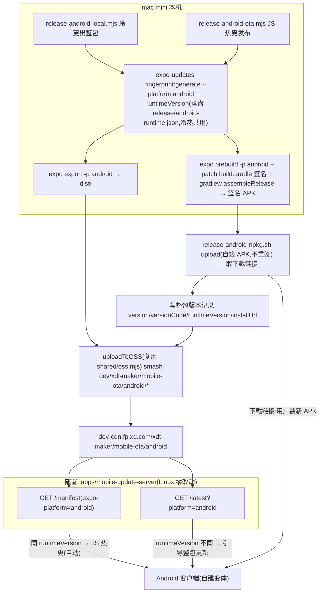

# 手机版 Android 自建打包与自托管 OTA(设计文档)

> 状态:设计稿(待评审 / 未实现)。负责人:dash。最后更新 2026-07-05。
>
> ⚠️ **自建线身份切换(2026-07-16,已实现,本文其余章节的 `com.xd.lizcn` / `xdmaker-release` 描述为历史值)**:
> 自建线 package 改为 **`com.xd.cindycn`**(与 EAS 线的 `com.xd.lizcn` 分离),签名 keystore 换为
> **`Cindy.jks`**(alias `Cindy`,PKCS12,storePassword 与 keyPassword 相同,证书 SHA256
> `B0:A5:77:DC:05:DF:60:75:96:47:A6:E5:97:42:B2:C4:A7:82:8A:1F:4C:04:01:B6:A9:BB:B3:EE:42:F0:27:A9`,
> 有效期至 2053),打包机路径 `/Users/cn-ios/Documents/cindy/CindyMobileCer/Android/`(不进仓库);
> 签名参数**零代码默认值**:keystore 路径 / alias / 两个口令全部由 `XDT_ANDROID_*` 环境变量提供,
> `--execute` 缺任一项报错(本文 §7 的"路径/alias 有默认值"描述为历史设计);
> scheme 仍为 `lizcn`。**换 keystore + 换包名 = 全新安装线**:旧 `com.xd.lizcn` / `com.xd.maker` 包
> 无法覆盖安装,需重装；原生飞书 SSO 与相应 package/SHA 登记已退役。
> 现状以 `RELEASING.md` 与脚本头注释为准。
>
> ⚠️ **分发链路变更(2026-07-06,已实现,本文其余章节的 NPKG 描述为历史设计)**:冷更 APK
> 不再经 NPKG 取下载链接,由 `release-android-local.mjs` **直传自有 OSS**
> (`mobile-dist/android/<versionCode>/`,installUrl = CDN 直链;helper 见
> `scripts/lib/oss-dist.mjs`)。`release-android-npkg.sh` 保留仅供手动补传;
> `--skip-npkg` 更名 `--skip-upload`(旧名兼容)。现状以 `RELEASING.md` 与脚本头注释为准。
>
> 目标:在本机(mac mini)本地编译 Android release **APK**,用**自有 keystore 自签**后经 NPKG 内部分发(**不走 iOS 的企业重签**);**更新走双通道**——纯 JS/TS 改动经自建服务(`mobile-update-server`)做 expo-updates 自托管 OTA(秒级、无感);动了原生层(指纹变化)的整包更新,客户端发现后引导跳 NPKG 下载新 APK。**Google Play 不做**(企业内部分发)。
>
> 本文档只定义模型、契约、红线与脚本职责;**不内嵌任何密钥**。本方案是 [iOS 自建线](./self-hosted-ios-build-and-ota.md) 的 Android 对称版,结构逐节对齐,只标注 Android 差异。现行 EAS 流程见 [`RELEASING.md`](../RELEASING.md) 与 [`dev-and-release-workflow.md`](./dev-and-release-workflow.md),本方案与其**并存且不互相影响**(指发布流程/脚本互相独立;但 2026-07-07 起两条线统一使用同一 bundleId `com.xd.lizcn` 后,**同一台设备只能安装其中一条线的包,不能同机共装**)。

## 1. 背景与动机

现状:iOS 已有完整自建分发线(本机出包 + 自托管 OTA),Android 侧空白——`RELEASING.md` 与 `dev-and-release-workflow.md` 明确 "Android NPKG 上传路径落地 pending,脚本当前仅 iOS"。本方案补齐一条**完全自托管的 Android 分发线**,与 iOS 完全对称:

- **冷更(出整包)**:本机 `expo prebuild + gradlew assembleRelease` 出**签名 APK** → NPKG 上传取下载链接 → 内部分发。替代 `eas build`。
- **热更(JS OTA)**:`expo export -p android` 产物上传 OSS/CDN → 客户端从 `mobile-update-server` 按 Expo Updates Protocol 拉热更。替代 `eas update`。

两条线靠 **`runtimeVersion`(`@expo/fingerprint`)** 这同一把"能不能 JS 热更"的门闸约束,与 iOS 线、与现行客户端冷热更逻辑完全一致。

**与 iOS 线的四点核心差异**(贯穿全文):

| 维度 | iOS 自建线 | Android 自建线(本方案) |
|---|---|---|
| 产物 | `.ipa` | `.apk` |
| 签名 | dev 证书本地签,**NPKG 企业重签**(`UE5H8B62F9.*`,无设备上限) | **自有 keystore 自签**,NPKG **不重签**、只上传取下载链接 |
| 版本单调键 | `app.json` 的 `ios.buildNumber` | committed `apps/mobile/android-version.json` 的 `versionCode`(整数,单调) |
| 整包安装入口 | `itms-services://` 链接(iOS 专有) | 直接下载 APK(`installUrl`/download URL);客户端 `Linking.openURL` 触发下载 |

## 2. 决策基线(继承 iOS,标注 Android 特有)

| # | 决策 | Android 说明 |
|---|---|---|
| 1 | 新流程产物是**全新发布线**,可接受全员重装一次 | **无 flag day**:runtimeVersion 只对本地工具链自洽,不碰 EAS 历史基线 |
| 2 | **更新走双通道**:能 JS 热更就热更,整包更新才跳 NPKG | 同 iOS;`mobile-update-server` 已平台无关,Android 零改动复用 |
| 3 | OTA manifest **首期不上 code signing** | 同 iOS,`/manifest` 端点无签名 |
| 4 | 冷更用**自有 release keystore** 本地签 | mac 上 `gradlew assembleRelease` 用 `xdmaker-release.jks` 出 APK;**无重签环节**,自签即最终生产签名 |
| 5 | `mobile-update-server` 部署在 Linux;OSS/CDN 复用桌面端机制 | 同 iOS;CDN 布局 `mobile-ota/android/*`(与 iOS `mobile-ota/ios/*` 平级隔离) |
| 6 | **EAS 保留且仍可用**,新脚本不得影响既有 EAS 逻辑 | 靠 `EXPO_PUBLIC_XDT_OTA_SELFHOST` env gate 隔离,非自建 Expo config 逐字节不变 |
| 7 | Android package 固定为 `com.xd.lizcn` | 历史身份决策；现行 region 身份见本文顶部更新与 `RELEASING.md` |
| 8(Android 特有) | **versionCode 单调递增**,APK 覆盖安装的硬约束 | 值 committed 在仓库;`release-android-local.mjs` 检测到 ≤ 线上基线时自动 +1 写回(发布后 commit 回 main),语义对齐 iOS `buildNumber`;self-host fingerprint 排除 `ExpoConfigVersions`,所以它是整包安装元数据,不会单独改变 OTA runtime |

## 3. 关键事实(实现前提)

- 工程是 **managed workflow**(无 `android/` 目录),每次出包需 `expo prebuild -p android` 现生成原生工程。
- 有 2 个本地原生模块需正确 autolink:`xdt-mobile-realtime-audio` / `xdt-tapdb`；`xdt-feishu-login` 与其 config plugin 已删除。
- Expo SDK ~56 / RN 0.85 / `expo-updates ~56`——完整支持 Expo Updates Protocol 自建服务器,客户端运行时 OTA 逻辑零改动。
- **工具链**:mac 上需 **Android SDK**(`ANDROID_HOME` / `sdkmanager` / build-tools 含 `apksigner`)+ **JDK 17**。JDK 17 解析**复用 `scripts/java-runtime-env.mjs` 的 `resolveJavaRuntimeEnv()`**(已在 sim/e2e 脚本使用,自动探测 `/usr/libexec/java_home -v 17`、homebrew openjdk@17)。
- **签名 keystore(已就绪)**:`xdmaker-release.jks`(alias `xdmaker-release`,storeType JKS,RSA 2048,证书 SHA256 `AD:73:7E:7E:13:1A:63:C6:B2:2B:43:D2:E6:76:9C:48:E5:C5:4C:65:25:32:85:A0:43:55:07:11:44:59:92:E4`,有效期至 2053)。文件在**仓库外** `/Users/cn-ios/Documents/xdt/XDMakerMobileCer/Android/`,**不进仓库**;口令同目录 `signing-info.txt`(明文,**严禁复制进仓库工作区**,红线 23)。脚本通过环境变量读取路径与口令(§7),自签即最终生产签名——**NPKG 不重签**,故无 iOS 的证书 Team 校验环节。
- **NPKG 复用点**:NPKG 上传 API 本身平台无关(`POST /api/v1/packages/`)。但 iOS 的 `release-ios.sh` 核心是**轮询 `type=enterprise` 企业子包 + 校验签名 Team `UE5H8B62F9.*`**——这套**对 Android 不适用**(Android 不重签),需另写简化脚本(§11)。
- **现成可复用**(均已确认平台无关):`scripts/release-lib.mjs`(参数解析 / git 闸门 / public env 校验 / `decideReleaseMode`)、`scripts/lib/ota-manifest.mjs`(Expo 协议 manifest 组装 / runtime 基线闸门)、`scripts/lib/ios-local.mjs`(`compareBuildNumbers` / `assertBuildNumberMonotonic` / `fetchBaselineBuildNumber` / `buildReleaseRecord` / `parseNpkgInstallLinks`——命名带 ios 但逻辑与平台无关)、`scripts/shared/oss.mjs`(OSS/CDN 原语)。
- **服务端 `apps/mobile-update-server`**:`/manifest` 读 `expo-platform` 头并按 canary header 选择指针、`/latest?platform=android` 默认解析 stable `release.json`，canary query 解析 `canary-release.json`(`resolveReleaseUrl(cdnBase, otaPrefix, platform, channel)`),已完全平台化。

## 4. 总体架构



**生命线**:`release-android-local.mjs` 与 `release-android-ota.mjs` 共用同一条本地指纹命令(`--platform android` + self-host env)算出的 `runtimeVersion`。它既烧进 APK,又作为该 APK 后续 JS 热更产物在 OSS 上 `mobile-ota/android/<rtv>/` 的目录键——二者必须逐字节一致,否则客户端要么收不到能装的 JS OTA,要么 `/latest` 误判整包更新。

## 5. 更新策略:两条通道

与 iOS 完全一致,判定逻辑全在客户端代码(确定性,不依赖 prompt/服务端话术):

| 客户端 runtimeVersion vs `/latest` 整包 runtimeVersion | 含义 | 动作 |
|---|---|---|
| **相同** | 原生层没变,差异只在 JS | 走 **expo-updates JS OTA**:后台拉 `/manifest`、下次启动生效(沿用现有运行时逻辑,无 UI) |
| **不同** | 原生层变了,JS OTA 覆盖不到 | **弹窗引导整包更新** |

**Android 差异**:整包引导入口不是 iOS 的 `itms-services://`,而是**直接下载 APK**——`Linking.openURL(installUrl)`(NPKG 下载链接)由系统下载器接管并触发安装。客户端 `preferredInstallUrl`(`src/update/bundleUpdate.ts`)已在无 `itmsUrl` 时回退 `installUrl`,而 Android 的 `release.json` 本就不写 `itmsUrl`,天然走这条回退——**无需改** `preferredInstallUrl`。

## 6. 客户端改动(env-gated,JS OTA 零改动 + 整包发现平台化)

1. **`app.config.js` 自建分支补 `android.versionCode`**:默认 `android.package` 已是 `com.xd.lizcn`;自建分支注入 `android.versionCode = Number(process.env.XDT_ANDROID_VERSION_CODE)`(缺省不注入),并使用固定 OTA 占位 URL + `checkAutomatically=NEVER` + `disableAntiBrickingMeasures=true`。**非自建路径仍原样返回 app.json**(红线 1)。
2. **JS 热更**:启动先拉 region 对应 `endpoint.json?t=<Date.now()>`,取 `mobileUpdateBaseUrl` 运行时覆盖 Expo Updates URL 为 `${base}/manifest`,再手动 check/fetch;真实更新域名不参与 build/fingerprint。
3. **整包发现平台化**:`src/update/useBundleUpdatePrompt.ts` 当前硬编码 `fetchLatestRelease('ios')` → 改为 `fetchLatestRelease(Platform.OS === 'android' ? 'android' : 'ios')`(`import { Platform } from 'react-native'`)。`fetchLatestRelease` 已按 `?platform=` 参数化,`preferredInstallUrl` 已回退 `installUrl`——**只此一处 IO 平台化**,判定纯函数与弹窗逻辑不动。
4. **Android package / scheme 按 region 保持稳定**；登录统一走 Cindy auth-server，不再注入飞书 appId 或原生飞书 SSO。

## 6.5 地区分包(region,cn / global)

自建线四脚本(`release-android-{local,ota,check}.mjs` + iOS 对应)**必须显式 `--region cn|global`**(无默认,缺失即报错;`lib/self-host-region.mjs` 解析)。随地区变的**非机密**分包参数集中在打包机本地 `scripts/self-host-regions.json`(纯值、gitignore;结构见 `self-host-regions.json.example`):`androidPackage`(cn=`com.xd.cindycn` / global=`com.xd.cindy`)、`tapdb.{clientId,clientToken}`、`oss.{cdnBaseUrl,bucket,prefix,ossRegion}`、`androidSigning.{keyAlias,keystorePath}`。脚本读该 region 的 `oss.*` 覆盖 `XDT_OSS_*` 后 `refreshOssConfig()`,切到该地区独立 bucket(两地不撞);`app.config.js` 把 `tapdb` 公开配置写入 Expo extra,不再依赖同名 `EXPO_PUBLIC_*` 注入。**真机密走 env、按 region 后缀**:keystore 两个口令 `XDT_ANDROID_KEYSTORE_PASSWORD_{CN,GLOBAL}` / `XDT_ANDROID_KEY_PASSWORD_{CN,GLOBAL}`(cn 兼容无后缀旧名);OSS AK/SK 同账号用 `FP_DEV_OSS_ACCESS_KEY_ID/SECRET`、不同账号用 `XDT_OSS_ACCESS_KEY_{ID,SECRET}_{CN,GLOBAL}`。

## 7. 冷更:`apps/mobile/scripts/release-android-local.mjs`

复用 `release-lib.mjs` 的参数解析 / git 闸门 / dry-run 风格。步骤:

1. **算指纹**:`npx expo-updates fingerprint:generate --platform android`(self-host 身份 env:`EXPO_PUBLIC_XDT_OTA_SELFHOST=1`;`fingerprint.config.cjs` 的 beta 剥离 hook 仍生效)→ 得 `runtimeVersion`,落盘 `release/android-runtime.json` 供热更脚本复用(镜像 iOS 的 `release/ios-runtime.json`)。
2. **读并校验 versionCode**:读 committed `apps/mobile/android-version.json`(`{ "versionCode": N }`)——放仓库根而非 `release/`,因为 `apps/mobile/.gitignore` 忽略整个 `/release`(那里只放 per-build 产物如 `android-runtime.json`);经 `assertBuildNumberMonotonic`(复用 `lib/ios-local.mjs`)对 CDN canary 基线 `mobile-ota/android/canary-release.json`（无 canary 时回退 stable `release.json`）的上一条 `buildNumber`(即上次 versionCode)做单调校验;经 env `XDT_ANDROID_VERSION_CODE` 传给 prebuild(供 §6.1 注入)。该值只负责 APK 覆盖安装 / 发布去重,`fingerprint.config.cjs` 在 self-host 模式跳过 `ExpoConfigVersions`,不会因为 bump versionCode 单独生成新 runtime。
3. **prebuild**:`expo prebuild -p android --clean`,注入自建变体 env(`EXPO_PUBLIC_XDT_OTA_SELFHOST=1` / `XDT_ANDROID_VERSION_CODE` / 必要的 `EXPO_PUBLIC_*`)。真实更新地址只来自 endpoint 清单。
4. **注入签名 + 编译**:`android/` 是生成目录(gitignored、每次 prebuild 重建),脚本**幂等 patch** 生成的 `android/app/build.gradle`——把 `release` buildType 的 `signingConfig` 从默认的 `signingConfigs.debug` 改为指向 env 驱动的 release keystore(默认模板 release 用 debug 签名,**必须改**)。keystore 路径与口令经 `-P` gradle property 从环境变量传入 `gradlew assembleRelease`,**绝不落盘明文、绝不写进被 patch 的 build.gradle**(patch 只引用 property 名):
   - `XDT_ANDROID_KEYSTORE_PATH`(默认 `/Users/cn-ios/Documents/xdt/XDMakerMobileCer/Android/xdmaker-release.jks`)
   - `XDT_ANDROID_KEYSTORE_PASSWORD` / `XDT_ANDROID_KEY_ALIAS`(默认 `xdmaker-release`)/ `XDT_ANDROID_KEY_PASSWORD`
   - gradle 环境用 `resolveJavaRuntimeEnv()` 补 JDK 17。
   - 镜像 iOS 脚本"构建期写 `ExportOptions.plist` + 装 profile"的时机——生成物只在临时构建目录,不进仓。
5. **交付 NPKG**:调用 §11 的 `release-android-npkg.sh upload <apk>`;`--skip-npkg` 时跳过上传与版本记录、只产 APK。
6. **写整包版本记录**:`buildReleaseRecord({ version, buildNumber: versionCode, runtimeVersion, installUrl, releaseNotes, minVersion? })`(复用 `lib/ios-local.mjs`)→ 上传 `mobile-ota/android/canary-release.json`,供 `/latest?platform=android&channel=canary` 读取；验证后由 promote 写 stable 指针。
7. **闸门**:`assertProductionGitGate`(main + clean + `HEAD==origin/main`)、versionCode 单调、**默认 dry-run,`--execute` 才真跑**。逃生开关对齐 iOS:`--skip-git-gate` / `--skip-record` / `--skip-npkg` / `--apk <path>`(直传预构建 APK)。⚠️ `--apk` 逃生路径的元数据一致性硬化(读 APK 内 versionCode/runtimeVersion 与待写记录比对)沿用 iOS 文档 §13.4 的同类 pending 项。

`--execute` 前置:校验 region / endpoint manifest 自举基址,并要求所选 region 的 `self-host-regions.json.tapdb` 完整;需 macOS + Android SDK + JDK 17 + keystore env + NPKG 凭证(除非 `--skip-npkg`)。

## 8. 热更:`apps/mobile/scripts/release-android-ota.mjs` + OSS/CDN 布局

OSS/CDN 复用 `scripts/shared/oss.mjs`(bucket `smash-dev`,region `oss-cn-shanghai`,prefix `xdt-maker`,CDN `https://dev-cdn.fp.xd.com/xdt-maker`)。

步骤:

1. `expo export -p android`(用 §7 步骤 1 的**同一** `runtimeVersion`,保证冷热同源)→ `dist/`。
2. 读 `dist/metadata.json` 的 **`fileMetadata.android`**(iOS 版读 `.ios`,**唯一实质差异**)→ 用 `lib/ota-manifest.mjs` 的 `buildAssetEntry` / `buildManifest` / `sha256Hex` 组装 manifest。
3. 上传 OSS(独立 prefix,与 iOS 及桌面端产物物理隔离):

```
smash-dev/xdt-maker/mobile-ota/
  assets/<sha256>                                   # bundle(.hbc)+ 图片等,内容寻址、永久缓存、天然增量(与 iOS 共享内容寻址目录)
  android/<runtimeVersion>/<updateId>/update.json   # Expo 协议 manifest
  android/<runtimeVersion>/canary-latest.json       # canary JS OTA 指针(脚本默认写入)
  android/<runtimeVersion>/latest.json              # stable JS OTA 指针(promote 后写入)
  android/canary-release.json                       # canary 整包记录(脚本默认写入)
  android/release.json                              # stable 整包记录(promote 后写入,供 /latest?platform=android)
```

4. **runtime 基线闸门**(`--execute`,复用 `assertOtaRuntimeMatchesBaseline`):重算当前工作树 android 指纹,要它等于 CDN `mobile-ota/android/canary-release.json`（无 canary 时回退 stable `release.json`）的 `runtimeVersion`,不等则原生层已变、须先出冷更整包;`--skip-runtime-check` / `--runtime-version` override 对齐 iOS。
5. 默认 dry-run,`--execute` 才真正上传 + 翻新 `latest.json`(先传归档 `update.json` 再翻 `latest.json` 指针,避免指向未就绪产物)。

## 9. `mobile-update-server`:零改动复用

服务已平台化,Android **无需任何改动**:

- **`GET /manifest`**:客户端带 `expo-platform: android` + `expo-runtime-version` → 服务端 `resolveLatestManifestUrl(cdnBase, otaPrefix, 'android', rtv)` 拉 `mobile-ota/android/<rtv>/latest.json` → 包成 `multipart/mixed` 返回;无匹配 → 204。
- **`GET /latest?platform=android`**:`resolveReleaseUrl(cdnBase, otaPrefix, 'android')` 默认透传 `mobile-ota/android/release.json`;canary 请求带 `channel=canary` 时透传 `canary-release.json`。`androidStoreUrl` 为空时仍回退 OSS APK。

## 10. `release-android-check.mjs`:冷/热更只读预判

镜像 `release-ios-check.mjs`:本地算 android 指纹(`--platform android` + self-host env)vs CDN `mobile-ota/android/canary-release.json`（无 canary 时回退 stable `release.json`）的 `runtimeVersion`,复用 `decideReleaseMode` 输出:

- 相等 → `OTA_OK`(发热更即可,`pnpm mobile:release:android:ota -- --execute`)
- 不等 → `COLD_BUILD_REQUIRED`(必须冷更,`pnpm mobile:release:android:local -- --execute`)
- 读不到基线 → `BASELINE_UNKNOWN`(首发)

只读:只算本地指纹 + GET 公开 CDN,不写、不碰 NPKG/keystore。

## 11. NPKG:`apps/mobile/scripts/release-android-npkg.sh`(新写,不复用 `release-ios.sh`)

**不能复用 `release-ios.sh`**:其核心是轮询 `type=enterprise` 企业子包并校验签名 Team `UE5H8B62F9.*`——Android **不做企业重签**,APK 自签即终版。新脚本简化:

- `upload <apk> [--memo --tag]`:`POST /api/v1/packages/`(form-data:`file`+`memo`+`tags`)→ 取父包 id → 直接打印安装/下载链接:`${NPKG_BASE_URL}/install/<parentId>`(前端安装页)与 `${NPKG_BASE_URL}/api/v1/packages/<parentId>/download/`(直下 APK)。**无企业子包轮询、无 Team 校验**。
- `from-eas [--profile]`:按 profile 精确取最近一次 finished EAS **android** 构建产物(`.apk`;若 EAS 出 `.aab` 需另议)→ 下载 → `upload`。
- `resolve <parent_id>`:补取已上传父包的链接(自测/补发)。
- 凭证沿用 iOS 约定:`NPKG_TOKEN` / `NPKG_BASE_URL`(env 优先,回退 `~/.config/xdt-maker/npkg/credentials.env`,`chmod 600`,**不进库**),脚本本体零密钥。
- `lib/ios-local.mjs` 的 `parseNpkgInstallLinks` 已能抓 `/install/<id>`(Android 输出无 itms,只多一个 download URL);当前 Android 自建冷更直接把自签 APK 上传 OSS，按 `androidStoreUrl` 或 APK CDN 直链写进 `canary-release.json`。

> ⚠️ NPKG 是否已支持"APK 上传即取下载链接"属外部待确认项(§13)。未确认前,`release-android-local.mjs --skip-npkg` 可只产签名 APK + 跳过 NPKG/记录,链路其余部分照跑。

## 12. `package.json`(仓库根)入口(实现时新增)

镜像 iOS 四条:

```
"mobile:release:android:check": "node apps/mobile/scripts/release-android-check.mjs",
"mobile:release:android:local": "node apps/mobile/scripts/release-android-local.mjs",
"mobile:release:android:ota":   "node apps/mobile/scripts/release-android-ota.mjs",
"mobile:release:android:npkg":  "bash apps/mobile/scripts/release-android-npkg.sh"
```

## 13. 红线与不变量

1. **EAS 指纹不变**:`app.config.js` 在无 `EXPO_PUBLIC_XDT_OTA_SELFHOST` 时逐字节原样返回;`android.versionCode` **只在自建分支注入** → EAS/beta Android OTA runtime 不受影响。**实现后必须验证**(§15)。
2. **冷热同源(生命线)**:`release-android-local.mjs` 与 `release-android-ota.mjs` 必须用同一条 `fingerprint:generate --platform android` + 同一 self-host env;禁止一侧用 eas-cli 指纹、另一侧用本地指纹。
3. **package / scheme 稳定**:按 region 使用固定身份与 OAuth callback；自建线只通过 `EXPO_PUBLIC_XDT_OTA_SELFHOST=1` 切换 OTA URL 与本地签名链路，登录统一走 Cindy auth-server。
4. **整包可覆盖安装**:同 `package`(`com.xd.lizcn`)+ **同一 keystore 签名**(签名不一致 Android 拒绝覆盖安装)+ `versionCode` 严格递增,三者缺一装不上。
5. **OSS prefix 隔离**:Android OTA 只写 `xdt-maker/mobile-ota/android/`(及共享 `assets/`),不碰 iOS `mobile-ota/ios/` 与桌面端产物。
6. **写操作默认 dry-run**:冷更上传 NPKG、热更上传 OSS 都必须显式 `--execute`。
7. **密钥不进仓库(红线 23)**:keystore 文件与口令在仓库外 + 经环境变量供给;NPKG token 在 `~/.config/xdt-maker/npkg/credentials.env`;OSS AK/SK 走 `FP_DEV_OSS_*` 环境变量;被 patch 的 `build.gradle` 只引用 property 名、不写明文;单测涉及路径一律 `os.tmpdir()`,不碰真 keystore。

## 14. 落地顺序(建议)

> **前置最小验证(keystore 已就绪,立刻可做)**:本机 `prebuild(com.xd.lizcn)→ patch build.gradle 签名 → gradlew assembleRelease → 出一个 APK → apksigner 校验其证书 SHA256 == §3 的 `AD:73:...:E4``。这一步通过,整条冷更构建段坐实(NPKG 上传段待 §13 外部确认)。

1. 最小验证(上)。
2. `app.config.js` 自建分支注入 `android.versionCode`(env-gated)。
3. `release-android-local.mjs`(冷更 + 写整包版本记录)+ `lib/android-local.mjs`(gradle patch 等纯函数 + 单测)。
4. `release-android-ota.mjs`(JS 热更)+ OSS 布局。
5. `release-android-check.mjs`(预判)。
6. `release-android-npkg.sh`(NPKG 上传,`--skip-npkg` 兜底)。
7. 客户端整包发现平台化(`useBundleUpdatePrompt` → `Platform.OS`)。
8. 端到端验证两通道:
   - 纯 JS 改动 → 发 OTA → 客户端确认 runtimeVersion 不变、无需重装。
   - 动原生层 → 出新整包(新 runtimeVersion + bump versionCode)→ 客户端弹"去更新" → 下载装新 APK。

## 15. 验证(实现阶段)

- `pnpm --filter mobile typecheck` + `pnpm --filter mobile test`(含新增单测:versionCode 单调、release.json 组装、`parseNpkgInstallLinks` 对 Android 输出、build.gradle patch 幂等纯函数、`src/update` 补 android 平台用例)。
- **红线 1 验证**:`expo config --json`(无 SELFHOST env)对比改 `app.config.js` 前后逐字节一致;`fingerprint:generate --platform android`(非自建)hash 改动前后相同 → 证明 EAS/beta Android 指纹未变。
- **versionCode 注入生效**:带 `EXPO_PUBLIC_XDT_OTA_SELFHOST=1 XDT_ANDROID_VERSION_CODE=N` 时 `expo config --json` 的 `android.versionCode == N`、`android.package == com.xd.lizcn`。
- **dry-run 计划**:`mobile:release:android:check` / `:local`(dry-run)/ `:ota`(fake dist dry-run)打印正确计划,无写操作。
- **真实构建段(mac,`--execute --skip-npkg`)**:跑通 fingerprint → prebuild → patch → gradle assembleRelease → 产出**已用 `xdmaker-release` 签名**的 APK(`apksigner verify --print-certs` 确认 SHA256 == §3);runtimeVersion 落盘。
- NPKG 上传段与 OTA 端到端待 NPKG Android 路径确认 + `mobile-update-server` 部署后验(**标注 pending,不假装完成**)。

## 16. 外部登记待办(不阻塞写代码,阻塞真实发版)

1. **NPKG APK 上传路径确认**:确认 NPKG 支持"上传 APK → 取下载/安装链接"(Android 不重签)。未确认前 `--skip-npkg` 兜底。
2. 原生飞书 SSO 与相应 Android package / 签名登记已退役，不再是发版前置条件。

## 17. 实现状态(2026-07-05,代码已落地,真实构建/上传待外部依赖)

> 注:本节 2026-07-05 实跑记录是自建 Android 线**改名前**的产物(当时 package=`com.xd.maker`);现已改为 `com.xd.lizcn`(见 §7 / §13),历史记录保留其真实产出值不改写。

代码已实现并通过单测 + dry-run + 静态校验;**真实 `--execute`(出 APK / 上传 NPKG / OTA 端到端)因依赖 macOS+Android SDK / NPKG Android 路径 / OTA 域名而待跑**:

| 产出 | 验证 |
|---|---|
| `app.config.js` 自建分支注入 `android.versionCode`(env-gated) | `expo config --json` 四分支:非自建无 versionCode / package=`com.xd.lizcn`;自建 + `XDT_ANDROID_VERSION_CODE=5` → package=`com.xd.lizcn`、versionCode=5、updates.url=`/manifest` |
| `apps/mobile/android-version.json`(committed versionCode) | tracked(不落 `/release`);`readAndroidVersionCode` 单测覆盖正整数/非法/缺失 |
| `scripts/lib/android-local.mjs`(`readAndroidVersionCode` / `resolveAndroidSigningEnv` / `patchBuildGradleSigning`) | 9 单测(含 build.gradle patch 幂等 + 找不到锚点抛错 + 缺口令抛错 + 口令走 getenv 不落明文) |
| `scripts/release-android-local.mjs`(冷更) | dry-run 计划输出;复用 `release-lib` / `lib/ios-local` / `shared/oss` / `java-runtime-env` |
| `scripts/release-android-ota.mjs`(JS 热更) | fake-android-dist dry-run:读 `fileMetadata.android`、键落 `mobile-ota/android/<rtv>/*` |
| `scripts/release-android-check.mjs`(预判) | 复用 `decideReleaseMode`;逻辑同 iOS(实跑需算指纹) |
| `scripts/release-android-npkg.sh`(NPKG,无企业重签) | bash 单测:from-eas 按 android+profile 过滤、upload 打印 install+download 链接、package 校验、无 `poll_enterprise`/`check_data` 逻辑 |
| `useBundleUpdatePrompt` 平台化 + 根 `package.json` 四条 `mobile:release:android:*` | typecheck 0 + 全量 1189 单测通过 |

**待外部依赖坐实的真实验证**:mac 上 `:local --execute --skip-npkg` 跑通 prebuild→patch→gradle→签名 APK(`apksigner verify` 确认证书 SHA256 == §3);NPKG 上传段与 OTA 端到端待 §16 外部项。服务端 `apps/mobile-update-server` 已平台化,无需改动。

### 首次真实 Android 构建发现(2026-07-05,`:local --execute --skip-npkg`)

在装好工具链(openjdk@17 + android-commandlinetools + `platforms;android-36` / `build-tools;36.0.0` + 两个 NDK 由 AGP 自动下)后实跑,**本发布流程本身全部跑通**:fingerprint(android)→ prebuild(`com.xd.maker` + versionCode 注入,历史改名前产物)→ **build.gradle 签名 patch 生效** → JDK17 探测 → gradle 配置/编译 770+ task。以下是当时的历史阻塞记录；其中 `xdt-feishu-login` 后续已整体删除，不再属于当前构建依赖:

1. **`xdt-tapdb`(真实 Kotlin 编译错误,阻断)**:`modules/xdt-tapdb/android/.../XdtTapdbModule.kt:43/63` —— `TapTapSdkOptions(clientId, clientToken, region)` 第三参现在要 `Int`,而 `resolveRegion()` 返回 `TapTapRegion` 枚举(类型不匹配)。该模块 Android 源码对着的 TapDB SDK API 版本与解析到的不一致,需模块 owner 按当前 SDK 修正。
2. **历史:`xdt-feishu-login` flatDir 传递解析**:该模块与 vendored larksso 已删除；以下补丁只用于解释旧构建记录，不再执行。
3. **Gradle Metaspace(内存配置)**:生成的 `android/gradle.properties` 默认 `-XX:MaxMetaspaceSize=512m`,大型多模块 + KSP 编译 OOM;需调大(如 1–2g)。可由 §2 的 config plugin 一并写入,或发布脚本 patch。

结论:**打包链路成立**,真正出 APK 前需先解决上述 3 个模块/环境项。

### 已解决并出包成功(2026-07-05,同日跟进)

三项全部收口后 `:local --execute --skip-npkg` **构建成功产出签名 APK**:

1. **历史:`xdt-feishu-login` larksso flatDir**:旧发布脚本曾在 prebuild 后 patch 生成工程；模块下线后该 patch 与相关单测已一并删除。
2. **Metaspace**:同一 patch 阶段 bump `android/gradle.properties` 的 `org.gradle.jvmargs`(heap 4g / metaspace 2g),纯函数 `patchGradlePropertiesMemory`(单测覆盖)。
3. **`xdt-tapdb` Kotlin 类型错误**:经 `javap` 核对 `tap-core:4.10.5` 实际 API —— `TapTapRegion` 是 `@IntDef` 注解(`CN`/`GLOBAL` 为 `Int` 常量)、`TapTapSdkOptions(...)` 第三参为 `int`。故把 `resolveRegion(): TapTapRegion` 改为 `: Int`(Android-only 源文件,原本就编译不过,无回退风险)。

**产物校验**:`app-release.apk`(~140MB),`apksigner verify --print-certs` 证书 **SHA-256 = `ad73…5992e4`** == §3 的 `AD:73:…:E4`(自有 keystore 自签)、v2 签名 scheme verified;`aapt2 dump badging` = `package=com.xd.maker versionCode=1 versionName=1.0.0 compileSdk=36`。整条冷更构建段(fingerprint → prebuild → 三处 patch → gradle → 签名 APK)**在 mac 上实跑通过**。NPKG 上传段与 OTA 端到端仍待 §16 外部项。

> 该历史遗留已随 `xdt-feishu-login` 模块删除而解除。

## 相关文档

- [`self-hosted-ios-build-and-ota.md`](./self-hosted-ios-build-and-ota.md) —— iOS 自建打包与自托管 OTA(本方案的对称参照)。
- [`RELEASING.md`](../RELEASING.md) —— 现行 EAS 发版命令矩阵与人工 checklist。
- [`dev-and-release-workflow.md`](./dev-and-release-workflow.md) —— 三轨开发/发版模型与客户端冷热更指纹逻辑。
- [`npkg-ios-distribution.md`](./npkg-ios-distribution.md) —— NPKG 内部分发手册(iOS 走企业重签;Android 只上传取链接,不重签)。
