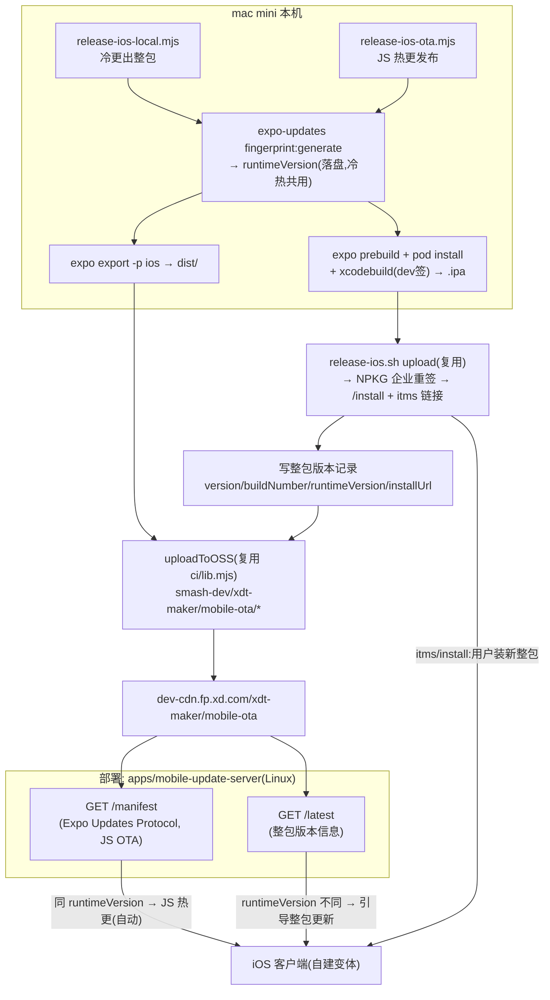

# 手机版 iOS 自建打包与自托管 OTA(设计文档)

> 状态:设计稿(待评审 / 未实现)。负责人:dash。最后更新 2026-07-01。
>
> ⚠️ **自建线身份切换(2026-07-16,已实现,本文其余章节的 `com.xd.lizcn` / `lizcn_dev` 描述为历史值)**:
> 自建线 bundleId 改为 **`com.xd.cindycn`**(与 EAS/TestFlight 线的 `com.xd.lizcn` 分离,可同机共装;
> 但两线 scheme 仍统一为 `lizcn`,共装时 scheme 重复注册、浏览器 OAuth 回调可能被另一条线抢走,内测机建议只装一条线),
> dev 签名套件换为 **CindyMobileCer**:profile `cindycn_dev`(Team 仍 `NTC4BJ542G`,App ID
> `NTC4BJ542G.com.xd.cindycn`,有效期 2027-07-08)+ p12 `Apple Development: Yi Zhou (RQ24UVT6TG)`,
> 打包机路径 `/Users/cn-ios/Documents/cindy/CindyMobileCer/iOS/cn/`(不进仓库);scheme 仍为 `lizcn`。
> 签名参数**零代码默认值**:`XDT_IOS_TEAM_ID` / `XDT_IOS_PROFILE_NAME` / `XDT_IOS_SIGN_IDENTITY` 必须经
> 环境变量提供(构建时缺任一项报错),`XDT_IOS_PROFILE_PATH` 可选(缺省视为描述文件已装入系统)。
> NPKG 企业重签(`UE5H8B62F9.*`)不变,但 **`com.xd.cindycn` 的 NPKG 白名单与飞书后台登记是新的外部待办**
> (§13 中针对 `com.xd.lizcn` 的登记不自动覆盖新 bundleId)。现状以 `RELEASING.md` 与脚本头注释为准。
>
> ⚠️ **分发链路变更(2026-07-06,已实现,本文其余章节"引导跳 NPKG 下载"的描述为历史设计)**:
> 企业重签仍走 NPKG(证书在 NPKG 侧,不可绕开),但 `release-ios-local.mjs` 会把重签后的
> `.ipa` 经 `release-ios.sh download` 拉回,连同自生成的 `manifest.plist` / `install.html`
> **直传自有 OSS**(`mobile-dist/ios/<buildNumber>/`);`release.json` 的 `itmsUrl` / `installUrl`
> 均指向 OSS/CDN,用户装机流量不再经过 NPKG。现状以 `RELEASING.md` 与脚本头注释为准。
>
> 目标:在本机(mac mini)本地编译 iOS release 包,经 NPKG 企业重签后公司内部分发;**更新走双通道**——纯 JS/TS 改动经自建服务(`mobile-update-server`)做 expo-updates 自托管 OTA(秒级、无感);动了原生层(指纹变化)的整包更新,客户端发现后引导跳 NPKG 下载新整包。**App Store / TestFlight 首期不做**。
>
> 本文档只定义模型、契约、红线与脚本职责;不内嵌任何密钥。现行 EAS 流程见 [`RELEASING.md`](../RELEASING.md) 与 [`dev-and-release-workflow.md`](./dev-and-release-workflow.md),本方案与其**并存且不互相影响**(指发布流程/脚本互相独立;但 2026-07-07 起两条线统一使用同一 bundleId `com.xd.lizcn` 后,**同一台设备只能安装其中一条线的包,不能同机共装**)。

## 1. 背景与动机

现状(详见 `RELEASING.md`):iOS 出包走 **EAS 云构建**,OTA 走 **`eas update` + EAS Update 服务**(`updates.url = https://u.expo.dev/<projectId>`)。本方案新增一条**完全自托管**的分发线:

- **冷更(出整包)**:本机 `prebuild + xcodebuild` 出 `.ipa` → NPKG 企业重签(无设备上限)→ 内部分发。替代 `eas build`。
- **热更(JS OTA)**:`expo export` 产物上传 OSS/CDN → 客户端从 `mobile-update-server` 按 Expo Updates Protocol 拉热更。替代 `eas update`。

> **本地签名(A1)已就绪(2026-07-01)**,app 身份为 `com.xd.lizcn`。2026-07-07 起 EAS/TestFlight 与自建线统一使用同一 bundleId;旧 `com.xdtmaker.mobile` 仅作为历史包存在。

两条线靠 **`runtimeVersion`(`@expo/fingerprint`)** 这同一把"能不能 JS 热更"的门闸约束 —— 与现行客户端冷热更逻辑完全一致(见 `dev-and-release-workflow.md` 的指纹模型)。本方案把这把门闸**显式暴露给客户端 UI**:同 runtimeVersion 走 JS OTA,不同 runtimeVersion 引导整包更新。

## 2. 决策基线(已拍板)

| # | 决策 | 影响 |
|---|---|---|
| 1 | 新流程产物是**全新发布线**,可接受全员重装一次 | **无 flag day**:runtimeVersion 只需对自己的本地工具链自洽,不碰 EAS 历史基线 |
| 2 | **更新走双通道(B 方案)**:能 JS 热更就热更,整包更新才跳 NPKG | 体验最优(秒级热修 + 原生变更可控);mobile-update-server 需同时提供 OTA manifest 与整包版本检查 |
| 3 | OTA manifest **首期不上 code signing** | `mobile-update-server` 的 manifest 端点无签名 |
| 4 | 冷更用 **dev 证书** 本地签 | mac mini 用 Apple Development 证书出 ipa,NPKG 再企业重签 |
| 5 | `mobile-update-server` 部署在 Linux 服务器;OSS/CDN **复用桌面端机制** | 见第 8 节 |
| 6 | **EAS 保留且仍可用**,新脚本不得影响既有 EAS 逻辑 | 所有新行为靠 env gate 隔离,默认路径 Expo config 逐字节不变 |
| 7 | 自建线用 bundleId `com.xd.lizcn`(X.D. Network Inc. `NTC4BJ542G`) | 与 EAS/TestFlight 默认身份一致;自建线仍通过 env gate 切换 OTA URL 与本地签名链路;连带 NPKG 白名单 + 飞书登记两项外部待办(§13) |

## 3. 关键事实(实现前提)

- 工程是 **managed workflow**(无 `ios/` 目录),每次出包需 `expo prebuild` 现生成原生工程。
- 有 3 个本地原生模块需正确 autolink:`xdt-feishu-login` / `xdt-mobile-realtime-audio` / `xdt-tapdb`,外加从私有构建配置读取 App ID 的飞书 config plugin。
- Expo SDK ~56 / RN 0.85 / `expo-updates ~56` —— 完整支持 Expo Updates Protocol 自建服务器,客户端运行时 OTA 逻辑零改动。
- NPKG 企业证书 = **`UE5H8B62F9.*`**(Shanghai Xindong Enterprise Development,无设备上限),**只重签不编译**,上传即自动出 `type=enterprise` 子包,并打印 `/install/<id>` 与 `itms-services` 安装链接(详见 [`npkg-ios-distribution.md`](./npkg-ios-distribution.md))。`com.xd.lizcn` 必须在 NPKG 白名单内(§13)。
- 现成可复用脚本:`apps/mobile/scripts/release-ios.sh`(NPKG 上传/轮询/校验/出安装链接)、`apps/desktop/scripts/ci/lib.mjs`(OSS/CDN helper)。`release-ios.sh` 默认校验 `EXPECT_BUNDLE="com.xd.lizcn"`,需要历史包校验时可用环境变量覆盖。
- **本地签名(已就绪)**:profile `iOS/Dev/lizcn_dev.mobileprovision`(Development,`get-task-allow=true`,5 台设备,有效期 2027-06-30),App ID `NTC4BJ542G.com.xd.lizcn`,证书 `Apple Development: Jiali LIU (2PZFDX5K2U)`(p12 已装钥匙串)。文件在仓库外 `/Users/cn-ios/Documents/xdt/XDMakerMobileCer/iOS/Dev/`,**不进仓库**。dev 签名只为让 `xcodebuild -exportArchive` 产出 ipa;NPKG 会 strip 后企业重签,故 5 台设备上限不影响最终分发。

## 4. 总体架构



**生命线**:`release-ios-local.mjs` 与 `release-ios-ota.mjs` 共用同一条本地指纹命令算出的 `runtimeVersion`。它既烧进整包二进制,又作为该整包后续 JS 热更产物在 OSS 上的目录键 —— 二者必须逐字节一致,否则客户端要么收不到能装的 JS OTA,要么 `/latest` 误判整包更新。

## 5. 更新策略:两条通道(本方案核心)

客户端启动时并行做两件事,判定逻辑全在客户端代码里(确定性,不依赖 prompt/服务端话术):

| 客户端当前 runtimeVersion vs `/latest` 整包 runtimeVersion | 含义 | 动作 |
|---|---|---|
| **相同** | 原生层没变,差异只在 JS | 走 **expo-updates JS OTA**:后台拉 `/manifest`、下次启动生效(沿用现有运行时逻辑,无 UI) |
| **不同** | 原生层变了,JS OTA 覆盖不到 | **弹窗引导整包更新**:`Linking.openURL(itmsUrl)` 直接拉起安装,或开 `/install/<id>` 网页 |

要点:
- **expo-updates 本身只感知"我这个 runtimeVersion 有没有新 JS OTA"**,不会告知"有更高 runtimeVersion 的整包"。所以整包发现必须靠 `/latest` 这条独立通道 + 客户端比对 runtimeVersion。
- 比对用 `Updates.runtimeVersion`(expo-updates 提供的当前运行 runtimeVersion),而非 `version`/`buildNumber` —— runtimeVersion 才是 JS OTA 能否落地的真实门闸。
- 可选 `minRuntimeVersion` / `minVersion` 做**强制整包更新**(低于阈值阻断使用、只留"去更新")。

## 6. 客户端改动(env-gated 身份 + endpoint 驱动更新地址)

1. `app.config.js` 的**自建变体分支**只由 `EXPO_PUBLIC_XDT_OTA_SELFHOST=1` 决定包身份与原生 OTA 策略。原生 `updates.url` 使用固定占位 URL、`checkAutomatically=NEVER`,不烘焙真实 mobile-update-server 地址:

```js
if (process.env.EXPO_PUBLIC_XDT_OTA_SELFHOST === '1') {
  return {
    ...config,
    updates: {
      ...config.updates,
      url: 'https://selfhost.invalid/manifest',
      checkAutomatically: 'NEVER',
      disableAntiBrickingMeasures: true,
    },
  };
}
```

2. **JS 热更**:启动先从 region 对应 hotfix CDN 拉 `endpoint.json?t=<Date.now()>`;自建变体取 `mobileUpdateBaseUrl`,调用 `Updates.setUpdateURLAndRequestHeadersOverride({ updateUrl: base + '/manifest' })`,再手动 check/fetch/reload。Expo 的 URL override API 要求 `disableAntiBrickingMeasures=true`,因此首次接入必须冷更;以后迁移更新域名只改 endpoint 清单。
3. **整包发现(新增)**:新增一个轻量 service(main/render 解耦,逻辑放可单测的纯函数),启动/进设置时拉 `/latest`,按第 5 节表格比对 `Updates.runtimeVersion`,触发"去更新"弹窗 → `Linking.openURL(itmsUrl)`。
4. **bundleIdentifier 统一为 `com.xd.lizcn`**;`scheme` 固定为 `lizcn`。EAS/TestFlight 默认优先走飞书 App 原生 SSO;自建线是否启用由发布 env 控制,启用时必须保留浏览器 OAuth 兜底以覆盖 §13 的 appId callback scheme 共装风险。

## 7. 冷更:`apps/mobile/scripts/release-ios-local.mjs`

复用 `release-lib.mjs` 的参数解析 / git 闸门 / dry-run 风格。步骤:

1. **算指纹**:`npx expo-updates fingerprint:generate`(本地工具链;`fingerprint.config.cjs` 的 beta 剥离 hook 仍生效)→ 得到 `runtimeVersion`,落盘(如 `release/ios-runtime.json`)供热更脚本复用。
2. **prebuild**:`expo prebuild -p ios --clean`,注入自建变体身份 env(`EXPO_PUBLIC_XDT_OTA_SELFHOST=1` / 必要的 `EXPO_PUBLIC_*`);`pod install`。真实更新地址不参与 build/fingerprint。
3. **编译**:`xcodebuild archive` + `-exportArchive`,`ExportOptions.plist` 用 `signingStyle=manual` + `teamID=NTC4BJ542G` + `provisioningProfiles: { "com.xd.lizcn": "lizcn_dev" }` + method `development`,证书取钥匙串 `Apple Development: Jiali LIU` → 产出 `.ipa`。profile 文件在仓库外 `/Users/cn-ios/Documents/xdt/XDMakerMobileCer/iOS/Dev/`,脚本用环境变量指向路径,不入库。
4. **交付 NPKG**:调用 `release-ios.sh upload <ipa>`;默认校验 bundleId `com.xd.lizcn`,企业签 Team 校验 `UE5H8B62F9.*` 不变。
5. **写整包版本记录**:把 `{ version, buildNumber, runtimeVersion, installUrl, itmsUrl, releaseNotes, minVersion? }` 上传到 OSS(`mobile-ota/ios/release.json`),供 `/latest` 读取。
6. **闸门**:沿用 `assertProductionGitGate`(main + clean + `HEAD==origin/main`)、`app.json` 的 `ios.buildNumber` 单调递增(NPKG md5 去重 + iOS 覆盖安装都需要)、**默认 dry-run,`--execute` 才真跑**。

## 8. 热更:`apps/mobile/scripts/release-ios-ota.mjs` + OSS/CDN 布局

OSS/CDN 复用桌面端机制(`apps/desktop/scripts/ci/lib.mjs`):

- `ali-oss`,bucket **`smash-dev`**,region `oss-cn-shanghai`,prefix `xdt-maker`
- 凭证 env:`FP_DEV_OSS_ACCESS_KEY_ID` / `FP_DEV_OSS_ACCESS_KEY_SECRET`
- CDN base:**`https://dev-cdn.fp.xd.com/xdt-maker`**
- helper:`createOSSClient()` / `uploadToOSS()`(分片+重试+断点)/ `sha256()`

> **复用方式(待定,见第 11 节)**:推荐把 `createOSSClient/uploadToOSS/sha256/CDN_BASE` 抽到仓库根 `scripts/shared/oss.mjs`,desktop 与 mobile 共同引用,避免 mobile 反向依赖 desktop。首期最省事也可直接 `import` desktop 的 `ci/lib.mjs`。

步骤:

1. `expo export -p ios`(用第 7 节步骤 1 的**同一** `runtimeVersion`,保证冷热同源)→ `dist/`(`_expo/.../*.hbc` bundle + assets + `metadata.json`)。
2. 上传 OSS(独立 prefix,绝不与桌面端产物冲突):

```
smash-dev/xdt-maker/mobile-ota/
  assets/<sha256>                               # bundle(.hbc)+ 图片等,内容寻址、永久缓存、天然增量
  ios/<runtimeVersion>/<updateId>/update.json   # 已是 Expo 协议 manifest 形状,服务端零计算
  ios/<runtimeVersion>/latest.json              # JS OTA 指针:该 runtimeVersion 最新 updateId
  ios/release.json                              # 整包版本记录(由 release-ios-local.mjs 写,供 /latest)
```

3. `update.json` 直接按 Expo Updates Protocol 的 manifest 字段写好(`id` / `createdAt` / `runtimeVersion` / `launchAsset` / `assets[]` / `metadata` / `extra`),各 url 指向 CDN。
4. 默认 dry-run,`--execute` 才真正上传 + 翻新 `latest.json`。

## 9. `mobile-update-server`(自建服务,两个端点)

> 仓库内 workspace 应用 `apps/mobile-update-server`(部署形态对齐 `apps/heartbeat-server`:TS + Express + pino + Docker + release.sh),部署到 Linux 服务器。无状态、无 DB,数据源就是 CDN 上的 json,服务只做读取与协议翻译。

- **`GET /manifest`(JS OTA,Expo Updates Protocol)**:读请求头 `expo-runtime-version` + `expo-platform`(`expo-channel-name` 首期可忽略)→ 从 CDN 拉 `ios/<rtv>/latest.json` 指向的 `update.json` → 包成 **`multipart/mixed`**(part name `manifest`)返回;无匹配 → **204**(客户端继续跑当前 bundle)。**首期不签名**(决策 3)。
- **`GET /latest`(整包发现)**:返回 `ios/release.json` 内容(`{ version, buildNumber, runtimeVersion, installUrl, itmsUrl, releaseNotes, minVersion? }`),供客户端比对 runtimeVersion 判断是否需要整包更新。
- 技术栈:TypeScript + Express(pino 日志)、Docker 部署,形态与 `apps/heartbeat-server` 一致(`release.sh` → `release/` → `docker compose up -d --build`)。

## 10. 红线与不变量

1. **EAS 指纹不变**:`app.config.js` 在无 `EXPO_PUBLIC_XDT_OTA_SELFHOST` 时必须逐字节原样返回 → EAS `production` OTA runtime 不受影响。
2. **冷热同源(生命线)**:`release-ios-local.mjs` 与 `release-ios-ota.mjs` 必须用同一条指纹命令、同一 runtimeVersion;禁止一侧用 eas-cli 指纹、另一侧用本地指纹(实测两者 hash 不一致)。否则 JS OTA 装不上 + `/latest` 误判。
3. **bundleId / scheme 稳定**:EAS/TestFlight 与自建线都使用 `com.xd.lizcn` + `lizcn://auth`;EAS/TestFlight 默认优先走飞书 App 原生 SSO并保留浏览器 OAuth 兜底。自建线只通过 `EXPO_PUBLIC_XDT_OTA_SELFHOST=1` 切换 OTA URL 与本地签名链路,native SSO 是否启用由发布 env 显式决定。
4. **整包可覆盖安装**:同 `bundleId`(自建线内 `com.xd.lizcn` 稳定)+ 签名 Team 一致(NPKG `UE5H8B62F9.*` 固定)+ `buildNumber`/`version` 严格递增,否则用户装不上。
5. **OSS prefix 隔离**:mobile OTA 只写 `xdt-maker/mobile-ota/`,不碰桌面端产物。
6. **写操作默认 dry-run**:冷更上传 NPKG、热更上传 OSS 都必须显式 `--execute`。
7. **密钥不进仓库**:NPKG token 在 `~/.config/xdt-maker/npkg/credentials.env`;OSS AK/SK 走 `FP_DEV_OSS_*` 环境变量。

## 11. 已确认决策(2026-06-30)

| 项 | 决定 |
|---|---|
| A1 dev 签名 | **已就绪(2026-07-01)**:`com.xd.lizcn` dev profile + p12 已装(见 §3);连带 §13 外部待办 |
| A2 mobile-update-server 技术栈 | **TS + Express**(对齐 heartbeat-server 形态:Docker + release.sh),无状态、只读两个端点 |
| A3 OSS helper | **抽到仓库根 `scripts/shared/oss.mjs`**,desktop 与 mobile 共用(desktop `ci/lib.mjs` 改为 re-export) |
| A4 脚本命名 | `release-ios-local.mjs`(出整包)+ `release-ios-ota.mjs`(JS 热更) |
| A5 channel | **首期单 `production` channel**,可后加 |
| A6 整包发现 | **启动 + 设置页"检查更新"都加**;`minVersion` 字段预留但**默认不强制** |
| A7 EAS profile | **首期不加**自建变体 profile,自建线纯本地驱动,`eas.json` 零改动 |
| A8 mobile-update-server 域名 | 由 region 对应 `endpoint.json.mobileUpdateBaseUrl` 运行时下发;不再使用构建 env |

## 12. 落地顺序(建议)

> **前置最小验证(A1 已就绪,立刻可做)**:本机 `prebuild(com.xd.lizcn)→ xcodebuild(lizcn_dev 签)→ 出一个 .ipa → 跑通 `release-ios.sh upload`(EXPECT_BUNDLE=com.xd.lizcn),确认 NPKG 能出企业子包并装上`。⚠️ 这一步依赖 §13 的 NPKG 白名单登记先完成,否则轮询企业子包会超时。这一步通过,整条冷更链路才坐实。

1. 最小验证(上)。
2. `app.config.js` 自建变体分支 + env gate。
3. `release-ios-local.mjs`(冷更 + 写整包版本记录),复用 `release-ios.sh`。
4. `release-ios-ota.mjs`(JS 热更)+ OSS 布局。
5. `mobile-update-server` 实现 `/manifest` + `/latest` 并部署。
6. 客户端整包发现 service + 弹窗引导。
7. 端到端验证两通道:
   - 纯 JS 改动 → 发 OTA → 客户端设置页确认 `运行来源=OTA 热更新`、runtimeVersion 不变、无需重装。
   - 动原生层 → 出新整包(新 runtimeVersion)→ 客户端弹"去更新" → itms 装新包。

## 13. 外部登记待办(dash 跟进,不阻塞写代码,但阻塞真实发版)

bundleId `com.xd.lizcn` 依赖以下仓库外动作 —— 第 1 项是自建冷更真实分发硬前提；第 2/3 项是登录回调共装风险的收敛记录：

1. **NPKG 企业重签白名单**:找明瑞锐(`mingruirui` / @PKG)把 `com.xd.lizcn` 登记进企业自动重签白名单。未登记则上传后**轮询不到企业子包、超时报错**(冷更真实分发的硬前提)。
2. **飞书后台登记 `com.xd.lizcn`**:EAS/TestFlight 已要求新 bundleId 使用同一飞书 appId 走原生 SSO;发版前必须确认飞书开放平台登记仍覆盖 `com.xd.lizcn`。
3. **历史共装 URL scheme 冲突的处理口径(2026-07-08)**:浏览器 OAuth 回调已收敛:新包统一使用 `lizcn://auth`,server 通过 `lizcn.` state 前缀回跳新 scheme,无前缀历史包仍回 `xdmaker://auth`。原生飞书 SSO 仍会注册由私有 `feishuAppId` 派生的 callback scheme,旧包未卸载时可能抢回调;客户端必须对 native SSO 设置超时并回退浏览器 OAuth,真实内测建议先移除旧 `com.xdtmaker.mobile` 包。

4. **`--ipa` 传预构建包时校验元数据一致性待硬化(codex review 提出,2026-07-02;代码硬化,非外部登记)**:`release-ios-local.mjs` 的 `--ipa` 逃生路径直接上传操作者给的 ipa,却把**当前 checkout** 现算的 `version` / `buildNumber` / `runtimeVersion` 写进 `release.json`。若传的是旧 ipa 或不同 checkout 构建的包,`/latest` 会宣告一个下载包里并不存在的 runtime/build,误导后续 OTA/runtime 判定。正解:接受 `--ipa` 前解包读 `Info.plist`(`CFBundleShortVersionString` / `CFBundleVersion`)与 Expo 更新元数据(`EXUpdatesRuntimeVersion`),与待写入记录逐一比对、不符即中止。改动较重且属低频路径,交 dash 评估。⚠️ 不带 `--ipa` 的主路径由本机指纹现算,无此风险。

在 item 1/2 完成前,可先做:OSS helper 抽取、`mobile-update-server`、`release-ios-ota.mjs`(JS 热更,与签名/NPKG 无关)、`app.config.js` 变体分支、以及冷更脚本的**代码与 dry-run**(只是真实 `--execute upload` 要等白名单)。

## 14. 实现状态(2026-07-01,代码已落地)

五批代码已实现并单测/dry-run 验证(真实构建/上传因依赖 macOS+Xcode / NPKG 白名单 / OTA 域名而待跑):

| 批 | 产出 | 验证 |
|---|---|---|
| 1 | `scripts/shared/oss.mjs`;`apps/desktop/scripts/ci/lib.mjs` 改 re-export | 符号对齐 + 全 desktop 消费者语法通过,行为零变化 |
| 2 | `apps/mobile-update-server`(TS+Express,heartbeat 形态:`/manifest` `/latest` `/health`) | 单测 4 + 活体冒烟(真连 dev CDN,204/404 正确) |
| 3 | `app.config.js` 自建分支;`src/config/env.ts`;`src/update/*`;`app/_layout.tsx` 启动检查;`settings.tsx` 手动检查 | 11 单测 + typecheck 0 + config 四分支校验(EAS 原样) |
| 4 | `scripts/lib/ota-manifest.mjs`;`scripts/release-ios-ota.mjs`;`mobile:release:ios:ota` | 9 单测 + fake-dist dry-run 计划 |
| 5 | `scripts/lib/ios-local.mjs`;`scripts/release-ios-local.mjs`;`release-ios.sh` EXPECT_BUNDLE 参数化;`mobile:release:ios:local` | 9+4 单测(含 override,default 行为保持)+ dry-run 计划 |

**冷更构建段实跑验证(2026-07-02,`--execute --skip-npkg`)**:mac mini(Xcode 26.6 / Swift 6.3.3 / CocoaPods 1.16.2)跑通 fingerprint → prebuild(com.xd.maker)→ pod install → xcodebuild archive → export → **产出 `XDMaker.ipa`**。校验:`CFBundleIdentifier=com.xd.maker`、`EXUpdatesURL=<base>/manifest`、dev 签 Team `NTC4BJ542G`、`runtimeVersion` 落盘 `release/ios-runtime.json`。⚠️ 工具链要求:**RN 0.85 需 Xcode ≥ 26(Swift 6.2);Xcode 16.x 不可用**。NPKG 上传段仍待(凭证 + iOS 自建线白名单)。
> 注:上述 2026-07-02 实跑记录是 iOS 自建线**改名前**的产物(当时 bundleId=`com.xd.maker` / profile=`maker_dev`);现已改为 `com.xd.lizcn` / `lizcn_dev`(见 §3、§13),历史记录保留其真实产出值不改写。OTA 端到端(含包内 runtimeVersion 与 `/latest` 一致性)待 mobile-update-server 部署后验。

实现中的细化(相对前文设计):
- **OTA 服务地址只认 endpoint 清单**:`EXPO_PUBLIC_XDT_OTA_SELFHOST=1` 只标识自建包;启动闸门把 `endpoint.json.mobileUpdateBaseUrl` 回填为 live binding,同时用于 `${base}/manifest` JS 热更与 `${base}/latest` 整包发现。构建/指纹不再接受真实 OTA URL。端点清单自举 CDN 基址仍是不可自引用覆盖的唯一烘焙远程 URL。
- **`ali-oss` 已 hoist 到仓库根**,`scripts/shared/oss.mjs` 直接 `require('ali-oss')`,`apps/mobile` **无需**新增依赖。
- `release-ios.sh` 默认校验 `com.xd.lizcn`;`NPKG_EXPECT_BUNDLE` 仅用于历史包校验。
- 真实运行需带其它构建身份 `EXPO_PUBLIC_*`(建议 `eas env:exec production` 包裹),但不再需要 OTA URL env;冷更 `--execute` 需 macOS+Xcode+已装 `lizcn_dev` 描述文件 + NPKG 白名单。

## 相关文档

- [`RELEASING.md`](../RELEASING.md) —— 现行 EAS 发版命令矩阵与人工 checklist。
- [`dev-and-release-workflow.md`](./dev-and-release-workflow.md) —— 三轨开发/发版模型与客户端冷热更指纹逻辑。
- [`npkg-ios-distribution.md`](./npkg-ios-distribution.md) —— NPKG 企业重签内部分发手册(本方案冷更交付环节复用)。
