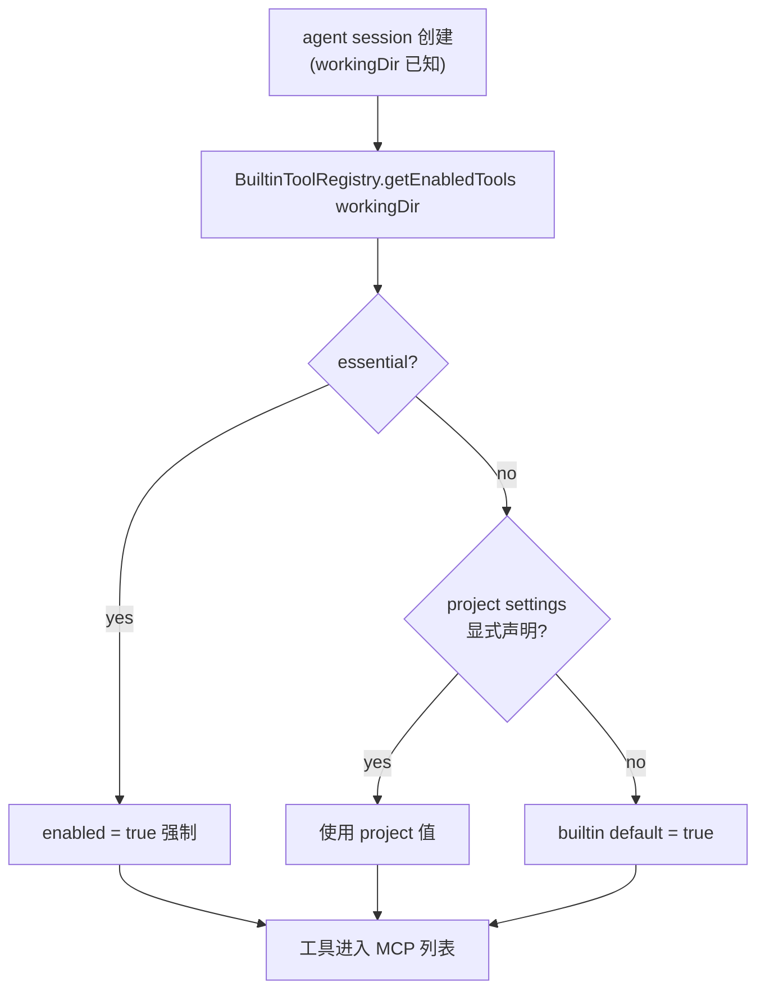

# Builtin tools system

xdt-maker 内置 MCP 工具的项目级开关架构与 Phase 1 实施计划。

> **History**:本文 v1 名为 "Plugin system",使用 Plugin / PluginRegistry / `xdtMaker.plugins`,UI 走独立 Settings tab,含用户级 toggle。MR !85 review 反馈后调整为当前版本,主要变化:rename → 内置工具 / BuiltinTool;砍用户级 toggle;UI 改放 Connections section 内;essential 工具不显示;`xdt_helper` 拆出 `collab`;toggle 后增加"重启当前会话"按钮。变更原因见各小节及 [Decisions log](#decisions-log)。

## Problem

Cindy 在 desktop main 进程里硬编码注入了一批内置 MCP（`lizi_jira` / `lizi_feishu` / `lizi_confluence` / `lizi_google` / `lizi_scheduler` / `lizi_memory` / `cindy_helper` / `lizi_xd_service` / `lizi_feishu_bot` / `art`）。当下游项目（如 work23）已经为某个外部系统建立了自有通道（本地脚本 + skill + 强流程）时，无法关闭对应的内置 MCP，导致：

- **流程语义丢失**：模型偏向更"轻"的 MCP 路径，绕过 skill 里定义的强流程（如 Jira 状态变化必须同步 WebUI、附件必须看完再下结论、Art Subtask 必须三步走等）。表现为"调用看似成功但单子状态不对/前端不更新"。
- **鉴权身份分裂**：MCP 走 xdt-maker 内 OAuth 身份，skill 走本地 token；同一项目两条通道往同一实例写不同人的操作记录。
- **偶发 OAuth 失败**：MCP 的 OAuth 状态间歇性失效时，模型选错通道就直接报错出来——感知为"jira 偶发调不通"。

根因是 **host（xdt-maker）没把"哪些 MCP 暴露给 agent"的决策权下放给项目**。仅在 CLAUDE.md 里加规则、或在 PreToolUse hook 里拦截，都是治标——只要工具列表里有，模型就有可能调。

## Naming

不叫 "plugin" 而叫 **"内置工具 / BuiltinTool"**。原因：

- Claude Code 2.0 官方 `plugin` 体系已存在，语义是 commands / skills / hooks / MCP 打包 + marketplace 安装，跟本期"内置 MCP 的项目级开关"完全不是一回事。混用会让用户和后续 maintainer 困惑。
- 当前能力范围就是 MCP 工具，直白命名避免过度承诺。
- settings key / IPC channel / 文件夹 / i18n 全部跟随 `builtinTools`，不留 `plugin` 遗留。

## Goals

1. **项目级开关**：项目可在 `.claude/settings.json` 里声明禁用某个内置工具，agent session 启动时该工具的 MCP 不进入 capability 列表。
2. **infrastructure 工具保护**：`memory` / `xdt_helper` / `scheduler` 即使被显式禁用也忽略（host 基础设施）。**UI 上完全不显示**——既然不能关，显示出来只增加认知负担。
3. **接口为未来扩展预留**：工具的 capability 字段一次定义好（mcps / skills / hooks / uiPanels），但 Phase 1 只实装 `mcps`。
4. **不引入 hub / 分发基础设施**：Phase 1 全部 `source: 'builtin'`。

## Non-goals (Phase 1)

- **用户级全局开关**（砍掉）。理由：work23 痛点是项目级冲突，不是用户从不想用某个工具；暴露用户级 toggle 会让用户"全局关 jira 后在某个还想用的项目抓瞎"，增加自己绕自己的可能。如果将来真出现"我所有项目都不想用 X"的场景，再单独立项。
- Tool hub（分发、下载、签名、审核、沙箱）—— 见 [Phase 2](#phase-2-tool-hub).
- 加载 `source: 'local'` 的本地未签名工具。
- **运行时 capability 热失效**。toggle 后只对**新 session** 生效。Codex 尤其硬：out-of-process，工具列表 spawn 时锁死，绝对不可热更新。
- skills / hooks / uiPanels capability 的实装。
- `getIdentity()` 的实装——接口预留，不接线。
- 每工具的调用统计 UI。
- work23 的临时 PreToolUse hook 兜底。

## Design principles

- **不改 `packages/maker-core`**：现有 `LiziMcpProvider` 已经有 `isEnabled(ctx)` 钩子，`ctx.workingDir` 在 agent session 启动时可用，所有策略留在 desktop host 层。
- **两层优先级 + essential bypass**：`essential bypass (always on) → project (.claude/settings.json) → builtin default (true)`。
- **toggle 只对新 session 生效，配 "重启当前会话" 按钮兜底**：纯文字 toast 提醒不够强；Codex 工具列表 spawn 时锁死必须显式重启会话。
- **未知字段容错**：未知工具 id、坏 JSON、缺失字段全部 log warning + 走默认，不让 settings 错误阻断 agent 启动。
- **UI 不显示 loading 态**：本地数据读取，符合 CLAUDE.md 规则 12——数据未到时父组件预取或先空白，到了一次性渲染，禁止"loading 文字 → 列表"视觉跳变。

## Architecture

### 数据契约

**BuiltinTool 接口**（capability 字段一次定义好，Phase 1 只实装 `mcps`）：

```ts
interface BuiltinTool {
  id: string                              // 'jira' | 'feishu' | 'collab' | ... 稳定标识,settings key
  name: string                            // 'Jira' 人类可读
  description: string
  version: string                         // '1.0.0' 起步
  source: 'builtin' | 'hub' | 'local'     // Phase 1 全部 'builtin'
  essential?: boolean                     // true 时不可禁用,且 UI 不显示
  capabilities: {
    mcps?: LiziMcpProvider[]              // Phase 1 唯一实装
    skills?: unknown[]                    // 预留
    hooks?: unknown[]                     // 预留
    uiPanels?: unknown[]                  // 预留
  }
  getIdentity?(): Promise<string | null>  // 预留,Phase 1 不实装
}
```

**项目级 settings**（`<project>/.claude/settings.json`）：

```jsonc
{
  "xdtMaker": {
    "builtinTools": {
      "jira":       { "enabled": false },
      "confluence": { "enabled": false }
    }
  }
}
```

**没有用户级 prefs 文件**。Phase 1 不写 `tool-prefs.json` 之类的 userData 文件，所有 override 来自项目 `.claude/settings.json`。

### Enable 决策流



### 模块边界

```
apps/desktop/src/main/maker-host/builtin-tools/        ← Phase 1 新增
├── types.ts             BuiltinTool / capabilities 接口
├── builtin-tools.ts     把现有 MCP 包成 BuiltinTool[] (含 xdt_helper / collab 拆分)
├── settings-reader.ts   readProjectBuiltinToolSettings(workingDir) + mtime 缓存
├── tool-registry.ts     BuiltinToolRegistry.isEnabled(id, workingDir) 含 essential 兜底
└── index.ts             createBuiltinToolRegistry(deps)

apps/desktop/src/main/mcp-integrations/mcp-providers.ts   ← 改造
  createDesktopMcpProviders 从 registry 派生 LiziMcpProvider[]
  xdt_helper MCP 拆出 collab 子 server

apps/desktop/src/renderer/components/settings/
  ConnectionsSection.tsx                                  ← 改造
    在已有 Connections section 里加 "内置工具" 子段落,
    不新建 Settings tab,不新建 PluginsSection 文件

packages/maker-core/                                      ← 不动
  buildMcpServers() 继续走 provider.isEnabled(ctx) 钩子
```

**关键不变**：maker-core 不感知 BuiltinTool 抽象，desktop host 在构造 provider 时把 gate 包进 `isEnabled` 闭包里。将来若有 CLI/web 等其它 host，可自行实现策略，maker-core 无需改动。

## Implementation plan (Phase 1)

### 文件清单

| 类型 | 路径 | 说明 |
|---|---|---|
| 新建 | `apps/desktop/src/main/maker-host/builtin-tools/types.ts` | BuiltinTool / Capabilities 接口 |
| 新建 | `apps/desktop/src/main/maker-host/builtin-tools/builtin-tools.ts` | 把现有 MCP 包成 BuiltinTool[],含 `xdt_helper` / `collab` 拆分 |
| 新建 | `apps/desktop/src/main/maker-host/builtin-tools/settings-reader.ts` | 读项目 settings + mtime 缓存 |
| 新建 | `apps/desktop/src/main/maker-host/builtin-tools/tool-registry.ts` | essential bypass + project override |
| 新建 | `apps/desktop/src/main/maker-host/builtin-tools/index.ts` | `createBuiltinToolRegistry(deps)` |
| 修改 | `apps/desktop/src/main/mcp-integrations/mcp-providers.ts` | `createDesktopMcpProviders` 从 registry 派生;`xdt_helper` 拆出 `collab` 子 server |
| 修改 | `apps/desktop/src/main/maker-host/index.ts` | 接入 `builtinToolRegistry`(L309 / L327 附近) |
| 修改 | `apps/desktop/src/main/maker-ipc/register.ts` | 3 个 IPC:`builtinTools:list(workingDir)` / `builtinTools:setProjectEnabled` / `builtinTools:restartActiveSession` |
| 修改 | `apps/desktop/src/preload/*` | 暴露 `window.api.builtinTools.*` |
| 修改 | `apps/desktop/src/renderer/components/settings/ConnectionsSection.tsx` | 加 "内置工具" 子段落,列出 non-essential 工具 + 项目级 toggle |
| 修改 | `apps/desktop/src/renderer/i18n/*.json` | zh / en 文案 |
| 修改 | `agent-use/docs/*` | 项目级 builtin tool 配置文档段落;改完跑 `pnpm sync:agent-instructions` |

**MR !85 的 v1 实现需要相应调整**：

- `apps/desktop/src/main/maker-host/plugins/` → 整体迁到 `builtin-tools/` 并 rename 内部符号
- `apps/desktop/src/renderer/components/settings/PluginsSection.tsx` → **删除**，UI 改放 `ConnectionsSection.tsx` 子段落
- `SettingsView.tsx` 新增的 `plugins` tab 注册 → **回滚**
- userData 下的 `plugin-prefs.json` 读写 + 相关 IPC → **删除**

### Essential 名单（UI 不显示）

确认锁定不可禁用、UI 不显示：

- `memory` —— 跨 agent 长期记忆，禁用会破坏 memory 子系统（MCP namespace: `lizi_memory`）
- `xdt_helper`（兼容设置 ID）—— Cindy host 能力宣告与 team / history 工具入口，agent 通过它查 host 提供了什么能力（MCP namespace: `cindy_helper`）
- `scheduler` —— `ScheduleWakeup` / `/loop` 等核心调度依赖（MCP namespace: `lizi_scheduler`）

**xdt_helper / orca 拆分**：`send_to_session`(session handoff 原语)已迁入 essential 的 `cindy_helper` 常开(skill 永不断)；9 个 team 工具拆到独立的 `lizi_orca` server 成为非 essential 可关插件("协同模式"开关 gate 它)。旧 `lizi_collab` server 已删除。理由:team 工具是功能性协同,可关;`send_to_session` 是 skill 基础设施,不可关。

项目 settings 显式禁用 essential 工具时,log warning 并忽略;UI 上根本不列出 essential 工具,避免"显示了但点不动"。

### IPC 契约

```ts
// main → renderer

// list 必须带 workingDir,否则 project override 无法解析
'builtinTools:list'(workingDir: string): Promise<Array<{
  id: string
  name: string
  description: string
  source: 'builtin' | 'hub' | 'local'
  effectiveEnabled: boolean                  // 当前项目下生效状态
  projectOverride?: { enabled: boolean }     // 项目 settings.json 是否显式声明
}>>
// 返回值已过滤掉 essential = true 的工具

// 项目级 toggle 需要写 .claude/settings.json (而非 userData)
'builtinTools:setProjectEnabled'(
  workingDir: string,
  id: string,
  enabled: boolean | null    // null = 移除 override,回退到默认 true
): Promise<void>

// toggle 后兜底:让用户一键重启当前会话使其生效
'builtinTools:restartActiveSession'(sessionId: string): Promise<void>
```

### UX 细节

- `ConnectionsSection` 内增加 "内置工具" 子段落，只列 non-essential 工具
- 每个工具一行：名称 / 描述 / toggle 开关 / "本项目"标签
- toggle 后：toast "已禁用 X，新会话生效" + 行内出现"重启当前会话"按钮（Codex 会话尤其需要，工具列表 spawn 时锁死）
- 切换 tab/页面时**不显示 loading 态**：数据由父组件（或 `ConnectionsSection` 自身一次性）预取，组件渲染时已就绪；禁止"loading 文字 → 列表"视觉跳变（CLAUDE.md 规则 12）

### 工期预估

- Day 1-2：核心抽象（types / registry / settings-reader）+ 重构 mcp-providers + `xdt_helper` / `collab` 拆分
- Day 3：IPC + preload + `ConnectionsSection` 内嵌 UI
- Day 4：i18n + 跨平台 smoke + work23 真实场景验证
- Day 5：文档同步 + 收尾

**总计 ~5 个工作日**（单人）。

## Test plan

**单元**（就近 `__tests__/`）：

- `settings-reader`：合法 JSON / 坏 JSON / 缺字段 / mtime 缓存命中
- `tool-registry`：essential bypass（显式禁用被忽略）/ project override / 未知 id 容错 / collab 拆分后 essential / non-essential 行为正确

**手动 smoke**（merge 前必须勾选，由 MR 提交者明确说明在哪个平台验过）：

- **work23 真实场景**：在 work23 仓库 `.claude/settings.json` 加 `{"xdtMaker":{"builtinTools":{"jira":{"enabled":false}}}}`，`pnpm restart:desktop:remote`，开新 agent session，确认 `mcp__lizi_jira__*` 工具不在工具列表里
- **ConnectionsSection UI**：toggle jira off → toast + "重启当前会话"按钮 → 点重启后新 session 验证消失；toggle on 后新 session 又出现；切 tab 无 loading 闪屏
- **Essential 不显示**：UI 上 `memory` / `xdt_helper` / `scheduler` 完全不出现；手动在 settings.json 写 `memory: {enabled: false}` → 日志 warning，实际仍 enabled，工具仍可调用
- **collab 拆分验证**：`{"xdtMaker":{"builtinTools":{"collab":{"enabled":false}}}}` → `send_to_session` 工具消失，但 `get_capabilities` 和 team 工具仍可调用

**跨平台**（CLAUDE.md 规则 15）：macOS + Windows 都跑一遍项目 settings 读 + UI toggle，确认所有路径都走 `path.join`，无硬编码 `/` 或 `\\`。

## Phase 2: Tool hub

**单独立项，不在本期范围**。受众确认为 xindong 内部（蹭飞书 OAuth 鉴权，门槛低）。Phase 2 引入 `source: 'hub' | 'local'` 的工具，Phase 1 framework 已经留好接口（`BuiltinTool.source` 字段、capabilities 多类型）。

| 维度 | 主要工作 |
|---|---|
| 分发基础设施 | hub 服务端（可挂在 `apps/server`）、版本存储、CDN（国内访问）、签名验签 |
| 信任 / 安全模型 | 第一方 vs 社区工具；权限声明 manifest（fs / net / safeStorage 访问） |
| 沙箱 | Electron 跨平台沙箱难做彻底，现实选择 "review + 签名 + 权限提示" |
| API 兼容承诺 | BuiltinTool API semver、breaking change 迁移路径 |
| 审核 | 谁 review、自动还是人工、恶意工具下架机制 |

**启动条件**：Phase 1 上线后出现 ≥2 个真实第三方工具需求（如 work23 把 use-jira 反向包成工具、某项目发布自有 prompt pack），再来定形态。否则容易过度设计。

**注**：如届时发现 Claude Code 2.0 官方 `plugin` 体系 / marketplace 已能覆盖这些需求，优先用官方方案，不再造轮子；本期"内置工具"框架与官方 plugin 体系是**互补关系**——内置工具管 host 自带能力的开关，官方 plugin 管第三方扩展的安装。

## Decisions log

| 决策 | 选择 | 理由 |
|---|---|---|
| **命名** | **"内置工具 / BuiltinTool"，非 "Plugin"** | 避免与 Claude Code 2.0 官方 plugin 体系（commands / skills / hooks / MCP 打包 + marketplace）撞概念；明确范围只是 MCP 工具开关 |
| 抽象层位置 | in-place 在 `apps/desktop/src/main/maker-host/builtin-tools/` | 零包管理成本；Phase 2 hub 真要上时再抽出独立 package 也不晚 |
| 配置位置 | `.claude/settings.json` 加 `xdtMaker.builtinTools` | 复用 Claude Code 标准位置；项目已在维护这个文件 |
| 过滤时机 | provider 注册阶段 wrap `isEnabled` | 比 PreToolUse hook 更彻底——工具不进 capability 列表，模型连"看到"的机会都没有，省 token |
| **用户级 toggle** | **砍掉，只保留项目级** | work23 痛点是项目级冲突；用户级 toggle 会让用户"全局关 X 后在某项目抓瞎"，增加自己绕自己的可能 |
| **UI 位置** | **Settings → Connections 内部 section，不新建 tab** | Connections 已是"外部系统通道管理"心智，内置工具是同一心智的另一面，放一起连贯；新建 tab 增认知负担 |
| **Essential 工具 UI 不显示** | 列表过滤掉 essential | 既然不能关，显示出来只让用户困惑"为啥点不动"；过滤掉更清爽 |
| **xdt_helper / collab 拆分** | 协同模式开关和 worker 管理统一走 `cindy_helper` team 工具；`collab` 只保留 `send_to_session` 通用 handoff（non-essential） | `get_capabilities` 是 infrastructure，必锁；`send_to_session` 是功能 control，可关 |
| **Toggle 后兜底** | toast + "重启当前会话"按钮 | 纯文字提醒不强，用户容易以为立即生效；Codex 工具列表 spawn 时锁死，必须重启会话才生效 |
| Toggle 语义 | 只对新 session 生效 | 避免运行中 capability 突变导致工具调用半截失败；Codex out-of-process 根本无法热更新 |
| Essential 名单 | `memory` / `xdt_helper`（narrow）/ `scheduler` | host 基础设施，禁用会破坏其它子系统 |
| getIdentity | Phase 1 仅接口预留 | 收敛 Phase 1 范围；避免每个 MCP 都要做身份查询适配 |
| hub 受众 | xindong 内部 | 蹭飞书 OAuth，复杂度砍掉一半 |
| work23 临时兜底 | 不做 PreToolUse hook | 用户决定直等架构落地 |
| **MR !85 跟进** | 按本版重做实现 | review 反馈方向性 5 条 + 实现 4 条；先按本版重写，避免重复 polish |
