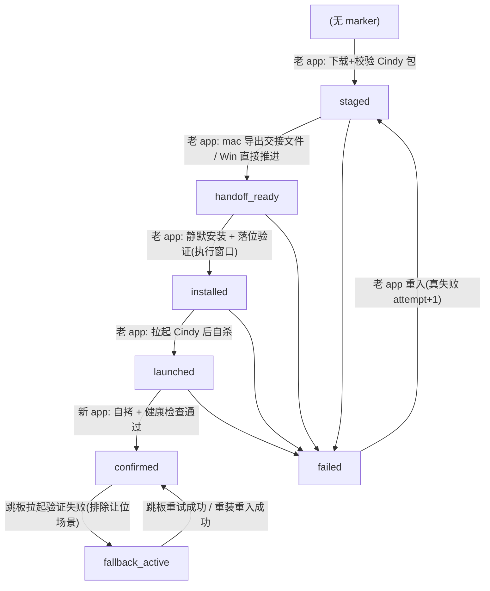

# Cindy 品牌迁移:marker 状态机、首启自拷与交接文件设计

> 状态:v3(B′ 方案,2026-07-13 拍板)。配套文档:[`inventory.md`](./inventory.md)、[`repo-split-and-handover.md`](./repo-split-and-handover.md)。
>
> 背景:XDMaker 彻底改名为 Cindy(exe 名、appId、userData 目录名全换),存量用户通过一次热更无感迁移。总体架构:老渠道发一个仍是 xdt-maker 身份的**过渡版**;过渡版下载 Cindy 完整包后**在自己进程内**静默安装(Cindy 装到不同目录,与老 app 零文件冲突)并拉起 Cindy;userData 拷贝由 **Cindy 首启自拷**完成。数据只拷不删,失败可重入重试。
>
> **v2 → v3 的关键变化(B′)**:砍掉独立迁移执行器(Rust `--migrate`)与整套跨进程协调(`.migrating` 锁、心跳、pid 容差、30 分钟粗筛、接管三条件)。理由:执行器存在的唯一前提是"替换运行中 app 的文件必须等它退出",而 Cindy 装到**不同安装目录**,老 app 活着就能装;userData 拷贝挪到 Cindy 首启后,拷贝窗口内只有单一写入者,活性判定收敛为一条**进程探测**。状态机从 9 态缩到 7 态,`installing/copying/copied` 消失,新增 `installed`。

## 1. 设计原则

1. **数据只拷不删**:老 userData 永久保留(老程序卸载也不碰它),任何一步失败都能回到老 app、下次重试。老目录即逃生舱本体——Cindy 升级自己目录里的库,老库永远停在迁移那一刻,不存在跨 app schema 耦合。
2. **可重入**:整个流程由 marker 状态机驱动,两方(老 app / 新 app)崩在任何一步,重启后都能从确定的位置继续或重来。Cindy 首启拷贝的崩溃恢复模型是**整体重拷**(journal 标记 + 源目录冻结 = 幂等),不做断点续传。
3. **单写入者消灭跨进程协调**:安装 + 拉起在老 app 进程内同步完成;拷贝在 Cindy 首启单进程完成(此时老 app 已退出、新目录尚无 sentinel)。不存在"第三方死在半路谁接管"的问题,锁 / 心跳 / 时限判定整体不需要。
4. **复用已验证组件**:Windows 装新 app 直接静默跑 Cindy 正式 NSIS 安装包(`/S`),与新用户首装同一条路径;mac 解压 .app zip 落 /Applications。
5. **活性判定 = 进程探测**:重入前唯一要确认的是"Cindy 进程是否在跑"(首启自拷期间进程必然存活);在跑就不介入,不在跑立即重入,无时间阈值。
6. **解耦边界明确**:macOS safeStorage 重封装只能由两端 app 完成;marker schema 是两方共享契约,`schemaVersion` 只增不改。

## 2. 角色与平台承载

| 角色 | Windows | macOS |
|---|---|---|
| 过渡版(老渠道终点版,xdt-maker 身份) | Electron app;进程内 spawn NSIS `/S` 装 Cindy | Electron app;进程内 `ditto -xk` 解压 Cindy.app |
| 新 app | Cindy(正式 NSIS 装出);首启自拷老 userData | Cindy.app(/Applications);首启自拷老 userData |

## 3. Marker 状态机

### 3.1 文件位置

- **主 marker**(单一事实源):`<old-userData>/migration/state.json`
- **新侧 receipt**(Cindy 健康检查凭证 + 健康启动计数):`<new-userData>/migration/receipt.json`
- **first-run sentinel**(Cindy 首次健康启动后写):`<new-userData>/migration/first-run-ok`
- **拷贝 journal**(Cindy 首启自拷的幂等标记):`<new-userData>/migration/copy-journal.json`

所有写入原子(临时文件 + rename)。marker 损坏按"不存在"处理。

### 3.2 Schema(v1)

```json
{
  "schemaVersion": 1,
  "migrationId": "uuid — 一场迁移一个,重试不换",
  "state": "staged | handoff_ready | installed | launched | confirmed | failed | fallback_active",
  "attempt": 1,
  "maxAttempts": 5,
  "updatedAt": "ISO8601",
  "updatedBy": "old-app | new-app",
  "source": {
    "app": "xdt-maker",
    "version": "0.0.x",
    "installDir": "…",
    "userDataDir": "…",
    "uninstallDisplayNamePrefix": "xdt-maker(Cindy 定位老卸载键用,由身份配置生成)"
  },
  "target": {
    "app": "cindy",
    "version": "…(重入时与当前期望版本比对,不符则作废重 stage,见 3.4)",
    "payloadPath": "…", "payloadSha256": "…",
    "installDir": "…", "userDataDir": "…", "exeName": "cindy.exe"
  },
  "handoff": { "path": "…", "createdAt": "…", "sha256": "…" },
  "lastError": { "code": "…", "message": "…", "at": "ISO8601" }
}
```

`handoff` 仅 macOS;`lastError` 无错误时为 `null`。

### 3.3 状态转移、合法写入者矩阵



**合法写入者矩阵**(写入前必须校验"当前 state 是本次转移的合法前驱且自己是合法写入者",非法则放弃写入并记日志):

| 目标 state | 合法写入者 | 合法前驱 |
|---|---|---|
| `staged` | old-app | ∅ / `failed` / `staged`(重 stage)/ `fallback_active`(重装重入) |
| `handoff_ready` | old-app | `staged` |
| `installed` | old-app | `handoff_ready`(执行窗口:安装成功且 expectFile 落位) |
| `launched` | old-app | `installed`(拉起 spawn 成功,随即 forceQuit) |
| `confirmed` | new-app(from `launched`);old-app(from `fallback_active` 跳板重试成功;或 sentinel override 从任意态,见 3.4 铁律) | 见左 |
| `failed` | 当步执行方(old-app / new-app) | `staged` ~ `launched` |
| `fallback_active` | old-app | `confirmed` |

> 实现基准:`apps/desktop/src/main/migration/transitions.ts`(唯一矩阵来源,穷举单测锁定)。

差异点:

- `staged` 推进前校验 `target.version` 是否等于**当前构建期望的 Cindy 版本**——老渠道发过 N+2 后,老 marker 里 N+1 时代的 payload 即使 sha 完好也作废重下(评审 P1-5)。
- macOS packaged app 只有在 `app.isInApplicationsFolder()` 为真时才允许 stage / 执行迁移；App Translocation 临时挂载下直接跳过，避免把短生命周期的 bundle 路径写入 `source.installDir`，导致首启失败时无法回拉老 app。
- `handoff_ready` → `installed` → `launched` 是执行窗口内的同步链条(用户点"重启完成升级"触发),中途失败写 `failed(INSTALL_FAILED | LAUNCH_FAILED)`,老 app 继续正常运行等下轮重入。

### 3.4 重入与重试规则

**老 app(过渡版)每次启动时读 marker:**

- `confirmed` → **跳板模式**:
  1. 先探测 Cindy 是否已在运行(进程枚举)——**已在运行即视为成功,静默退出**;
  2. 未运行则 spawn Cindy 并验证存活;spawn 后目标进程短时退出时,必须再次执行第 1 步区分"单实例让位退出"(视为成功)与真崩溃(评审 P0-1,必现场景);
  3. 确认真拉不起来 → 提示「Cindy 启动失败,本次以 XDMaker 继续运行」,置 `fallback_active`,老 app 正常运行。
- `fallback_active` → 每次启动先重试跳板(含让位探测),成功 → 回写 `confirmed`;失败继续 fallback。**该状态不抑制老渠道热更**——老渠道可发修复过渡版,其迁移编排检测到 `fallback_active` 时走**重装重入**(`staged ← fallback_active` 合法):重新下载当前 Cindy 包 → 执行窗口重装 + 拉起;Cindy 首启看到自己 userData 已有 sentinel 会跳过自拷,天然 install-only,不碰已有新数据(评审 P0-3:fallback 必须有出路,修复版经老 app 热更抵达)。已知代价:fallback 期间写入老 userData 的增量与 Cindy 侧分叉,受防覆盖铁律约束不重拷,接受丢失或未来定向补拷。
- `failed` → 重入:`lastError` 非空的真失败 `attempt+1`;重入起点:payload 校验(含版本比对)→ handoff **无条件重新导出**(见 §6)→ 重跑。同版本 `attempt ≥ maxAttempts` → 停止自动重试,UI 报错 + 日志路径；若 manifest 下发新 payload 版本,版本作废判定优先于 give-up,重 stage 时将 attempt 重置为 0，让 N+2 修正版获得独立完整预算。
- `staged` / `handoff_ready` → 这两个状态始终归老 app 所有,正常继续编排;`handoff_ready` 且同版本 payload 在盘时**快速重挂执行窗口**(app 重启后 banner 重现,不重复下载、不重复导出交接)。
- in-progress(`installed` / `launched`)→ 上一实例执行到一半死了,或 Cindy 尚在首启确认中。判定只有一条:
  - **Cindy 进程在跑** → 不介入(首启自拷/健康检查进行中,进程探测即活性);
  - **不在跑** → 立即重入(无 lastError 的纯中断不计 attempt;带 lastError 计数)。重入需先把 marker 合法降级到 `failed`(矩阵不允许 `staged ← in-progress`),lastError 原样保留。
- 无 marker → 正常启动。

**防覆盖铁律**(sentinel 写入与 confirmed 回写之间崩溃即触发的**预期路径**):

新 userData 目录存在 **first-run sentinel** 时,任何一方都禁止删除/覆盖该目录。老 app 读到 marker ≠ `confirmed` 但新侧有 sentinel → 直接把 marker 置 `confirmed`,以新侧事实为准(`fallback_active` 豁免——它是 confirmed 之后的已知状态,sentinel 存在是预期而非分歧,reconcile 只会跳板再失败空转,其出路是上文的重装重入)。

### 3.5 并发与热更抑制

- B′ 下不存在执行器锁与心跳;唯一的跨进程并发面是"老 app 重入 vs Cindy 首启",由进程探测裁决(§3.4)。
- **执行窗口内老 app 是单实例**(Electron single-instance lock),不存在两个老 app 同时推进 marker。
- campaign staging 与执行窗口共享进程内互斥门：用户点击执行时先等待正在重 stage 的 campaign 收敛；执行窗口期间新 campaign 跳过并留到下轮 manifest 轮询，避免点击撞上 marker 短暂降级为 `failed` 的中间态。
- **热更抑制窗口**:仅执行窗口(安装 + 拉起)同步进行中抑制普通热更检查(进程内 in-flight 标记,非 marker 判定);其余状态均不抑制。
- 已知残余竞态(接受):marker=`launched`、Cindy 首启拷贝进行中,用户手动点老快捷方式 → 跳板判 wait → 老 app 正常运行并写老 userData。首启 DB 探针对每个库独立执行 open / WAL checkpoint / `quick_check`,任一异常只告警并继续其它账号库，待实际账号登录后由 `ensureReady` 的备份恢复路径处理，避免单个历史坏库永久卡住整机迁移。

## 4. userData 拷贝规则(Cindy 首启自拷)

执行者:**Cindy 首启**(`--migrated-from` 触发,sentinel 不存在时)。实现:`apps/desktop/src/main/migration/userDataCopy.ts`。

- **前置**:等老 app 进程退出(老 app 拉起 Cindy 后随即自杀,通常秒级;30s 超时 → `failed(OLD_APP_WONT_EXIT)`)。
- **journal 幂等**:`copy-journal.json` `copying → done`;首启看到 `copying`(上次半途崩溃)→ 从头重拷(覆盖写,源目录冻结故幂等)。只要 first-run sentinel 尚未落盘,即使 journal 已是 `done` 也不信任并整体重拷——覆盖“拷完后、确认前被强杀,用户回老 app 继续产生增量”的窗口；健康检查失败退出前仍 reset journal。
- **preflight**:预扫描(按排除清单统计文件数 + 字节)→ 目标卷剩余空间 ≥ 待拷字节 × 1.2,不足 → `failed(INSUFFICIENT_DISK)`,UI 明确提示;余量探测不可用时降级放行(仅告警)。
- **进度**:逐文件回调(预扫描给出总数),首启界面可展示进度——上万小文件在机械盘上可达分钟级,无进度用户会强杀(强杀正是半成品的主要来源)。
- 拷贝对源只读;遇 symlink/junction 一律跳过并记日志(managed-dir-links 由 Cindy 首启自愈重建)。
- 直接拷入新 userData(Electron 已为本进程创建该目录;此时窗口未建,Chromium 水位数据尚未生成,覆盖写安全)。不用 tmp+rename——原子性由 journal 整体重拷模型承担。

### 4.1 迁移范围(基于 userData 实勘,2026-07-09 事实核查修订)

**必迁(核心数据)**:

| 内容 | 说明 |
|---|---|
| `xdt-maker-{userId}.db`(+ `-wal` / `-shm`) | 主 SQLite 库,最大体积项。是否借迁移改前缀见 §10 遗留待确认项 |
| `safe-storage/` | 全部 `.enc` + 伴随 `*_connection.json` / `google_accounts.json` / `*_expiry.json`(审计确认所有 safeStorage 密文均落此目录,无散点) |
| `codex-home/`、`claude-home/` | agent home + 登录态;`codex-home/sessions/` 大体积但属用户数据 |
| `dialogues/`、`brain/`、`maker-memory/`、`learn/`、`skillhub*/` | 对话工作区 / brain / memory / learn / 已装 skill |
| `remote-ssh/`(**仅 `known-hosts.json`**) | SSH 私钥在 `~/.ssh/`,**不在 userData、不受迁移影响** |
| `schedule-hooks/` | 无 workingDir 定时任务的 hook 脚本。⚠️ DB 里 schedule 命令存的是**老 userData 绝对路径**,同类还有 IM 会话 workingDir 列——首启健康检查后由 Cindy 做一次**路径重写**(失败不阻塞 confirmed,靠老目录永久保留兜底;首版不启用) |
| `im-working-dir/` | IM bot 会话 workingDir,内容物不可再生 |
| `lizi-mivo/tokens/`、hook 绑定 json、voice-input 配置与录音 | 凭证与用户配置 |
| userData 根下全部散落文件(`*-settings.json`、`layout`、`slack-hook.json`、`canary-flag.json` 等) | 根目录文件默认全拷 |
| `cc-agent/`(各 IM media、`images/`、`shared-media/`) | 会话历史引用的本地媒体,不可再生,必迁;preflight 体积主变量 |
| `browser-runtime/browser/XDMaker/user-data/`(受管浏览器 profile) | 承载浏览器自动化登录态,必迁(profile 目录名 `XDMaker` 是 `MANAGED_PROFILE` 常量,不改名) |

**排除(可再生/运行时独占)**:userData 根级 `Singleton*`(Cindy 当前进程已持有的 Electron singleton lock/cookie/socket,禁止被老 profile 覆盖)、`logs/`、`updates/`、`cache/`、`diagnostics/`、`claude-code/<version>/` 与 `codex/<version>/`(agent 二进制,新 app 按 pin 重下)、`prepared-android-platform-tools/`、`agent-island/` 与 `voice-input/` 下的原生 helper 二进制、`file-browser` 远程缓存、`browser-runtime/media/` 与 profile `user-data/` 内的 Chromium 缓存子目录、Chromium 主 profile 缓存(`Cache/`、`Code Cache/`、`GPUCache/`、`DawnCache/`、`Crashpad/`、`blob_storage/`)、`migration/state.json`(老侧 marker,拷过去会污染新侧语义;`migration/handoff.json` 必须随拷)。

**Chromium profile 中必须保留的例外**:`Local Storage/`、`IndexedDB/`、`Session Storage/`(公告已读水位等 renderer 数据)。

**排除清单的唯一生成源**:`apps/desktop/src/main/migration/copyExcludes.ts`(禁止第二份手写清单);glob 语义显式定义——**锚定于老 userData 根**(非任意深度匹配,嵌套目录用完整相对路径列出)、`*` 单段、`**` 任意深度(尾部 `**` 至少吞一段)、Windows 大小写不敏感;一致性单测锁定(清单 ↔ 必迁前缀互不误杀)。

## 5. Cindy 首启健康检查(`--migrated-from=<source.app> --legacy-user-data=<old-userData>`)

launch args 带老 userData 路径(评审 P1-4:Cindy 不硬编码推导老目录,回写老 marker / 读 source 信息全经此参数)。顺序:

0. 等老 app 进程退出(§4 前置);
1. **自拷**:老 userData → 新 userData(§4;已有 sentinel 的非首启不会进入本流程,天然 install-only);
2. localDb 打开探针(逐库隔离地尝试可写 checkpoint 与 SQLite `quick_check`；open / pragma / close 任一异常均只告警并继续,恢复与 drizzle 迁移到 HEAD 由登录后的 ensureReady 正常路径执行);
3. (mac)交接文件导入:全部条目用新 safeStorage 重加密落盘;
4. safe-storage 可解密探针(win 验 DPAPI 同用户可用 / mac 验交接重加密结果可读;**纯数据完整性,非登录态**——v3.1 起 Cindy 1.0 直接接新 auth server,老登录态对新 server 无效,登录不再是迁移成败判据);
5. 写 first-run sentinel → 写 receipt(含 `legacyUserDataDir`、`healthyLaunchCount=1`、`confirmedAt`)→ 老 marker 置 `confirmed` → 删除**两侧**交接文件;
6. DB 绝对路径重写(§4.1 schedule/IM workingDir 项,失败不阻塞;首版不启用);
7. 之后每次健康启动 receipt `healthyLaunchCount` +1。

**confirmed 之后的首登与老库认领**(v3.1,Cindy 1.0 即新 auth server):健康检查只验收数据;应用随后正常启动,用户进入**新账号系统登录页**重新登录(§9 用户可见项 5)。新登录成功后,main 侧 `registerLocalDbIpc.beforeEnsureReady` 先取 (newUserId, email, feishuOpenId) → 读身份锚(`migration/identity-anchor.json`,随自拷带入)→ `findAnchorByIdentity` 排除当前新 UID,优先按 email 唯一命中、零命中时回退 feishuOpenId → 唯一命中则在 ensureReady 前复制重绑老库(`xdt-maker-<oldUid>.db` → `<当前db前缀>-<newUid>.db`,SQLite online backup + quick_check + 同卷原子落位 + 认领 sentinel);无命中 / 多命中安静走新用户分支、老库保留。复制/校验失败只告警并放行 `ensureReady` 创建新库,避免旧库问题永久锁死登录；旧库继续保留供手动认领。**不回滚迁移**——数据已 confirmed,failed 状态只属于数据迁移问题。

**老程序延迟清理**(缴械观察期,决策 §10-4):

- confirmed 后老程序保留但已缴械(跳板模式),同时是假阳性 confirmed 的本地逃生舱。
- 卸载触发条件(全部满足,由 Cindy 在启动后台检查):
  1. 距 `confirmedAt` ≥ 7 天 **且** `healthyLaunchCount` ≥ 3;
  2. 读老 marker **当前值 == `confirmed`**(`fallback_active` 期间绝不卸逃生舱);
  3. 无 xdt-maker 进程在跑(跳板可能正活着;有则本次跳过)。
- 执行前必须仍能读取与 receipt `migrationId` 一致且状态为 `confirmed` 的老 marker，并验证 receipt 中首启等待旧进程前捕获的可执行文件身份(dev/inode/size/mtime/birthtime)仍完全一致；缺失或变化一律 fail closed，避免静默卸载用户后来重装/覆盖到原路径的旧 app，实际执行前再比对一次缩小 TOCTOU 窗口。Windows 仅选择 `source.uninstallDisplayNamePrefix` 命中且 `InstallLocation` 与 `source.installDir` 精确一致的唯一卸载项，调其 `QuietUninstallString`；零/多候选均跳过。mac 只删除文件身份仍归属本次迁移的老 `.app`。**不碰老 userData**(已实查 installer.nsh:customUnInstall 只删快捷方式与右键菜单注册表)。失败下次重试。
- 最后兜底:老渠道 CDN `/xdt-maker/app/` 安装包永久保留,重装即回老 app + 老 userData 续上。

任何健康检查步骤失败:**先删新侧交接文件**(评审 P1-2)→ reset 拷贝 journal(§4)→ 写 `failed`(带对应错误码:`OLD_APP_WONT_EXIT` / `COPY_FAILED` / `INSUFFICIENT_DISK` / `HEALTH_CHECK_FAILED`),自杀退出,拉回老 app。

## 6. 交接文件(macOS safeStorage 重封装)

**为什么需要**:Electron `safeStorage` 在 mac 的密钥存于钥匙串条目 `"<appName> Safe Storage"`(隐式跟 app name 走——已核查);改名后 Cindy 解不开老密文,跨 app 读老条目会触发系统弹窗。Windows 走 DPAPI,不需要交接。

**范围**(2026-07-09 审计结论):`<old-userData>/safe-storage/` 目录**动态枚举全部 `.enc`** 解密导出;伴随的明文 json 随普通拷贝走,不进交接文件。**明确不进交接**:mac 系统钥匙串的 `"Claude Code-credentials"` 条目——它绑定 Claude Code 的名字而非 app 名,改名零影响。

**生成**:**每次进入 `handoff_ready` 前无条件重新导出**(评审 P1-3:失败重试间隙用户可能改了凭证,复用旧明文会覆盖新数据);`encryptedSha256` 仅作导入端 warning 日志,不做行为分支。

**删除**(评审 P1-2,覆盖 `failed` 长驻场景):

1. Cindy `confirmed` 时删两侧;
2. Cindy 健康检查失败自杀前删**新侧**;
3. 老 app 每次启动兜底:state ∈ {`failed`, `fallback_active`, `confirmed`} 或 `createdAt` 超 7 天 → 删**老侧**;
4. 交接文件随 §4 自拷到新侧(`migration/handoff.json` 在必迁清单),导入后即删;
5. receipt 已存在的 Cindy 后续启动幂等补删新旧两侧，覆盖 receipt/confirmed 落盘后、首次清理前崩溃的窗口。

**驻留窗口的诚实表述**:正常路径分钟级;失败路径上界 = 用户下次启动老 app(启动兜底删)。0600 权限、userData 内落盘,威胁模型与 `~/.codex/auth.json` 明文一致,符合 AGENTS 规则 23。

**格式(v1)**:`{ schemaVersion, createdAt, platform, sourceApp, sourceVersion, entries[{ store, relPath, contentType, plaintextB64, encryptedSha256 }] }`。

**复用约定**:导出/导入是两端 app 内的 `migration-handoff` 模块;下次迁移若不改 app name,不启用 handoff 即整段 no-op。

## 7. 执行窗口(老 app 进程内安装 + 拉起)

> v2 的"执行器 manifest"章节整体作废:没有执行器,就没有 manifest。执行窗口的输入就是 marker 本身。

用户点"重启完成升级"(热更 banner 复用)触发 `executeMigrationWindow`(`orchestrator.ts`):

1. 盘上 marker 必须是 `handoff_ready`(并发方已推进则放弃);
2. 复测 Cindy 进程不在跑(上轮 launched 的进程还活着则放弃);
3. **安装**:win = spawn `<payload> /S` 等退出码(10 分钟超时);mac = 清掉上次半成品 `.app` 后 `ditto -xk <zip> /Applications`;
4. 落位验证:win `<installDir>/<exeName>`;mac `<installDir>/Contents/MacOS/<exeName>` → `installed`;
5. **拉起**:spawn Cindy(win 直接 exe;mac `open <app> --args`),参数 `--migrated-from=<source.app> --legacy-user-data=<old-userData>` → `launched`;
6. 老 app forceQuit 退场,等 Cindy 首启确认。

任一步失败写 `failed(INSTALL_FAILED | LAUNCH_FAILED)`,老 app 继续正常运行(下轮 campaign 重入,handoff_ready 快速重挂)。

## 8. 渠道与版本策略

(与 v1 一致,要点:老渠道 `/xdt-maker/` manifest 钉过渡版即完成"钉住",字符串相等比较天然支持 N+2 修复;Cindy 走全新 `/cindy/` CDN 前缀,从 `1.0.0` 起版;canary 先行验证迁移;landing page 独立切换;`cindy://` 与 `xdt-maker://` 永久双注册。)

补充:老渠道发 N+2 后,存量 marker 中 N+1 时代的 `target.payloadPath` 经 §3.3 版本比对作废重 stage,不会装旧 Cindy 包。

## 9. 已知不可消除的用户可见项(进升级公告)

1. macOS Dock 固定图标失效(pin 的是老 .app 路径)。
2. macOS 麦克风等 TCC 权限重新授权(bundle id 变更)。
3. Windows 控制面板双条目约一周(缴械观察期);老快捷方式此期间点开即 Cindy。
4. 迁移体感:点"重启完成升级"后 Cindy 首启多一段拷贝进度(数据量大时分钟级)。
5. **必须重新登录一次**(v3.1):Cindy 1.0 接新账号系统,老登录态无法交接;首启 confirmed 后进入新登录页,登录成功后历史数据经身份锚认领自动挂回。

## 10. 产品决策

| # | 事项 | 决策 |
|---|---|---|
| 1 | 身份常量基线(2026-07-09) | `Cindy` / `cindy(.exe)` / `com.magiclizi.cindy` / `cindy://` / userData `Cindy`;**必须收敛为可配置单点**(§11) |
| 2 | ~~mac 执行器~~ | **作废(B′)**:无执行器,双平台安装/拉起在老 app 进程内完成 |
| 3 | 版本号 | Cindy 从 `1.0.0` 起步 |
| 4 | 老程序清理 | 缴械观察期 + 延迟卸载(7 天 + 3 次健康启动 + marker==confirmed + 无老进程 + 旧安装文件身份未变化),`fallback_active` 逃生舱见 §3.4 |
| 5 | 执行器改名 | 随决策 2 作废;xdt-updater 保持热更单一职责,Cindy 侧更新器命名由新仓库决定 |
| 6 | **B′ 方案(2026-07-13)** | userData 改名保留(拷贝到 `Cindy` 目录),拷贝执行者从独立执行器改为 **Cindy 首启自拷**;砍执行器/锁/心跳/接管判定;状态机 9 态 → 7 态 |
| 7 | **Cindy 1.0 即新 auth server(2026-07-14)** | 品牌迁移与账号系统切换合并为一跳;健康检查降为纯数据验收(verifyAuth → verifySafeStorage),登录+身份锚认领移到 confirmed 之后的应用内首登流程;email 一致性由新 auth server 保证 |

**遗留待确认**:DB 文件名前缀是否借迁移改为 `cindy-<userId>.db`(§11 `dbFilePrefix` + `legacyDbFilePrefixes[]` 已预留;改则认领器从旧前缀 online backup 到新前缀,不改则只完成 old uid → new uid)。

## 11. 身份配置单点(决策 1 附加要求)

`packages/maker-shared/src/brand-identity.ts`(构建期单点):`displayName`、`executableName`、`appId`、`bundleIdPrefix`、`primaryScheme`、`legacySchemes[]`、`userDataDirName`、`legacyUserDataDirNames[]`(orphan-reaper 等历史值表)、`cdnPrefix`、`updaterName`、`dbFilePrefix`、`legacyDbFilePrefixes[]`、`uninstallDisplayNamePrefix`。

- TS/Node 消费方(forge.config、main 常量、release/publish 脚本、smoke、迁移编排)统一 import。
- **构建期单点,不是运行时开关**:改任何字段仍 = 一次完整迁移(新渠道 + 两端 hook);收益是下次改名代码 churn 归零。
- B 类兼容锚点(`inventory.md` §2)以 `legacySchemes[]` / `legacyUserDataDirNames[]` / `legacyDbFilePrefixes[]` / 显式兼容代码承载,永不随主值变化。
- 三处硬编码 userData 路径消费点(usageIndexer、orphan-reaper 标记;codex-local-sessions 仅测试兜底)重构为从该配置派生,收割器同时匹配当前值 + 历史值表。

## 12. 修订记录

- **v2(2026-07-09)**:吸收双评审(架构 3P0/7P1/5P2、事实核查 48 条)。要点存档:跳板单实例让位(P0-1)、活性优先于时限(P0-2)、fallback 出路(P0-3)、锁 pid 复用 / handoff 无条件重导出 / `--legacy-user-data` 参数化 / excludes 单源等。其中与执行器绑定的条目(锁心跳、30 分钟粗筛、tmp+rename、install-only manifest 模式)已随 v3 砍执行器而作废;其余原则(跳板判定、sentinel 铁律、handoff 规则、excludes 单源、版本作废)在 v3 中全部保留。
- **v3(2026-07-13,B′)**:见文首变化说明。实现基准:`apps/desktop/src/main/migration/`(types / transitions / startupDecision / stage / orchestrator / userDataCopy / firstRun / handoff / trampoline / electronRuntime),穷举单测锁定矩阵与决策。
- **v3.1(2026-07-14)**:决策 7——Cindy 1.0 直接接新 auth server。§5 步骤 4 从"登录态校验"改为 safe-storage 可解密探针(FirstRunDeps.verifyAuth → verifySafeStorage;探针实现本就是 probeSafeStorageReadable,语义归位),新增"confirmed 之后的首登与老库认领"段;§9 新增用户可见项 5(必须重新登录);新增 identityAnchor.ts(身份锚埋点,收尾版落 `migration/identity-anchor.json`,认领契约含 excludeUserId 防自命中)。handoff 保留——交接的是集成凭证(机器级),与账号系统无关。
