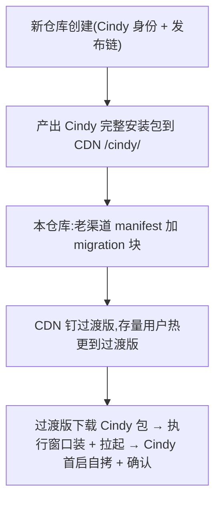

# Cindy 双仓库分工与移交清单

> 2026-07-10 拍板:**Cindy 不在当前仓库升级,当前仓库永远是 XDMaker(过渡版);Cindy 使用独立新仓库**(截至本文撰写尚未创建)。2026-07-13 拍板 **B′ 方案**:无独立迁移执行器,安装 + 拉起在老 app 进程内完成,userData 拷贝由 Cindy 首启自拷(见 `migration-state-machine.md` v3)。本文记录两仓分工、本仓库中"预置但惰性"的 Cindy 侧代码,以及新仓库就绪后需要做的事。**实际执行升级时的顺序约束与注意事项见 [`upgrade-launch-checklist.md`](./upgrade-launch-checklist.md)**。

## 1. 分工总览

| 角色 | 仓库 | 承载 |
|---|---|---|
| 老 app(过渡版) | 本仓库(XDMaker) | marker 状态机、stage/campaign 编排、执行窗口(进程内静默安装 + 拉起 Cindy)、跳板、热更抑制、handoff **导出**、老渠道 manifest `migration` 块**消费** |
| 新 app(Cindy) | **新仓库** | 首启自拷(userDataCopy)、首启健康检查、handoff **导入**、receipt/健康计数、延迟卸载执行、`/cindy` 渠道 |

两方契约(锁定,双仓必须逐字对齐):
- `<old-userData>/migration/state.json`(marker schema v1,7 态)——`apps/desktop/src/main/migration/types.ts`
- `<old-userData>/migration/handoff.json`(mac safeStorage 交接)——`handoff.ts`
- `<new-userData>/migration/receipt.json` + first-run sentinel + copy-journal ——`firstRun.ts` / `userDataCopy.ts`
- 拷贝排除清单与锚定 glob 语义 ——`copyExcludes.ts`(唯一生成源)
- `<userData>/migration/identity-anchor.json`(身份锚:账号系统切换后按 email 认领老库,随自拷进 Cindy)——`identityAnchor.ts`
- 启动参数:`--migrated-from=<app>`、`--legacy-user-data=<path>`

## 2. 本仓库中"预置但惰性"的 Cindy 侧代码

以下代码在 XDMaker 构建中**永远不激活**(XDMaker 不会带 `--migrated-from` 被拉起、不会有 receipt),保留为契约的参考实现;若新仓库以 fork/复制本仓库方式创建,即为现成的另一端 hook:

- `apps/desktop/src/main/migration/userDataCopy.ts`(+ 测试)——首启自拷:锚定 glob、preflight、journal 幂等、进度
- `apps/desktop/src/main/migration/firstRun.ts`(+ 测试)——首启健康检查(等老进程退出 → 自拷 → 探针 → sentinel/receipt/confirmed)、延迟卸载决策
- `apps/desktop/src/main/migration/handoff.ts` 的 `importHandoff` 导入侧
- `apps/desktop/src/main/migration/electronRuntime.ts` 的 `maybeRunCindyFirstRun`、探针(SQLite WAL checkpoint + quick_check 软诊断 / safe-storage 可解密)、`runDelayedUninstallCheck`(旧可执行文件身份二次校验后，win QuietUninstallString / mac 限 `.app` 删除)
- `apps/desktop/src/main/bootstrap-electron.ts` ready 处理器的 Cindy 首启分支(先于过渡版分支执行)

## 3. 本仓库(XDMaker 侧)剩余工作 —— 等新仓库产物就绪后做

1. **老渠道 manifest 发布端生成 `migration` 块**:release 脚本在 manifest.app 下发 `{ targetApp: 'cindy', version, file, sha256, size }`,file 指向 Cindy 完整安装包(由新仓库发布链产出并上传;win NSIS Setup.exe / mac .app zip)。消费侧已就绪(`manifestService.ts` 类型 + `updateService` 触发)。
2. **执行窗口 UX 打磨**(可选):安装(NSIS `/S` 数十秒)期间 banner 文案与进度反馈;当前实现复用热更 banner 状态机。
3. **CDN `/xdt-maker/` 钉过渡版**(发布操作):manifest.app.version 固定为过渡版版本号,后续修复走 N+2 重钉(版本比较是字符串相等,天然支持)。
4. 端到端演练(win + mac):真实 NSIS 包 / .app zip 走一遍 staged → confirmed → 延迟卸载,重点验证首启自拷进度与失败重入(journal reset)。

## 4. 新仓库需要做的事(Cindy 侧 checklist)

**已拆出为独立文档 [`cindy-repo-checklist.md`](./cindy-repo-checklist.md)(唯一清单,本节不再维护副本)**——含身份与构建配置、被 XDMaker 唤起链路的打包形态实测、首启迁移 splash、新 auth server + 首登认领、发布链与本仓库对接点。

## 5. 时序依赖

