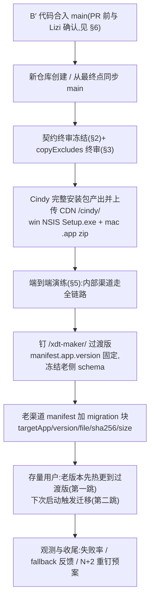

# Cindy 升级上线:执行注意事项与流程清单

> 2026-07-13 整理,2026-07-14 补两阶段模型与身份锚(账号系统切换前置)。前置阅读:[`migration-state-machine.md`](./migration-state-machine.md)(B′ 方案状态机 v3)、[`repo-split-and-handover.md`](./repo-split-and-handover.md)(双仓分工)。本文回答"真正执行升级时要注意什么"——**git 分支合并不是风险点,真正的风险在时间轴上:过渡版钉版点与 Cindy 切出点的先后关系,以及钉版前的终审动作**。

## -1. 两阶段模型(2026-07-14 拍板)

整个升级分两个阶段,解耦"随时能发的部分"与"依赖就绪时间不确定的部分":

**第一阶段:XDMaker 收尾版(= 过渡版,最后一个 XDMaker 版本)**。两跳升级保证所有存量用户必经它、且至少启动一次——凡"Cindy 侧需要但只能由老 app 提前准备"的东西,这一版是唯一也是最后的机会:

1. migration 块消费链(状态机 / 执行窗口 / 跳板 / handoff 导出)——已就绪;
2. **身份锚埋点**(账号系统切换前置,见 §7.1)——已就绪;
3. failed 遥测轻上报(§6 观测缺口)——收尾版之后老渠道不再发版,想加观测只剩这一班车,发布前拍板;
4. 发完即钉版:老渠道冻结,不再发任何带 DB migration 的版本。

**第二阶段:Cindy 1.0 一跳完成 = 品牌迁移 + 新 auth server**(2026-07-14 拍板合并,状态机文档 v3.1 决策 7):

- Cindy 1.0 直接连**新 auth server**(全新空库,不迁老 server 数据),不存在"先连老 server 的 1.0"过渡形态;
- **首启健康检查 = 纯数据验收**:等退出 → 自拷(未确认首启不信任 stale `journal=done`)→ openDb 逐库 WAL checkpoint + quick_check 诊断(open/pragma/close 异常均隔离为告警)→ handoff 导入 → verifySafeStorage(safe-storage 可解密探针,前身 verifyAuth 的语义归位——登录态不再是迁移成败判据)→ confirmed;
- **confirmed 之后进入新账号系统登录页**(不可消除的用户可见项,进升级公告):新登录成功钩子里优先按 email、零命中时按 feishuOpenId 匹配身份锚(`findAnchorByIdentity` 传 `excludeUserId=新uid` 防自命中)→ 命中则复制重绑老库(online backup → quick_check → 认领 sentinel 幂等)→ 历史数据挂回;未命中安静走新用户分支、老库保留;
- **认领失败不回滚/不锁死登录**:数据已 confirmed,复制或校验失败仅告警并保留老库,随后放行 `ensureReady` 创建新库；手动认领入口兜底;
- handoff **保留**:mac safe-storage 交接的是飞书 / Slack 等第三方集成凭证(机器级、与账号系统无关),不是登录态。

## 0. 关于"是否需要再做一次 main 合并"

- **本仓库(XDMaker)侧**:迁移代码在 main 上是**惰性**的——只有老渠道 manifest 下发 `migration` 块才激活。因此 B′ 分支可以提前合入、安静躺任意久,main 随便演进。合入 PR 前照常 rebase 一次当时的 main 即可,合入后不存在"再合并"问题。
- **新仓库(Cindy)侧**:如果新仓库以 fork 方式创建,而升级又拖了一段时间,**发布 Cindy 1.0 前必须把 main 最新代码同步过去**(或干脆在最终启动点才 fork)。原因见 §1 核心不变量——这是整个时间线上唯一的硬性版本约束。

## 1. 核心不变量:Cindy 的 schema 视野 ⊇ 过渡版的 schema 视野

Cindy 首启拿到的是老 app 拷过来的 SQLite 库。若老 app(过渡版)应用过的 drizzle migration 序号超出 Cindy 代码认识的范围,Cindy 打开的就是一个"来自未来"的库——轻则 quick_check 通过但字段语义对不上,重则崩进 failed 重入循环。由此推出三条铁律:

1. **发布顺序必须是:先钉 `/xdt-maker/` 过渡版(冻结老侧 schema 上限)→ Cindy 从 ≥ 该点的 main 切出发布**。反过来不行。
2. **决定启动升级后,老渠道不要再发带 DB migration 的版本**——老渠道每多发一版,就在抬高 Cindy 必须覆盖的基线。尽快钉版。
3. Cindy 比过渡版**新**没关系(drizzle 向后兼容旧库,首启把库升上去);比过渡版**旧**才致命。

## 2. 契约文件在 fork 点之后冻结

以下六样是双仓逐字对齐的契约(见 repo-split-and-handover.md §1),新仓库创建之后本仓库**不得再动其语义**;要改必须双仓同步 + 双向兼容评估。最省心的做法:B′ 合入前把契约定稿,之后当只读。

| 契约 | 定义处 |
|---|---|
| marker `state.json`(schema v1,7 态) | `apps/desktop/src/main/migration/types.ts` |
| `handoff.json`(mac safeStorage 交接) | `handoff.ts` |
| `receipt.json` + first-run sentinel | `firstRun.ts` |
| `copy-journal.json` | `userDataCopy.ts` |
| 拷贝排除清单与锚定 glob 语义 | `copyExcludes.ts`(唯一生成源) |
| 启动参数 `--migrated-from` / `--legacy-user-data` | `orchestrator.ts` |

## 3. 钉版前终审:copyExcludes 对照当时的真实 userData 布局重审

B′ 用黑名单式排除("宁可多拷"),main 后续新增的 userData 子目录会被天然拷走——这是对 main 演进免疫的部分。但过渡版发布前必须对照**发布时刻的**真实 userData 布局核一遍,两个漂移方向:

- **漏排(轻)**:main 新增了可再生大目录(新缓存 / 新二进制)没进排除清单 → 只是拷得慢,不算错,但分钟级首启拷贝的体验会变差。
- **误杀(重)**:新增的**必迁**目录恰好被现有 glob 命中(例:有人往 `cache/` 下放了非缓存数据)。`manifestAndTrampoline.test.ts` 的单源一致性测试挡一部分,但 `COPY_MUST_KEEP_PREFIXES` 清单本身也要跟着当时布局更新才有效。

终审动作:在一台真实使用过的开发机上 `ls` 老 userData 根,逐目录对照 `USER_DATA_COPY_EXCLUDES` 与 `COPY_MUST_KEEP_PREFIXES`,新目录逐个归类(必迁 / 可再生),更新两份清单 + 测试。

## 4. 发布执行流程(顺序敏感)

要点:

- **两跳升级是预期行为**:存量老版本没有 migration 块消费代码,看到新 manifest 只会正常热更到过渡版,下一次启动才触发迁移。全量用户的迁移会自然摊开在几天内,不要按"一夜切换"做心理预期与值班安排。
- **当前设计没有灰度机制**:migration 块一下发,所有过渡版用户同时进入迁移流程。补偿手段就是 §5 的演练前置——确认后再全量下发;如需事实灰度,可先只在内部渠道 / 独立 CDN 前缀下发 migration 块。
- **过渡版自身有 bug 时走 N+2 重钉**:manifest 版本比较是字符串相等,重钉新过渡版本号天然可行(migration-state-machine.md §10 决策)。

## 5. 端到端演练清单(win + mac,真实包)

全链路:staged → handoff_ready → 执行窗口安装 + 拉起 → Cindy 首启自拷 → confirmed → 延迟卸载。重点场景:

1. 首启自拷的**进度可见性**(拷贝分钟级时不能白屏——新仓库 checklist 里的迁移 splash);
2. **失败重入**:自拷中途 kill Cindy → 老 app 重入 → journal reset 整体重拷;
3. **磁盘不足**:INSUFFICIENT_DISK 退回老 app,文案可理解;
4. **confirmed 后点老快捷方式**:跳板让位(P0-1),不得出现双实例;
5. **fallback_active**:confirmed 后重装老 app,数据完好、可再次升级;
6. mac 的 safeStorage handoff 导入(keychain 归属变化)与 win 的 NSIS `/S` 静默安装时长。

## 6. 无遥测的失败黑洞(启动前拍板项)

同一 payload 的 attempt 到上限(5 次)后会**静默放弃、留在老 app**,当前没有任何上报——失败率超预期时只能靠用户反馈发现；manifest 下发新 payload 版本会优先 restage 并重置预算。启动升级前至少做到:

- 演练阶段确认 marker failed 的错误码(`INSTALL_FAILED` / `COPY_FAILED` / `INSUFFICIENT_DISK` / `HEALTH_CHECK_FAILED` 等)完整落进日志;
- 拍板是否给 failed / confirmed 加一条轻量上报(哪怕只是心跳服务上多带一个字段),用于观测迁移漏斗。**未拍板前默认无观测,风险自担**。

## 7.1 身份锚:账号系统切换的本地重绑契约

**问题**:Cindy 1.0 接入新账号系统后 userId 变更,而本地主库按 userId 切片(`<userData>/xdt-maker-<userId>.db`),新 uid 找不到老库。新 auth server 空库、不迁老 server 数据,两边服务器都给不出 old→new 映射——**映射只能在客户端本地完成**,锚是 email(一致性由新 auth server 保证),备锚 feishuOpenId。

**机制**(实现:`apps/desktop/src/main/migration/identityAnchor.ts` + `localDbClaim.ts`):

- **埋点(第一阶段,收尾版)**:登录成功 / 恢复登录态时把 `{ userId, email(归一化), feishuOpenId }` upsert 到 `<userData>/migration/identity-anchor.json`(bootstrap 的 `onAuthStateChange` 订阅 → `recordIdentityAnchor`)。多账号数组累积、登出不清、内容无变化跳过写盘;
- **随自拷进 Cindy**:该文件在 `COPY_MUST_KEEP_PREFIXES` 中,首启自拷天然带走。顺序天然安全:埋点发生在启动/登录时,自拷发生在用户点升级之后;
- **认领(第二阶段,Cindy 1.0 首启 confirmed 之后的首登)**:新账号登录成功 → `registerLocalDbIpc.beforeEnsureReady` 在打开新 uid 库前调用 `claimLegacyLocalDbBeforeEnsureReady` → `findAnchorByIdentity` 优先用归一化 email,排除新 UID 后零命中时回退 feishuOpenId,两者都**必须传 `excludeUserId=新uid`**；多命中一律返回 null → 唯一命中则用 SQLite online backup 复制老库重绑新 uid(复制而非 rename,老库冻结作逃生舱)→ quick_check → 原子落位 + 认领 sentinel → 再进入该账号 `ensureReady`;**未命中一律安静地当新用户处理、老库保留**。复制/校验失败只告警并放行新库创建,避免老库问题永久锁死登录；老库继续保留,由设置页手动认领入口兜底。不回滚已 confirmed 的品牌迁移。

**连带确认项**:新 auth server 空库意味着所有 server 侧 per-user 数据归零(登录续期凭证、chat-data-localization per-(userId, deviceId) 快照等),Cindy 1.0 发布前需盘一遍客户端对"server 说从没见过你"的各处反应是否安全;全员被迫重新登录是必然,正好就是认领钩子的触发点。

## 7. 流程性事项

- **提 PR 前与 Lizi 确认**(AGENTS.md 规则 21):xdt-updater 曾在方案探索期被改动,B′ 已将其 revert 到与 origin/main 零 diff,但 PR 说明里要写清这段历史。
- **`dbFilePrefix` 仍是 `'xdt-maker'`**时仅做 old uid → new uid 认领；若 Cindy 1.0 改为 `cindy`,必须同时配置 `legacyDbFilePrefixes: ['xdt-maker']`,认领器会扫描旧前缀并落到当前前缀。发布后再改成本高得多。
- 老渠道 manifest 发布端生成 `migration` 块、CDN 钉版均为发布操作,不在代码 PR 范围内(repo-split-and-handover.md §3)。
