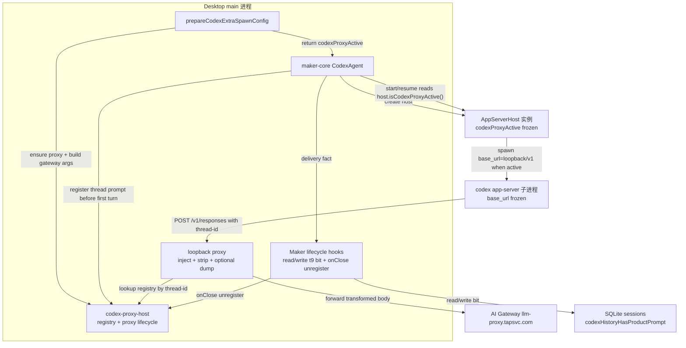
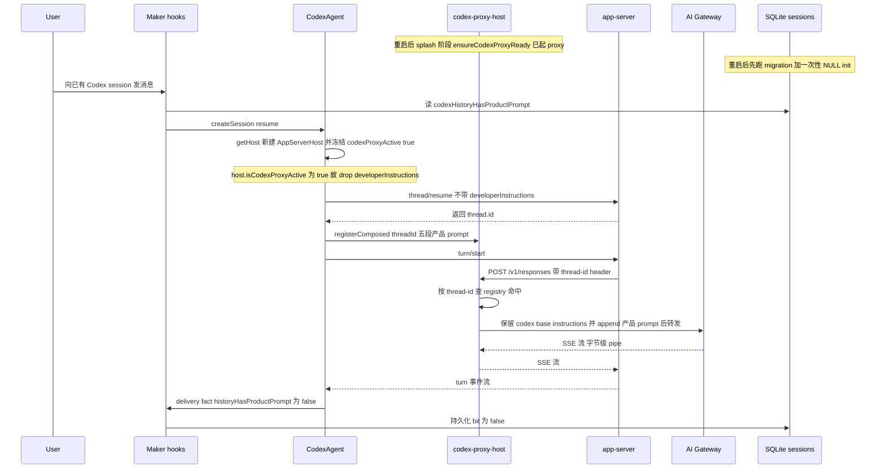

# Codex 产品 system prompt 持久化 —— 本地 proxy 方案(spec)

> **状态**:最终实现已落到 `f26c67915`,PR #10 已开(https://github.com/xindong/XDMaker/pull/10)。本文已按最终架构重写,以 §3 与 §7.4 为准;早期全局 active flag / register.ts cleanup / bootstrapSession 写 bit 等方案已被第二轮 review 修复替换。merge 前仍需 Lizi 确认系统提示词注入通道变更(规则 20)。
> 最近更新:2026-06-06。

## 已拍板边界 / 决策

1. **主修 Codex API 模式**:本地 loopback proxy 只能拦截本地 Codex app-server 的 API 模式出站请求;remote 不经本机 proxy,OAuth 不走该 base_url。
2. **范围 = 整个 codex 产品 system prompt(五段)**,不只 orca 契约。
3. **registry 按 `threadId` 精确关联**:app-server 是共享进程,per-session URL 不可行;唯一可用的 per-thread 信号是请求 header 里的 thread id。
4. **oneShot 豁免**:不承载五段产品 prompt / orca 身份,proxy 对其临时 thread 不登记、不注入。
5. **规则 20 闸门**:本 PR 已完成实现和实测,但系统提示词通道从 developer message 升到顶层 `instructions`;确认前不 merge。

---

## 0. 为什么从「最小修复」pivot 回「proxy」

最小修复(PR #7:resume 也传 `developerInstructions`)能解决 **P0 失忆**,但留下 **重复 developer message**。codex 0.135.0 的 maker 层没有干净解:

- `thread/resume.developerInstructions` 只 **append**,不 replace 历史里已有的 developer message。
- 没有「不进 history 的 ephemeral overlay 通道」。
- 没有可靠查询 compact / baseline 状态的协议字段,无法安全判断「该不该再注一份」。

根因是 `developerInstructions` 最终落在 Responses 请求体 `input[]` 里一条 `role:"developer"` message。它活在对话历史里,必然被 compact 波及;resume 重发只是不断往这条脆弱通道里补注。

本方案把产品 prompt 移到 Responses 顶层 `instructions` 尾部。它不进对话历史,每个 `/v1/responses` 请求重新注入,因此 compact / cold resume / app-server 重启后仍在,也不会变成重复 developer message。这相当于用本地 proxy 给 codex 补上 cc `systemPrompt.append` 一类的 overlay 能力。换句话说,Responses 顶层 `instructions` 就是本次请求的 system-level instructions 槽位;把产品 prompt 从“历史里的 developer message”挪到这里后,它在角色语义上等同于真正的 system prompt,而不再是会被 compact 波及的历史消息。

---

## 1. 关键架构事实(已核实源码)

| 事实 | 推论 |
|---|---|
| codex app-server 是共享单进程:1 个 `CodexAgent` spawn 1 个 app-server,N 个 session 以 `threadId` 多路复用;`base_url` 在 spawn 时冻结。 | per-session URL token 不可行;proxy 只能按每请求 header 中的 thread id 查 `registry[threadId]`。 |
| `thread/start` / `thread/resume` RPC 同步返回 `resp.thread.id`;真正模型请求发生在后续 `turn/start` 触发的 `/v1/responses`。 | 可以在首个模型请求之前同步登记 registry,首请求即可命中。 |
| 当前产品 prompt 是五段拼接:`MAKER_CODEX_SYSTEM_PROMPT_APPEND` + `makerMemoryRules` + `runtimeConfig.systemPrompt` + `makerMemoryIndex` + `opts.userPrompt`。orca 契约在 `opts.userPrompt` 段。 | 要注入的是整段已拼好的 blob;desktop host 不能自己重建,必须由 maker-core 在 start/resume 时回调登记。 |
| `supports_websockets` 若未来被打开,app-server 可能在 response 前 prewarm 模型。 | spawn args 显式加 `model_providers.tapsvc.supports_websockets=false`,固定首个模型请求晚于登记。 |

---

## 2. 最终设计

### 2.1 核心数据流

API + 本地 proxy active 时:

1. desktop 在 `prepareCodexExtraSpawnConfig(providers, { remoteHostId })` 中确认是本地 API 模式后 `ensureCodexProxyReady()`。
2. desktop 把 proxy endpoint 写进 `buildCodexGatewaySpawnArgs(endpoint)`,同时返回 `codexProxyActive: isCodexProxyHandleReady()`。
3. maker-core `CodexAgent.createHost` 把 `codexProxyActive` 冻到对应 `AppServerHost` 实例;后续 `startSession` 只读 `host.isCodexProxyActive()`,不再 live 读任何全局 flag。
4. `thread/start` / `thread/resume` active 时不带 `developerInstructions`;拿到 `thread.id` 后同步 `registerCodexSystemPromptForThread({ sessionId, threadId, text })`。
5. app-server 每个 `/v1/responses` 请求经 loopback proxy;proxy 用 `thread-id` 查 registry,把对应产品 prompt append 到顶层 `instructions`。
6. maker-core handle 回传 `codexProductPromptDelivery={ threadId, historyHasProductPrompt:false }`;Maker lifecycle hook 写库,记录该 codex 历史里没有产品 dev。

非 proxy 时:

1. `thread/start` 仍发 `developerInstructions`,因为新 thread 历史里还没有产品 prompt。
2. `thread/resume` 只在 `codexHistoryHasProductPrompt !== true` 时补发一次 `developerInstructions`;补发成功后回传 `historyHasProductPrompt:true`。
3. 明确 `codexHistoryHasProductPrompt === true` 时不重发,避免普通 OAuth / remote resume 重复堆积。

### 2.2 拓扑



### 2.3 冷恢复时序



关键点:

- `codexProxyActive` 与 spawn 时实际 `base_url` 绑定在同一个 `AppServerHost` 实例上,不会被其它 host / remote / auth-mode 切换污染。
- 登记发生在拿到 `threadId` 后、首个 `/v1/responses` 前。
- registry cleanup 在 Maker `onClose` hook 中执行,rehydrate close suppression 只跳过 worktree / temp file 等重副作用,不跳过 registry unregister。

---

## 3. 分层落地(最终实现)

### 3.1 proxy 包 `packages/anthropic-compat-proxy`

- `createInstructionsRegistry()` 返回隔离 `Map<threadId,string>` 工厂;包内不持有 singleton。
- `createInstructionsInjectionTransform({ registry, logger })`:
  - 默认 header 优先级: `thread-id` → `x-client-request-id`;不再使用 `session-id`,因为 registry key 是 threadId,`session-id` 命中也只会 miss。
  - 默认 pathMatch:用 `new URL(url, 'http://127.0.0.1').pathname` 取 pathname 并去尾斜杠,只匹配 `/responses`;支持 `/v1/responses?stream=true` 与 `/v1/responses/`,跳过 `/v1/responses/compact`。
  - registry miss 只 skip,禁止“最近 / 唯一一份”兜底。
  - `instructions` 是共用字段:codex app-server 先写入自己的 base instructions;registry hit 后 proxy 只把登记的五段产品 prompt 追加到该字段尾部(中间空一行分隔),最终是 codex base instructions 与产品 prompt 的拼接,绝不替换 codex base。
  - 幂等守卫只认登记 blob 本身:`before.includes(productInstructions)` 为 true 时跳过,因此只防止我们自己的产品 prompt 二次追加,不把 codex base instructions 计入重复判断。
  - hit 后注入失败打结构化 error `event:'codex_proxy_injection_error'`,不静默。
- 结构化 debug 日志 `event:'codex_proxy_injection'` 记录 selected header / threadId / registryHit / before-after bytes / inputDeveloperCount / appended / alreadyPresent。完整 prompt 不进日志。

### 3.2 desktop host `apps/desktop/src/main/maker-host`

- `codex-proxy-host.ts` 持有 module singleton registry,提供 `ensureCodexProxyReady()` / `getCodexProxyEndpoint()` / `registerComposed()` / `unregister()` / `disposeCodexProxy()`。
- `ensureCodexProxyReady()` 使用 in-flight promise 去重并发启动;`disposeCodexProxy()` 与启动 race 时按 generation 处理新 handle。
- transform 链为 `createCodexTransform()` → `stripNonAnthropicFields` → env-gated dump transform。dump 仅在 `XDT_CODEX_PROXY_DUMP_TRANSFORMED_BODY=1` 下写 `apps/desktop/logs/codex-proxy-dumps/`,proxy 包保持无 fs 依赖。
- `prepareCodexExtraSpawnConfig(providers, ctx)`:
  - `ctx.remoteHostId` 存在时直接返回 no-op,不启动本地 proxy、不污染本地状态。
  - MCP bridge prep 是可选能力,失败只降级为“无 lizi MCP”,不影响 API gateway args。
  - 非 API 模式返回 direct args + `codexProxyActive:false`。
  - API 模式 ensure proxy,按 handle ready 状态返回 `codexProxyActive`,并把 endpoint 冻进 `model_providers.tapsvc.base_url`。
  - 无条件追加 `model_providers.tapsvc.supports_websockets=false`。

### 3.3 maker-core

- `AgentDeps.prepareCodexExtraSpawnConfig(providers,{ remoteHostId })` 返回 `{ extraArgs, extraEnv, codexProxyActive? }`。
- `CodexAgent.createHost` 把 `codexProxyActive === true && !remoteHostId` 冻到 `AppServerHost` 实例;`AppServerHost.isCodexProxyActive()` 是后续 gate 的唯一来源。
- `startSession` 中 start / resume 两分支都照旧用 `buildCodexDeveloperInstructions(...)` 生成同一份五段文本,**不改 prompt 文本 / 顺序**。
- `useProxyChannel = host.isCodexProxyActive() && registerCodexSystemPromptForThread exists`。
- proxy active:
  - start / resume params 不带 `developerInstructions`;
  - 拿到 `resp.thread.id` 后同步登记 registry;
  - handle 暴露 `codexProductPromptDelivery={ threadId, historyHasProductPrompt:false }`。
- non-proxy:
  - start params 带 `developerInstructions`,成功后 delivery fact 为 `true`;
  - resume 仅当 `opts.codexHistoryHasProductPrompt !== true` 时带 `developerInstructions`,成功后 delivery fact 为 `true`;
  - bit 为 true 的 resume 不带 dev,也不写 delivery,保持 true。
- broken handle (`<failed>` / `<pending>`) 不触发持久化写回。

### 3.4 Maker lifecycle hook + desktop DB bit

- `sessions.codexHistoryHasProductPrompt` 是 nullable boolean(`codex_history_has_product_prompt`),无 DB default。`NULL` 表示未知。
- migration 由 `pnpm db:generate` 生成纯 DDL;不手写 UPDATE / snapshot / journal。
- `initializeCodexHistoryPromptState` 在启动迁移后、任何 session resume 前执行一次:
  - 若列不存在,只 warn 并跳过,避免 schema drift 把整个 app 弄挂。
  - 用 `migration_meta` guard,只把第一次初始化时的 legacy `NULL` 刷成 true。之后新产生的 NULL 保持未知,让 resume fail-toward-restore。
  - init 失败非致命:log + 留 NULL。
- `Maker.lifecycleHooks.getCodexHistoryHasProductPrompt(sessionId)` 在任何 codex resume 前读取 bit。读失败 warn,传 undefined,由 maker-core 补发兜底。
- `Maker.lifecycleHooks.onCodexProductPromptDelivery(...)` 在 start/resume 成功且 handle 有真实 delivery fact 时写 bit。写失败不阻塞,下次按 NULL/旧值兜底。
- `Maker.lifecycleHooks.onClose(sessionId)` 先 `unregisterCodexProxyPrompt(sessionId)`,再跑 rehydrate suppression 管控的 worktree / temp file cleanup。这样 IPC / scheduler / Feishu 等所有 `maker.createSession` caller 都覆盖。

### 3.5 fork / remote / oneShot

- fork 本身只做 `thread/fork`(+ 可选 `thread/rollback`),不打模型,不登记 prompt;forked session 首次 send 走 lazy-create resume,由 §3.3 的 resume 路径登记。
- fork DB insert 复制源 session 的 `codexHistoryHasProductPrompt`,因为 forked thread 继承源 thread 历史。
- remote Codex 不经本机 proxy,`codexProxyActive=false`;remote start 发 dev,remote resume 走 bit 决策。
- oneShot 不承载五段产品 prompt / orca 身份,不登记、不注入。

---

## 4. 待 Lizi 确认 / 规则 19-20

1. **规则 20**:本 PR 不改 prompt 文本,但把产品 prompt 的注入通道从 `input[] role:"developer"` 改到顶层 `instructions`。这属于系统提示词通道 / 角色语义变化,必须 Lizi 确认后 merge。
2. **规则 19**:proxy 主路径的产品 prompt 文本和顺序不变;稳定前缀从“base instructions + input developer”变成“base instructions + product in top-level instructions”。必须以 live cache 数据证明无持续回退。
3. **非 proxy 限制**:OAuth / remote 仍走 codex 历史里的 developerInstructions 通道。t9 bit 只保证从 proxy 切出时不裸奔,不把非 proxy 变成顶层 instructions。

---

## 5. 端到端验证协议(结构化日志 + dump + assert)

`codex-proxy` 对每个命中的 `/responses` transform 打结构化 DEBUG:

- `event:codex_proxy_injection`
- `selectedHeaderName`
- `selectedThreadId`
- `registryHit`
- `instructionsBeforeBytes`
- `instructionsAfterBytes`
- `inputDeveloperCount`
- `appended`
- `alreadyPresent`

完整 transformed body 只在本地 env `XDT_CODEX_PROXY_DUMP_TRANSFORMED_BODY=1` 下落盘,release 不 dump。

> codex 0.135.0 的 `/v1/responses` `input[]` 总会带一条 codex 自己的 `role:"developer"` scaffolding。不能用 `inputDeveloperCount===0` 断言。正确不变量是:产品 prompt 标记出现在顶层 `instructions`,且不出现在任何 `input[]` developer message。

### 5.1 live 验证步骤

1. `XDT_CODEX_PROXY_DUMP_TRANSFORMED_BODY=1 pnpm restart:desktop:remote`,Codex 切 API 模式。
2. 起一个 codex orca worker,delegate task 放唯一 sentinel,要求完成后 `send_to_lead`。
3. 首 turn 断言首个 `/v1/responses`: `selectedHeaderName=thread-id`, `registryHit=true`, `appended=true`;dump 顶层 `instructions` 含 `send_to_lead` / `worker_id=<id>` 等契约;developer message 不含契约;body 不含 `output_config`。
4. restart + cold resume:重启 dev app 后对同一 worker 发消息,断言 resume 首个 `/v1/responses` 即 `registryHit=true` / `appended=true`。
5. 多 session:普通 Codex 会话与 worker 同活;普通会话 `instructions` 无 `send_to_lead` / `worker_id`,worker 只含自己的 worker 契约,互不串台。
6. 行为:问 worker “你是谁、怎么联系 lead”,确认它仍知道 worker 身份并实际调用 `send_to_lead`。
7. 缓存:连续轻量 turn 记录 `UsageTracker` hit rate / cached tokens,确认无持续回退。
8. assert 脚本:

```bash
node apps/desktop/scripts/assert-codex-proxy-e2e.mjs \
  --log-dir apps/desktop/logs \
  --thread <workerThreadId>,<plainThreadId> \
  --expect '<workerThreadId>:worker_id=<workerId>' \
  --plain-thread <plainThreadId> \
  --body-dump apps/desktop/logs/codex-proxy-dumps \
  --forbid-developer send_to_lead \
  --forbid-developer worker_id \
  --forbid-body-field output_config \
  --min-threads 2 \
  --min-hits-per-thread 1
```

### 5.2 第一轮实测(历史)

第一轮 live 曾验证 restart/cold resume、dump 金标准、多 session 无串台和高缓存命中。但该轮发生在第二轮 review 修复前,具体数字已被最终构建复验取代。最终可引用数据统一见 §7.4。

---

### 5.3 Windows 验证用例(待 release 前执行)

§5.1 是 macOS live 协议;Windows 主机需另跑一遍同款,仅两处按 Windows 调整:① 设 env 用 Windows shell 语法;② assert 命令的 `--log-dir` / `--body-dump` 路径加引号(防用户目录空格)。

1. **DB migration + 一次性 init**(风险面:better-sqlite3 Windows native、SQLite 文件锁 / 事务、0039 migration、init guard)
   - 用 0039 之前的既有 db 启动 Windows dev app → 0039 加列成功、日志 `codex history prompt state initialized` 出现一次;再重启一次确认该 log 不再出现(guard 不会每次刷 NULL);`pnpm --dir apps/desktop db:check` 通过。
2. **Codex API loopback proxy 连通**(风险面:`127.0.0.1:<port>` bind/connect、`spawn(shell:false)` argv、`-c ...base_url="http://127.0.0.1:<port>/v1"` 解析)
   - Windows 切 API 起 session → dev 日志 `codex proxy ready` + `codexProxyActive:true` + `codex_proxy_injection registryHit=true selectedHeaderName=thread-id`;无 proxy fallback / `ECONNREFUSED 127.0.0.1`。`registryHit=true` 即证明 Windows 正确解析了 spawn arg 且流量进了本地 proxy。
3. **Gold-standard E2E + assert 脚本**(风险面:Windows restart 新开 cmd.exe、env dump 继承、dump 写盘、assert 读 Windows 路径、`output_config` strip)
   - 设 env:PowerShell `$env:XDT_CODEX_PROXY_DUMP_TRANSFORMED_BODY='1'; pnpm restart:desktop:remote`;cmd `set "XDT_CODEX_PROXY_DUMP_TRANSFORMED_BODY=1" && pnpm restart:desktop:remote`。起 orca worker 发首 turn → 重启 dev app → cold resume 同一 worker → 跑 §5.1 step 8 的 assert 命令(`--log-dir` / `--body-dump` 加引号)。
   - 预期:cold resume 首请求 `registryHit=true` / `appended=true`、worker 不失忆、assert `passed`、body 无 `output_config`。
4. **OAuth / non-proxy + t9 跨模式恢复**(风险面:Windows auth-mode 切换的 app-server dispose / re-spawn、proxy dispose、non-proxy resume bit 补发)
   - A(OAuth fresh smoke):切 OAuth 新建普通 Codex 会话对话正常;该 host `codexProxyActive:false`、无本地 `codex_proxy_injection`。
   - B(t9 跨模式):API 模式建 worker / session → 切 OAuth 触发 `restartCodexAfterAuthModeChange` → resume 同一 session 不失忆 → 切回 API `codexProxyActive:true` + `registryHit=true` 回来。
   - 备注:若 Windows Defender 弹 loopback 监听提示,允许本机回环后继续,以 `registryHit=true` 为准。

---

## 6. 实施记录(历史,非最终架构说明)

本 PR 按层串行实现并逐层 review:

| # | 层 | 内容 | 状态 |
|---|---|---|---|
| 1 | proxy 包 | registry + instructions injection transform + 单测 | 已完成 |
| 2 | desktop host 基础设施 | codex-proxy-host + gateway base_url override + supports_websockets=false | 已完成,后续被 per-host active 方案收敛 |
| 3 | maker-core drop-dev + 登记 | start/resume active 时 drop dev + register | 已完成,后续加 t9 bit 与 delivery fact |
| 4 | desktop 接线 + E2E harness | AgentDeps / spawn 接线 + assert 脚本 + live E2E | 已完成 |
| 5 | review 修复批 | per-host active、Maker lifecycle hook、strip 恢复、init 非致命、path/header 边界 | 已完成于 `f26c67915` |

---

## 7. 自动 review 处置(PR #10)

### 7.1 处置摘要

| 问题 | 级别 | 结论 | 最终处置 |
|---|---|---|---|
| MCP prep 失败连带丢 API gateway args + 陈旧 active → 裸奔 | P1 | 真实 | MCP prep 单独 try/catch;API gateway args / active 判定继续执行。后续 `f26c67915` 删除全局 active,改为 per-host frozen active。 |
| 全局 `_activeForSpawn` 竞态 / remote 污染本地 active | P1 | 真实 | `codexProxyActive` 从 spawn prep 返回并冻结到 `AppServerHost`;maker-core 读 `host.isCodexProxyActive()`;remote no-op。 |
| `ensureCodexProxyReady` bool latch 并发首调 not-ready | P2 | 真实 | 改 in-flight promise 去重,与 dispose generation 协调。 |
| 非 proxy resume 每次重发 dev → 历史 append 重复 | P2 | 真实 | 非 proxy resume 改为 bit 驱动:只有 `codexHistoryHasProductPrompt !== true` 才补发一次。 |
| t9:proxy-origin session 切 OAuth 后裸奔 | P1 | 真实 | nullable bit + one-time init + maker-core delivery fact + Maker lifecycle hook。 |
| scheduler / Feishu 绕过 t9 写回和 unregister | P2 | 真实 | t9 bit 读写与 unregister 上移到 Maker lifecycle hook,覆盖所有 `maker.createSession` caller。 |
| assert 脚本 fs/stat / JSON.parse 容错 | P2/P3 | 真实 | 补 ENOENT 诊断、坏 JSON/NDJSON 跳过、walkFiles 读目录失败 warn。 |
| transform 丢了 `stripNonAnthropicFields` 安全网 | P3 | 真实 | desktop host transform 链恢复 injection + strip + optional dump;assert 加 `--forbid-body-field output_config`。 |
| fork 线程未登记 registry → 裸奔 | P1 | 误报 | fork 不打模型;forked 首次 send 必经 resume 登记。另复制 source bit,保证非 proxy 历史语义。 |
| 应持久化整段 prompt,而非 resume 重建 | P2 | 非问题 | 与 Claude Code 当前值语义对齐;orca 契约由 DB 重新合成。 |
| 系统提示词渠道改动需 Lizi 确认 | P1(流程) | 真实 | 作为 merge 闸门保留 open。 |

### 7.2 关于「resume 重建 prompt」(非问题)

proxy 之后产品 prompt 不再缓在 codex 历史,而是每次 `startSession` 按当前五段重建。这与 Claude Code 一致:cc 的 system prompt(含 userPrompt / memory)本就是每次 startSession 取当前值,不做 per-session 创建时快照。codex 此前把创建时 dev 缓进历史,反而是异类。

- orca worker 契约不受影响:它走 DB(`sessions.orca_role` + `orca_workers` link)经 `synthesizeOrcaVendorOptionsFromDb` 重新合成,不依赖 renderer userPrompt localStorage。
- 用户全局 prompt 中途变化后,老 session resume 使用当前值。属预期语义,不是失忆。

### 7.3 thread 9 修复:`codexHistoryHasProductPrompt`

proxy 模式建的线程历史无产品 dev,因为产品 prompt 只进顶层 `instructions`。若之后切回 OAuth 或 proxy 极端不可用,没有 registry 也没有历史 dev,会裸奔。修法是不持久化整段 prompt,只持久化一个“历史里是否可靠含产品 prompt”的 bit。

- `sessions.codexHistoryHasProductPrompt` nullable、无 default。`NULL`=未知。
- one-time init 在启动迁移后把 legacy NULL 刷成 true,且用 `migration_meta` guard 只跑一次;失败非致命。
- maker-core 不读 DB;Maker lifecycle hook 在 resume 前读 bit,在 start/resume 成功后按 handle delivery fact 写 bit。
- delivery fact 的语义:
  - proxy start/resume 走 registry,不进历史 → `historyHasProductPrompt=false`;
  - non-proxy start 发 dev 进历史 → true;
  - non-proxy resume 补发 dev → true;
  - non-proxy resume 因 bit=true 跳过 → 不写,保持 true。
- handle `<failed>` / `<pending>` 或无 delivery 时绝不写 bit,避免失败 resume 被误标 true。
- fork 继承源 bit。

### 7.4 第二轮修复 live 复验(2026-06-06,最终构建 `f26c67915`)

第二轮改动动了 proxy 激活(per-host 绑定)/ 登记(Maker lifecycle hook)/ transform 链(strip)主链,所以用最终构建重跑 §5 gold-standard:

- 新构建确认:dev app `@f26c679`,日志含 `codex MCP bridge ready ... codexProxyActive: true`。
- restart + cold resume:重启后 resume 首个 `/v1/responses` 即 `registryHit=true`, `appended=true`, `14764 -> 23348`;worker 不失忆并主动 `send_to_lead`。
- dump 金标准:worker 6 个 dump 顶层 `instructions` 均含 `send_to_lead` / `worker_id=s1quqculb8yzti3h37ifjggv`;`input[] developer` 均不含契约;所有 body 均无 `output_config`。
- 多 session 无串台:普通 codex 会话 thread `019e9d3d-cf39-7f23-ac98-b0bc1323fdc7` 的 `instructions` 无 orca 契约,行为为普通 codex。
- assert 脚本:`codex-proxy E2E assertions passed: events=8, threads=2, bodies=7`。
- 缓存(规则 19):首 turn 0.0%;cold resume 99.2%;随后稳态轻量 turn 为 97.7% / 99.2% / 99.0%。中间一次 13.3% 发生在手动测试间隔超过 5 分钟后,下一轮即回 99%,判断为 prompt cache TTL 后的单轮重预热,不是前缀持续回退。

### 7.5 已知限制

1. **混合模式横跳重复**:同一 session 在 API↔OAuth 间反复切会偏向“宁可重复不失忆”。OAuth-origin 线程切 API 时,历史旧 dev 与顶层 `instructions` 并存;之后再切 OAuth,由于 proxy 接管期间 bit 会被置 false,会再补发一次 dev。重复可能累积到 compact 清理,但这是用户主动跨模式横跳的边角,本 PR 接受该代价以保证不裸奔。
2. **全局 userPrompt 非 per-session 快照**:与 cc 对齐的预期语义,非缺陷。
3. **跨模式 live E2E 未自动化**:t9 恢复走 OAuth 非 proxy 路径,proxy assert 工具观测不到;决策逻辑已被 maker-core / desktop 单测覆盖。
4. **Maker.createSession 同 session 并发锁**:pre-existing,非本 PR 引入,已拆 follow-up issue #12。
