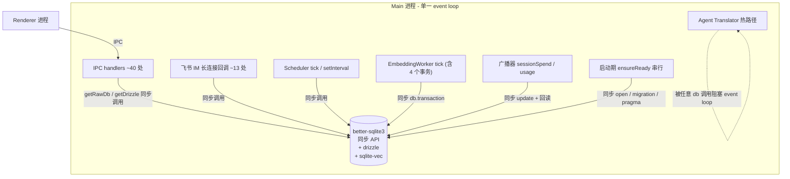
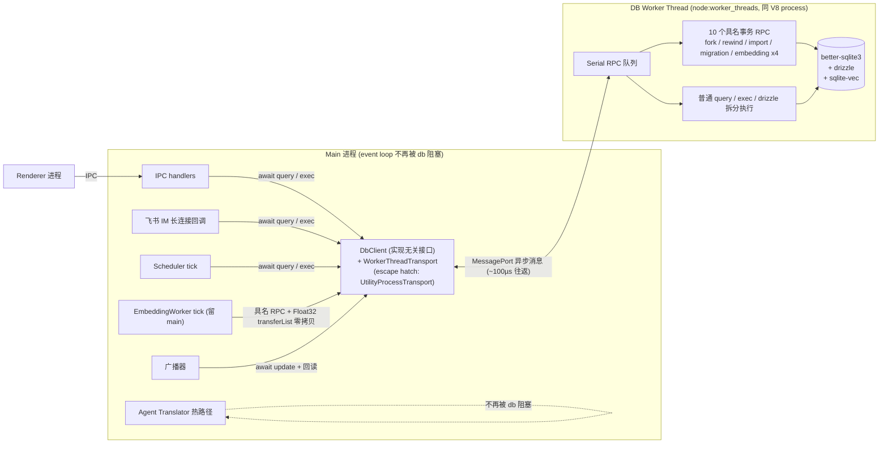

# Desktop DB 子进程化(方案 7)

> **配套文档(2026-06 审计)**:
> - `desktop-db-subprocess-callsites.md` —— 全部 ~158 个 db 调用点清单(按难度/事务/非IPC/热循环/write-read 分类)
> - `desktop-db-subprocess-tx-migration.md` —— 10 个 `db.transaction` 闭包的逐个搬迁方案
> - `desktop-db-subprocess-mr0-spike.md` —— SPIKE-0 已 PASS(dev 验证),SPIKE-1/2 标 N/A,只剩 SPIKE-3 drizzle 拆分
>
> **真实改造面**:经逐文件审计,db 调用点横跨 **30+ main 进程文件、~158 处**,其中 30 处难、**10 个事务闭包**需在 worker 侧重写。"db 在 main 进程里"波及的是大半个持久化层,不是 `localDb/` 一个文件夹。详见下方"真实改造面"与配套文档。
>
> **2026-06 决策结果(关键!)**:**走 worker_threads,不走 utilityProcess(不对齐 codex 子进程模型)**。理由 + 代价 + escape hatch 详见下方「决策结果」章节。"原方案 7 = utilityProcess" 措辞已在全文统一改为 "db worker thread"。codex 对照节保留作参考(我们没对齐其进程隔离形态,理由见决策章节)。

## 背景

xdt-maker desktop 当前把 SQLite(`better-sqlite3` 同步 API + `drizzle-orm`)直接跑在 Electron main 进程里。`apps/desktop/src/main/localDb/` 下 16 个文件全部是 main 进程独占的 db 调用面:`getRawDb()` / `getDrizzle()` 暴露给 IPC handler、chatHistorySearch、orcaWorkflowStore、dailySpend、schemaDriftDetector 等所有持久化路径都吃同一根 db 连接。

这个架构在 chat-data-localization 落地后(ADR-FE7/FE8/FE9)长期工作良好,直到 db 体积涨到几百 MB 级,关闭体验出现 ~5s 阻塞,根因定位为 main 进程内的 `db.backup` 物理瓶颈 + event loop 被 SQLite 同步 PRAGMA 整段占住。

我们已经做了一轮"在现有架构里榨"的优化(详见下节),把关闭从 ~4.85s 砍到 ~1.03s,但天花板已经触到了:**只要 db 还在 main 进程里、`closeDb` 还在 post-async 阶段、`PRAGMA optimize` 还要在退出前跑,就永远要花几百 ms 走 SQLite 自己的 graceful shutdown 节奏**。这一节奏不可被 main 进程的事件循环 yield 掉,是 better-sqlite3 同步 API 的本质属性。

方案 7 是终极架构方案:**把 db 操作整体下放到独立子进程,main 进程不再直接持有 db 连接**。main 退出时只需要关掉 stdin,子进程自己 graceful close db,main 进程瞬间退出,关闭体感接近 0。

## 已落地的优化(2026-06)

按落地顺序,作为方案 7 的前置事实:

1. **embedding worker 抢占退出**(commit `3dbd5c26`) —— embedding worker 的 `stop()` 改为 abort 语义,不再等 3s in-flight tick;tick 内增 3 个 checkpoint,SQLite 写操作不会被腰斩。修复了"关闭时 embedding worker 还在抓 SQLite 文件锁,导致 `clean_exit_snapshot` 拷贝拿到非一致快照"的数据完整性 bug。
2. **proxy dispose 即时 destroy + 砍 `quick_check`**(commit `76d365d8`) —— `anthropic-compat-proxy` 的 2s grace 改为立即 socket destroy;`cleanExitSnapshot` 内的 `PRAGMA quick_check`(同步阻塞 ~1.7s)前置砍掉。
3. **退出体验**(commit `80f807c5`) —— 无 in-flight 时跳过确认对话框直接关;关闭过程加 capsule overlay + spinner,让"砍掉确认框"不至于显得"点一下就僵在那"。
4. **砍 cleanExitSnapshot**(commit `93d93556`) —— 整段移除 `cleanExitSnapshot.ts`,容灾改由 SQLite WAL crash recovery 兜底。`.bak.clean` 文件不再 refresh,只保留 read 兼容(老用户磁盘上已有的 `.bak.clean` 仍作 SQLITE_CORRUPT 恢复 Step 1)。

实测关闭总耗时:**~4.85s → ~1.03s**。其中 `orphan-reaper` sync 阶段固定占 ~1.02s,async/post-async 阶段加起来 ~10ms 级。

## 残留问题

`orphan-reaper` 那 1.02s 是另一回事(枚举 claude 子进程 + kill),跟 db 无关。聚焦到 db 这条线:

- `closeDb()` 现在仍在 post-async 阶段, 需要等 `PRAGMA optimize` + `db.close()` 跑完。轻量 db 时 ~10ms,但 db 涨到 GB 级时 `PRAGMA optimize` 会重新爬慢
- 启动路径上 `ensureReady` 是 main 进程的串行阻塞:打开 db → migration → schema drift 检测 → 必要时回落到备份,任一步慢就阻塞窗口创建
- 长会话过程中,IPC handler 调 `getRawDb().prepare(...).all()` 是**进程内同步调用**,大查询(全表 scan / FTS5 大 corpus)会直接卡住 main 的事件循环,renderer 在窗口动画上能看到掉帧
- `migrationCoordinator` 跨多 db 实例的协调当前是"main 进程内静态变量",未来如果要支持"两个账号并存的 dev 调试"或"db 修复工具临时连同一文件",架构上没有干净边界

这些问题在当前架构里要么改不动(同步 API),要么改了也只是局部缓解;**架构上的根因是"db 在 main 进程里"**。

## 真实价值与 trade-off(2026-06 复盘)

> 关闭体感已经从 4.85s 砍到 1.03s,且剩下的 1s 主要是 orphan-reaper(跟 db 无关)。**db 子进程化对"关闭"几乎没有额外改善空间**。本节澄清"那这方案到底图什么",避免被原标题"关闭瞬间退出"误导。

### 真受益的 6 类场景

| # | 场景 | 当前问题 | 量级 |
|---|---|---|---|
| 1 | 大查询不卡 UI | FTS5 全表 scan / KNN 向量检索,卡 main 几百 ms,renderer 掉帧 | 大(显眼) |
| 2 | 高频小查询不再争 main event loop | `touchUserSent` 每条飞书消息必调、`persistSdkSessionId` 每次 agent 启动必调、`dailySpend` 每 turn 必调,1ms × N 在 main event loop 上累加 | 中(隐性) |
| 3 | **agent translator 热路径不被 db 偶发打断** | CLAUDE.md 规则 19:translator 是"每事件/每 token 都过一遍的热路径",当前任何 db 调用都跟 translator 抢 event loop,可能让 token 流出现微停顿 | 中-大(直接影响 agent 返回速度指标) |
| 4 | 飞书 IM 长连接回调不互相阻塞 | `sessionRepo` 13 处 db 调用挂在 WS 消息回调链里,A 消息的 db 查询阻塞 B 消息的处理 | 中 |
| 5 | scheduler tick / embedding tick / 定时任务不互挤 | 当前所有 setInterval 都跟 IPC handler 共享 main event loop | 小-中 |
| 6 | 启动期 `ensureReady` 串行阻塞可异步化 | 当前 db open → migration → schema drift 全卡 main,窗口创建被推后 | 小(只影响冷启动) |

**最大隐性收益是 #3** —— 跟 maker-core 性能基线直接相关。把 db 拽出 main 等于给 translator 独占 event loop。这条没被原方案显式列出,但实际价值不小于 #1。

### 必须诚实的两个 trade-off

1. **单次 db 调用 wall-clock 时间会略增**:每次多一次 IPC/thread message 往返(约 100µs-1ms)。原来 1ms 的小查询 → 改后 1.2-2ms。**main event loop 释放了,但单次延迟略升,典型的"以延迟换并发"**。
2. **循环内逐行调 db 的热点必须先批量化,否则性能负优化**:清单里 4 处,最严重的是 `chatHistorySearch.fetchContextWindow`(每命中 3 次串行 query,limit 10 → 30 次往返)。当前 µs 级,迁移后变 ms × N,**不重写就是负优化**。

### 一句话

> 不是图关闭快(已经够),是图 **main event loop 完全解放 + agent 热路径不被 db 打断**。代价是单次 db 延迟略升 + 4 处热循环必须先批量化。

## 决策结果:worker_threads + DbClient 实现无关层(2026-06)

> 原方案 7 默认 utilityProcess(对齐 codex)。2026-06 复盘后改为 **worker_threads**。本节给出决策、论据、代价、escape hatch。

### 决策

- **db worker 用 `node:worker_threads`,跑在 main 进程内的独立线程**(共享 V8 process,独立 isolate)
- `DbClient` 作为**实现无关层**:调用方只看接口,底层 transport 可在 `WorkerThreadTransport` / `UtilityProcessTransport` 间切换
- 默认 `WorkerThreadTransport`;万一出现 thread crash → 切 `UtilityProcessTransport` (**escape hatch**,调用方 0 改动)

### 为什么不对齐 codex 的子进程模型

codex 用独立 Rust 子进程是**已验证可行的方案**,但 2026-06 复盘后的硬约束变了:

1. **关闭体感已达标**(实测从 4.85s 砍到 1.03s,剩下 1s 是 orphan-reaper 跟 db 无关)— 子进程独占的最大单点优势(关闭 0ms 退出)对我们不再是硬指标
2. **真痛点是 main event loop 解放**(CLAUDE.md 规则 19 的 agent translator 热路径)— worker_threads 完全够解
3. **代价/收益**对我们项目更划算(见下表)

### worker_threads vs utilityProcess(我们场景下的 8 维度对比)

| 维度 | worker_threads | utilityProcess | 权重 |
|---|---|---|---|
| 崩溃域 | 劣:thread 崩 → main 一起挂 | 优:子进程崩 → 弹 dialog,UI 仍在 | 中(better-sqlite3 在 main 跑 N 月 0 crash,实际概率极低) |
| IPC 性能 | **优**:MessagePort 同进程 ~100µs;`transferList` 真零拷贝 | 一般:跨进程 ~1ms;transferable 仍要序列化 | **高**(对齐真痛点) |
| 启动开销 | 优:~30-100ms(只 spawn V8 isolate) | 一般:~200-500ms(fork + 全新 Node runtime) | 低 |
| 内存增量 | 优:~30-100MB | 一般:80-150MB | 低 |
| 调试 / 诊断 | 劣:无独立 PID,日志靠 scope tag | 优:任务管理器看得到,独立 stdout/stderr | 中 |
| 生态 / 文档 | 劣:Electron 官方文档对 native modules 有警告 | 优:官方推荐 db 模式,codex/vscode 都走 | 中(警告主要针对"多 native module 动态 load",我们只 require 一个 better-sqlite3,Context Aware,核心风险不踩) |
| 实现复杂度 | **优**:共享 main 的 node_modules / module resolution / sqlite-vec 路径;**SPIKE-1/2 N/A** | 一般:forge config 要适配 utility process native target;SPIKE-1/2 必须跑 | **高**(省 1-2 周工程量) |
| 关闭体感 | 一般:thread terminate 跟 main 退出耦合 | 优:`app.exit(0)` 不等子进程 | 0(已确认不是需求) |

### 量化的核心收益

**性能(IPC 10x)**:158 调用点中高频路径(`touchUserSent` 每飞书消息、`persistSdkSessionId` 每 agent 启动、`dailySpend` 每 turn)按日均 3000 次估算 → worker_threads 累加 ~0.3s/天 vs utilityProcess ~3s/天,**差 ~2.7s 全在 main event loop 上**,直接抢 translator 热路径。

**大查询零拷贝**:FTS5 结果几 MB 通过 `transferList` 零拷贝传 vs structured-clone 完整序列化 → 大查询路径快 10-20x。

**agent 性能基线(规则 19 四指标)**:db 跟 prompt 物理隔离 → db 改动 0 概率污染缓存前缀;translator **独占 event loop**,无外来打断;token 流稳定;profiling 清晰。**这是最大隐性收益**。

**工程量**:省 SPIKE-1 + SPIKE-2 + forge config 改动 + packaged 边界 case 排查 ≈ 1-2 周。

### 必须接受的代价

| 代价 | 量级 | 缓解 |
|---|---|---|
| thread 崩 → main 一起挂 | 概率极低(better-sqlite3 N 月 0 crash) | **DbClient escape hatch**:接口实现无关,切 `UtilityProcessTransport` 不动调用方;main 进程级 db error boundary 包住所有 RPC throw |
| 无独立 PID,调试需 scope tag | 中 | 沿用项目统一 logger 加 `[db-worker]` scope |
| 单次 db 调用 +100µs | 极小 | 整体并发优势抵消 |
| 循环内调 db 的热点(4 处,见 callsites doc) | 中 | **迁移前先批量化**(批量 RPC;utilityProcess 路径同样要做) |

### Escape hatch 设计(MR1 硬要求)

`DbClient` API 设计**绝对不能绑死 worker_thread 形态**:

```ts
// 调用方只看接口,不知道底层是 worker_thread 还是 utility process
interface DbClient {
  query<T>(sql: string, params?: unknown[]): Promise<T[]>;
  exec(sql: string, params?: unknown[]): Promise<{ changes: number; lastInsertRowid: number | bigint }>;
  tx<R>(name: string, args: unknown): Promise<R>;  // 10 个具名事务统一这个口
  dispose(): Promise<void>;
}

// 底层 transport 单独抽
interface DbTransport {
  send(op: string, args: unknown): Promise<unknown>;
  close(): Promise<void>;
}
class WorkerThreadTransport implements DbTransport { /* new Worker(...) + MessagePort */ }
class UtilityProcessTransport implements DbTransport { /* utilityProcess.fork(...) + MessageChannelMain */ }

// 工厂选 transport,默认 worker thread
function createDbClient(opts?: { transport?: 'worker-thread' | 'utility-process' }): DbClient
```

万一未来出 thread crash 频繁 → 一个 flag 切回子进程,**调用方代码 0 改动**。这条是接受 worker_threads 路径的**前提**,MR1 必须做对。

## 改动前后流程对照

### 改动前(当前架构)



**所有 db 调用同步发生在 main event loop 上**,translator / 动画 / IM 回调互相抢资源。

### 改动后(目标架构:db worker thread + DbClient 实现无关层)



**db 调用全部异步化,通过 DbClient → MessagePort → worker thread 内串行队列 → 同步 SQLite**。main event loop 释放给 translator / 动画 / IPC 调度,worker thread 内的同步事务不影响 main event loop。Float32Array 等大 payload 走 `transferList` 真零拷贝(同进程内存),IPC 往返 ~100µs(子进程模式 ~1ms,差 10x)。

### 关键变动一览

| 维度 | 改动前 | 改动后(worker_threads) |
|---|---|---|
| db 句柄位置 | main 进程 module-level 静态变量 | db worker thread 独占 |
| 调用方代码形态 | `getRawDb().prepare(sql).all(args)` 同步 | `await dbClient.query(sql, args)` 异步 |
| 事务 | main 进程内 `db.transaction(closure)` | worker thread 内 10 个具名 RPC(closure 整体下沉) |
| main event loop 上的 db 工作量 | 100% | 0%(只剩 IPC 序列化开销) |
| 单次 db 延迟 | µs-ms 级,同步 | +~100µs MessagePort 往返,异步 |
| 大 payload(FTS5 结果几 MB) | 同步直返 | `transferList` 真零拷贝 |
| 关闭体感 | 1.03s(其中 db 部分 ~10ms) | 不变(本来就不是 db 瓶颈) |
| translator 热路径独占 event loop | ❌ | ✅(最大隐性收益,对应规则 19) |
| 崩溃域 | db 错误同步抛 main | thread 崩 → main 一起挂(代价);可加 error boundary + escape hatch 切 UtilityProcess |
| DbClient 实现切换能力 | N/A | **escape hatch**:接口实现无关,thread/process 透明切 |

## codex 对照

codex 桌面端的架构(本地代码在 `cd-code/`,2026-05 调研):

- Electron main 启动时 spawn 一个 Rust `app-server` 子进程
- 所有 db 操作走 main → app-server 的 stdio JSON-RPC
- app-server 内部持有 SQLite 连接,跑 sqlx
- main 退出时:`appServer.stdin.end()` → Rust 端 `lines.next_line()` 收到 None → graceful close db → 进程自死
- main 进程的退出不等 app-server, app-server 自己在后台完成 graceful close;Electron 立刻 `app.exit(0)`
- 容灾:**完全靠 SQLite WAL crash recovery**。app-server 哪怕被 SIGKILL,下次启动 WAL 日志能 recover 所有已 commit 事务。没有任何"退出前备份"逻辑

**对 xdt-maker 的启示:**
- 进程边界本身就是性能的最大杠杆,不是某一个具体优化
- WAL crash recovery 是业界一等公民(VSCode / Slack / codex 同款),`db.backup` 这类"退出前保险"是历史包袱,不是必须
- 子进程不需要 Rust——Node `child_process` / Electron `utilityProcess` 都行,关键是**隔离边界**,不是语言。**我们走 worker_threads(同进程不同线程)而非子进程,理由见上方「决策结果」章节**

## 设计原则

1. **main 进程零 db 依赖**(零 SQLite 直接调用):`apps/desktop/src/main/localDb/` 下面所有直接 `Database`/`drizzle` 调用必须搬走;main 只保留一根 `DbClient`(thread message 句柄,实现无关)
2. **关闭体感不退化**:main 收到 quit 后,worker thread 跟随 main 退出。关闭体感已 1s 级别(瓶颈在 orphan-reaper 跟 db 无关),db 部分 ~10ms 不增加体感负担
3. **不引入 backup 路径**:容灾**完全靠 SQLite WAL crash recovery**。不写 `db.backup`、不写 `.bak.clean`、不写任何"退出前快照"。`.bak.{ISO}` 仅保留 schema migration 前的快照(那是迁移失败回滚用的,跟退出无关)
4. **不破坏现有 IPC 形状**:对 renderer 完全透明。renderer 仍调既有 IPC channel,handler 内部从"直接 `getRawDb()`"换成"async call DbClient"
5. **DbClient 对外只暴露 RPC**:不能让别的模块拿到 `Database` 实例的引用(否则隔离边界就漏了)。所有持久化路径都过 RPC 收口
6. **DbClient 实现无关**(escape hatch):接口跟 transport 解耦,默认 `WorkerThreadTransport`,可切 `UtilityProcessTransport` 不动调用方代码
7. **同步 → 异步是已知传染源**:现有 IPC handler 已经是 async,内部 db 调用从同步 `prepare().all()` 改成 `await db.query(...)` 不构成 contagion;但 main 进程内**非 IPC 调用方**(scheduler / orca / agent runtime / IM 回调链直接读 db 的位置)要逐一审计

## 架构设计

### 线程拓扑

```
┌──────────────────────────────────────────────────────────────┐
│ Electron Main Process (single V8 process)                    │
│                                                              │
│  ┌────────────────────────┐   MessagePort     ┌──────────┐   │
│  │ Main Thread            │ ←─ ~100µs/往返 ─→ │ DB Worker │  │
│  │                        │   transferList    │ Thread    │  │
│  │  - lifecycle           │   零拷贝大payload │           │  │
│  │  - IPC handlers ───────┼─── DbClient ─────►│ - sqlite  │  │
│  │  - scheduler / IM      │                   │ - drizzle │  │
│  │  - agent translator    │                   │ - migration│ │
│  │  - EmbeddingWorker     │                   │ - sqlite-vec│ │
│  │    (留 main, 路径 B)   │                   │           │  │
│  └────────────────────────┘                   └─────┬─────┘  │
│                                                     │        │
└─────────────────────────────────────────────────────┼────────┘
                                                      ▼
                                          <userData>/xdt-maker-*.db
                                                      (WAL mode)
```

### Worker 实现选择

候选 + 评估见上方「决策结果:8 维度对比」章节。结论:**`node:worker_threads`**(同 V8 process 独立 isolate)。

简要(详见决策章节):
- IPC 性能优 10x(MessagePort 同进程 ~100µs vs 子进程 ~1ms)
- 大 payload `transferList` 真零拷贝(同进程内存)
- 共享 main 的 node_modules + module resolution + sqlite-vec 加载路径 → 实现复杂度小一档,SPIKE-1/2 N/A
- 代价:崩溃域(thread 崩 → main 一起挂),概率极低,**用 DbClient escape hatch + main error boundary 兜底**

未来若 thread crash 频发 → 切 `UtilityProcessTransport`,调用方 0 改动(见 DbClient API 节)。

### 通信协议

底层 transport:`node:worker_threads` 的 `MessagePort`(同进程,~100µs 往返,`transferList` 真零拷贝)。escape hatch transport:Electron `utilityProcess` + `MessageChannelMain`(跨进程,代价见决策章节)。两种 transport 共享同一上层协议。

上层协议:简单的 request/response 消息,**不**引入完整 JSON-RPC 2.0 框架(YAGNI):

```ts
// main thread → db worker thread
type Request = {
  id: number;           // 单调递增, 对应 response 的 id
  op: string;           // 'query' | 'exec' | 'tx' | 'migration:run' | 'closeDb' | ...
  args: unknown[];
};

// db worker thread → main thread
type Response =
  | { id: number; ok: true; result: unknown }
  | { id: number; ok: false; error: { code: string; message: string; stack?: string } };

// db worker thread → main thread (push)
type Event =
  | { event: 'migration:progress'; phase: string; ... }
  | { event: 'corrupt-recovered'; source: 'iso'; mtime: string }
  | { event: 'log'; level: 'info' | 'warn' | 'error'; scope: string; payload: unknown };
```

**关键点:**
- 一个 `op` 对应一个 db 操作语义, 不是 raw SQL 透传(raw SQL 透传 = 把 SQL 拼接和参数绑定责任甩到协议层, 历史上必坑)
- 事务用具名 `op: 'tx:<name>'` + payload 单次往返(避免 N 次往返;事务内不能跨 IPC, 否则 hold 着 SQLite 锁阻塞其它请求)。10 个事务详见 `-tx-migration.md`
- 大 payload(FTS5 搜索结果、Float32 embeddings)走 `postMessage(msg, transferList)` 真零拷贝;benchmark 见"验收指标"
- 日志事件 push 回 main 走统一 logger 加 `[db-worker]` scope, 不让 db worker 自己写文件(否则日志路径冲突)

### DbClient API(实现无关层 + escape hatch)

main 侧只暴露 `DbClient` 接口,跟具体 transport(thread / process)解耦。**形状跟现在的 `getDrizzle()` 区别尽量小**,降低改造面:

```ts
// 实现无关接口 — 调用方只 import 这个,不知道底层 thread 还是 process
interface DbClient {
  query<T = unknown>(sql: string, params?: unknown[]): Promise<T[]>;
  queryOne<T = unknown>(sql: string, params?: unknown[]): Promise<T | undefined>;
  exec(sql: string, params?: unknown[]): Promise<{ changes: number; lastInsertRowid: number | bigint }>;
  /** 具名事务,10 个边界事务统一这个口 — 详见 -tx-migration.md */
  tx<R>(name: string, args: unknown): Promise<R>;

  /** drizzle proxy: builder 在 main 跑(pure),execute 走 RPC */
  drizzle: BetterSQLite3Database<typeof schema>;

  closeForUserSwitch(): Promise<void>;
  dispose(): Promise<void>;
}

// transport 抽象:DbClient 内部通过它收发消息
interface DbTransport {
  send(op: string, args: unknown): Promise<unknown>;
  on(event: 'log' | 'migration:progress' | 'corrupt-recovered', cb: (payload: unknown) => void): void;
  close(): Promise<void>;
}
class WorkerThreadTransport implements DbTransport { /* new Worker(...) + MessagePort */ }
class UtilityProcessTransport implements DbTransport { /* utilityProcess.fork(...) + MessageChannelMain — escape hatch */ }

// 工厂选 transport,默认 worker thread
function createDbClient(opts?: { transport?: 'worker-thread' | 'utility-process' }): DbClient
```

**关键约束(MR1 硬要求)**:**调用方代码绝对不能 import 任何 transport 实现细节**(没有 `import { worker } from 'worker_threads'` 出现在 `localDb/` 之外)。万一未来 thread crash 频发 → 一个 flag 切回 utility process,**调用方 0 改动**。

**drizzle proxy 的实现要点**:drizzle 的 `BetterSQLite3Database` 内部需要一个 `Database`-like 对象提供 `prepare` 等同步方法。直接拿 drizzle 套在 IPC 上做不到(IPC 是异步)。两种走法:
- **(a) shim 一个同步 `Database`**,内部用 `Atomics.wait` 阻塞 main 等 worker —— **明确不做**,把同步阻塞从 SQLite 搬到 IPC 上,性能负优化
- **(b) 重写 drizzle 调用面**:把 `db.select().from(...).where(...)` 换成 `db.query(sqlFromDrizzleBuilder, params)`。drizzle 的 query builder 可以独立于 driver 输出 SQL + params,**这条路是 SPIKE-3 要验的(已纳入 mr0-spike 文档)**

推荐 (b),细节在 MR1 探索 + SPIKE-3 验证。

### 生命周期

启动:
1. main 进程启动, 第一次需要 db 时 spawn db-worker
2. db-worker 起来后跑 `ensureReady(userId)`:打开文件 → migration → schema drift → SQLITE_CORRUPT 兜底
3. 完成后 ready 信号回 main, main 解锁所有 IPC handler

切账号:
1. main 调 `client.closeForUserSwitch()`
2. db worker thread 收到, graceful close 当前 db, 重新 `ensureReady(newUserId)`
3. ready 后返回 main, IPC handler 恢复处理

退出:
1. main 收到 `before-quit`
2. main 调 `client.dispose()` → MessagePort 发 `op: 'closeDb'` → await response(thread 跟 main 生命周期绑定,不能 fire-and-forget)
3. db worker thread 收到: graceful close db(`PRAGMA optimize` + `db.close()`)→ port 关闭
4. main 进程的 `before-quit` 走完所有 sync disposer 后 `app.exit(0)`
5. 关闭体感 ~10ms 级(db 部分;总关闭瓶颈仍是 orphan-reaper ~1s,跟 db 无关)

崩溃恢复:
- main 崩 / SIGKILL → 整个 V8 process 退出,thread 一起死 → 下次启动 SQLite WAL crash recovery 自动恢复已 commit 事务
- **db worker thread 崩(native SIGSEGV 等)→ 整个 main process 崩,UI 一起挂**(thread 跟 main 共享 V8,这是 worker_threads 路径的核心代价。详见决策章节)
  - **缓解 1**:`DbClient` 加 main 进程级 error boundary,所有 RPC throw 在 main 侧统一 catch,不让传到 unhandledRejection
  - **缓解 2**:escape hatch — 万一线上观察到 thread crash 频发,切 `UtilityProcessTransport` 不动调用方代码(详见 DbClient API 节)
  - **概率评估**:better-sqlite3 在 main 进程跑 N 个月 0 crash 报告,worker thread 内跑同一份代码触发 native crash 的概率不会显著变化
- db 文件本身 corrupt → db worker 内的 `tryRestoreWithFallback` 兜底(逻辑跟现在一样,**只是搬位置**), 走 SQLITE_CORRUPT 流程

### EmbeddingWorker 归属决策(必须先拍)

`embedding-host`(EmbeddingWorker tick + EmbeddingService)**当前就跑在 main 进程内**(setInterval + 直接持同步 db 连接),内含 4 个 `db.transaction` 闭包。但 embedding 的耦合不止 db:tick 里还有 `provider.getTextsForJobs()`(consumer 在 main 注册的闭包,读 messages 表)和 `client.embed()`(网络到 xdproxy + Bearer ANTHROPIC_API_KEY)。db 下放后二选一:

- **路径 A(不推荐):embedding-host 整体进 db-worker**。4 个事务不用改,但要把 **网络栈 + auth token + provider 注册模式**一起拖进 worker,provider 的 consumer 注册契约要重新设计,且 worker 崩溃域从"纯 db"扩大到"db + 网络 + auth"。
- **路径 B(推荐):embedding 留 main,db 操作走 RPC**。4 个事务改具名 RPC + `getTextsForJobs` 的 SELECT 改 query RPC。**worker 保持纯 db RPC 服务边界**(设计原则 5),net/auth/provider 全留 main 不动。`commitEmbeddings` 的 Float32Array 走 MessagePort transferable(128KB/批、5s 一 tick,零拷贝微秒级),不是性能问题。

详见 `desktop-db-subprocess-tx-migration.md`"洞察 1"。**本方案默认采路径 B。**

### 真实改造面(2026-06 审计结论)

逐文件审计后,改造面比初版估计大一个量级,三点必须正视:

1. **非 IPC 调用方不是"少",而是大头**:飞书 IM 长连接回调链就有 ~13 处 db 调用(`touchUserSent` 每条消息必调、`persistSdkSessionId` 每次 agent 启动必调),加 scheduler fire 回调、embedding tick、广播器。这批的同步→异步传染是真实风险,MR2 前必须逐一审计。
2. **10 个事务闭包**(见配套文档)是核心工作量。读源码确认其输入全是内存 POJO 数组/标量、闭包内无 await,搬迁模式统一为"具名 RPC + 数组/标量入参 + 计数返回",工作量大但风险可控。
3. **热路径性能要专测**:`chatHistorySearch.fetchContextWindow` 在循环内每命中 3 次串行 query(最差 30 次往返),迁移后必退化,需先批量化再迁移。

## 关键技术选型

- **better-sqlite3**:不换。同步 API 在 worker thread 里同样不阻塞 main thread 的 event loop(thread 各有自己的 isolate),继续用最成熟的实现
- **drizzle**:不换。query builder 是 pure 的,execute 阶段从同步变异步 RPC,兼容性 SPIKE-3 验证
- **sqlite-vec**:加载逻辑搬到 db worker thread,跟 db 实例绑死,main 不再持引用(worker thread 共享 main 的 `require` resolution,sqlite-vec 加载路径不变)
- **migration**:留在 db worker thread,跑完 push `migration:progress` 事件给 main 显示
- **FTS5 / chatHistorySearch**:留在 db worker thread,query API 走标准 RPC,大结果集走 `transferList` 零拷贝
- **schemaDriftDetector / orcaStaleIndexCleanup**:留在 db worker thread,启动时跑
- **worker_threads transport**:默认。**escape hatch:`UtilityProcessTransport`** 备用,实现无关接口允许 0 改动切换

## 迁移路径

分 MR0(spike)+ 4 个落地 MR,每个 MR 都可独立 ship,降低单 MR 风险。详细 spike 状态见 `desktop-db-subprocess-mr0-spike.md`。

### MR0:spike(状态)

- **SPIKE-0(worker_threads + better-sqlite3 + sqlite-vec 在 worker thread 内可用)**:**已 PASS**(2026-06-04 dev 验证 6/6,详见 mr0-spike 文档)。packaged 验证降级为 release smoke,不阻塞推进
- **SPIKE-1 / SPIKE-2**:**N/A**。worker_threads 路径下:
  - native deps 共享 main 的 node_modules,无需 forge config 改动适配 utility process target
  - TS migration `require(tsScriptPath)` 共享 main 的 module resolution,worker thread 的 `__dirname` 跟 main 一致
- **SPIKE-3(drizzle build/execute 拆分)**:**仍要做**(与 transport 形态无关)。挑最复杂的 6 条 query 验证 `.toSQL()` 可拆,在 MR1 阶段跑

### MR1:DbClient 骨架 + worker thread 启动 + 实现无关层

目标:`DbClient` 接口 + `WorkerThreadTransport` + `UtilityProcessTransport`(stub)+ 一两个 op 端到端跑通,**不接任何业务**。

范围:
- 新增 `apps/desktop/src/main/localDb/client/`(DbClient 接口 + transport 抽象 + 工厂)+ `apps/desktop/src/main/localDb/worker/`(worker thread 入口 + RPC dispatcher)
- 实现 `DbClient` skeleton:`query` / `exec` / `tx` / `dispose` 四个 RPC,worker 内绑到真 better-sqlite3(:memory: 起步,真 db 文件留 MR2)
- `WorkerThreadTransport` 完整实现,`UtilityProcessTransport` 留 stub(escape hatch 占位,确保接口分离干净)
- 集成 main 的 lifecycle:onQuit await `client.dispose()`(thread 跟 main 生命周期绑定)
- 全部加单测:client ↔ worker 双向 message、worker 崩了 client 的兜底、escape hatch transport 切换
- **不**改 `localDb/index.ts` 现有 `getRawDb`/`getDrizzle`,**不**改任何 IPC handler

验收:跑 dev,window 起得来,新 `DbClient` 与现有 `getRawDb()` 并存无冲突,smoke RPC(query / exec)往返成功。

### MR2:db worker thread 跑业务,main 仍可双写

目标:把 `localDb/` 整体逻辑搬到 worker,main 通过 `DbClient` 调用;留 feature flag,flag off 时走老路(main 直跑 db)作 rollback 兜底。

范围:
- 把 `apps/desktop/src/main/localDb/` 下 16 个文件的实现搬到 `apps/desktop/src/main/localDb/worker/`
- main 侧的 `localDb/index.ts` 改成 thin client 层:`getDrizzle()` / `getRawDb()` 标 deprecated 并 throw,引导调用方改用 `getDbClient()`
- drizzle proxy 落地:`db.select().from(...)` 走 builder → SQL → RPC 路径
- 所有 IPC handler 改造:`db.prepare(sql).all(args)` → `await dbClient.query(sql, args)`
- 10 个具名事务 RPC(见 `-tx-migration.md`)逐个落地到 worker
- migration / schema drift / orphan cleanup / SQLITE_CORRUPT 兜底全部搬到 worker
- 4 处循环内调 db 的热点(见 `-callsites.md`)先批量化再迁移
- 加 env flag `XDT_DB_INPROC=1` 走老路,默认走 worker
- 完整 e2e:登录 / 切账号 / 退出 / 重启在 worker 和 in-proc 两个模式都通

验收:
- 所有 IPC 路径功能等价
- 关闭耗时 ≤ 当前 1.03s(db 部分不应回退)
- WAL 文件在退出后存在(crash recovery 路径就绪)
- in-proc mode 仍可用(rollback 路径)
- agent translator 热路径在 db 操作下不被打断(规则 19 指标可观测改善)

### MR3:删除 in-proc fallback + cleanup

目标:线上跑稳后,删 in-proc 路径,简化代码。

范围:
- 删 `XDT_DB_INPROC` flag 分支
- 删 `localDb/index.ts` 里的 `_db` / `_drizzle` / `getRawDb` / `getDrizzle`(彻底转向 `getDbClient`)
- 删 `cleanExitSnapshot` 残余引用(理论上 commit `93d93556` 已删干净,复核一遍)
- 删旧 `.bak.clean` 兼容:worker 版本默认不再读 `.bak.clean`(老用户已迁完一轮)

前置:线上跑满 N 个版本(建议 2-3 个)无 crash report 后才能做。

### MR4:db worker 内部优化(可选,跟 MR3 解耦)

目标:利用线程隔离,做之前在 main 里做不了的事。

候选:
- 启动时 background `PRAGMA optimize`(thread 隔离了,慢也不影响 main event loop)
- 定期 `PRAGMA wal_checkpoint(TRUNCATE)`(控制 WAL 文件大小)
- 大查询自动 chunked stream(配合 `transferList` 零拷贝,避免一次性传几 MB)
- db 体积监控 + auto-vacuum 触发(目前没有)
- 单独的"db health"诊断面板 IPC

这些是 nice-to-have, 不是方案 7 的必要部分。

## 风险与权衡

| 风险 | 缓解 |
|---|---|
| 改造面非常大(~158 调用点 / 30+ 文件 / 10 事务) | MR2 用 in-proc fallback flag,出问题立刻 rollback;配套 `-callsites.md` 已按"难度/事务/非IPC/热循环"分层,易类批量改、难类逐个设计 RPC |
| 同步 → 异步传染到 scheduler / IM 回调 / agent runtime | MR2 前先按 `-callsites.md` 清单审计非 IPC 调用方(飞书 IM ~13 处、scheduler fire、broadcaster、embedding tick);`touchUserSent`/`persistSdkSessionId` 高频路径单独做延迟基线 |
| **worker thread crash → main 一起挂** | (1) DbClient main error boundary 包所有 RPC throw;(2) **escape hatch:`UtilityProcessTransport` 已在接口设计中预留,切换 0 调用方改动**;(3) better-sqlite3 在 main N 月 0 crash,实际概率极低 |
| IPC 往返开销高于进程内同步调用 | worker_threads MessagePort ~100µs/次,远低于子进程 ~1ms;`transferList` 真零拷贝大 payload;MR2 验收跑 benchmark(chatHistorySearch / orcaWorkflowStore list / dailySpend rollup),对比 in-proc / worker P50/P99 |
| WAL 模式下 main 进程被 SIGKILL | 下次启动 SQLite 自动 recover,这是 WAL 设计目的。零额外代码 |
| 循环内调 db 的热点(4 处)迁移后放大 N 倍往返 | MR2 前先批量化;`chatHistorySearch.fetchContextWindow` 最严重(30 次往返),改成批量 RPC |
| migration 进度通知体验降级 | MR2 已规划 `migration:progress` event 透传 |
| 调试无独立 PID(worker thread 短板) | 沿用项目统一 logger,加 `[db-worker]` scope tag |
| `commitEmbeddings` Float32Array 跨 thread 性能 | `transferList` 真零拷贝(128KB/批、5s/tick),微秒级;绝不用 JSON 序列化 number[] |
| embedding 子系统归属耦合 net/auth/provider | 采路径 B:embedding 留 main,只把 db 操作收口成 RPC,worker 保持纯 db |
| DbClient 接口被泄漏到 thread-specific 实现(escape hatch 失效) | MR1 硬要求:`localDb/` 之外的调用方禁止 import `worker_threads`/`utilityProcess`;CI lint 规则把关 |

## 验收指标

MR2 完成时必须实测:

| 指标 | 当前 | MR2 后(目标) |
|---|---|---|
| 关闭总耗时 | ~1.03s | 不退化(db 部分仍 ~10ms 量级) |
| 主路径 db 操作 P50(get session list) | ? | 不退化 > 20% |
| 主路径 db 操作 P99(chatHistorySearch FTS5) | ? | 不退化 > 50%(`transferList` 零拷贝抵消序列化) |
| 高频路径 5 次 db 串行(`touchUserSent` 等)总耗时 | ? | 不退化 > 30%(~100µs × 5 = +500µs 可接受) |
| 启动到窗口可交互 | ? | 不退化 > 10%(worker spawn ~50ms 开销) |
| **agent translator 热路径 event loop 阻塞中位值**(规则 19) | ? | **显著下降**(主诉求,db 不再抢 event loop) |

"?" 的基线在 MR1 阶段补齐(加性能埋点,走统一 logger)。

## 暂时搁置的备选方案

- **utilityProcess(对齐 codex 子进程模型)** —— 已严肃评估,8 维度对比下 worker_threads 在我们场景综合更优(见决策章节)。**保留为 escape hatch**:`DbClient` 实现无关接口预留 `UtilityProcessTransport`,万一 worker_threads 线上出现 crash 频发,0 调用方改动切换
- **直接迁 Rust app-server**(完全照 codex) —— 收益基本同方案 7,但要引入 Rust 工具链、跨平台编译、native binding 分发,投入产出比不划算。除非未来 xdt-maker 整体往 Rust 迁(目前无计划)
- **hidden BrowserWindow as worker**(Electron 官方推荐的另一条路) —— 跟 worker_threads 一样同进程,但要走 webContents IPC + 起一个隐藏 Chromium 渲染进程,启动开销 + 内存远大于 worker_thread,不划算
- **改用 Postgres / DuckDB / 其它 embedded DB** —— SQLite 是已知工作良好的选择,换 DB 等于推倒重来,不在本方案范围
- **`Atomics.wait` 阻塞同步 RPC** —— 见"DbClient API"部分,把同步阻塞从 SQLite 搬到 IPC 上是性能负优化,不做

## 已知技术债

### inline worker 与 TS reference 双实现的代码重复

- **现状**:`WORKER_CODE` inline string 是运行路径,`worker/opHandlers/*.ts` 是 TS reference / 单测路径,两边维护相同 op 逻辑。
- **风险**:任何 op 改动都必须双边同步,长期必然出现行为漂移。
- **建议收拾方向**:
  - 选项 A:build 时把 TS reference 内容字符串化注入 `WORKER_CODE`。
  - 选项 B:worker 启动后用 `require(workerData.opHandlersPath)` 加载 TS 文件(需解决 Electron #43513 在 packaged app 找不到 `.ts` 的问题)。
- **触发时机**:下次新增 op handler 时,如果实现长度 > 50 行,先收拾双实现债再加。

## 参考

- 已落地 commit:`3dbd5c26` / `76d365d8` / `80f807c5` / `93d93556`
- ADR-FE7 修订说明:`apps/desktop/src/main/localDb/index.ts` 文件头
- codex 对照:`cd-code/`(本地仓库, 2026-05 调研)
- SQLite WAL 文档:<https://www.sqlite.org/wal.html>
- Electron `utilityProcess`:<https://www.electronjs.org/docs/latest/api/utility-process>
