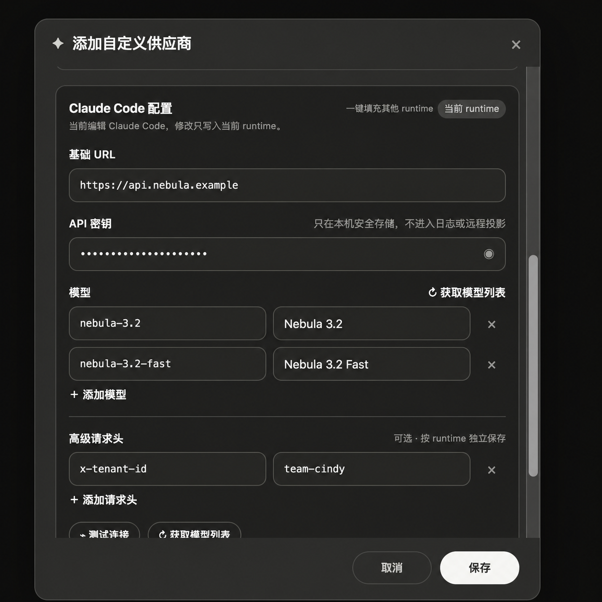
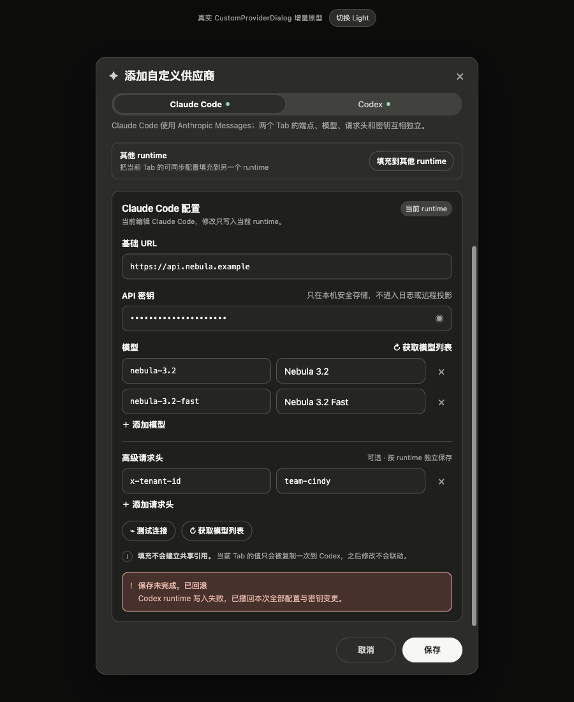

# 自定义供应商：一键填充其他 runtime（独立配置）

## 1. 结论

这是 Desktop Settings 的纯客户端体验优化：用户在当前 runtime Tab 填好配置后，在配置卡右上角点击一个低对比度的“一键填充其他 runtime”入口，再按提示把可同步字段复制到其他 runtime。

这不是新的应用范围向导，也不把多个 runtime 改成共享配置。复制完成后仍保存为现有的 per-runtime 独立配置与独立凭证记录，后续修改互不联动。

设计原则：**入口轻量，差异先看，覆盖要确认，复制后隔离。**



## 2. 用户问题

### 2.1 反馈来源

- 来源频道：Discord `#日常讨论`
- 原帖：`https://discord.com/channels/1524291334654132335/1524310903514992730/1535277016469864550`
- 提问人显示名称：fancy
- 脱敏摘要：同一自定义模型供应商需要接入多个 Harness 时，端点、API Key 和模型重复填写，希望一次填写并选择应用范围。

### 2.2 当前摩擦

现有 `CustomProviderDialog` 使用“共享供应商名称 + per-runtime Tab”结构，Base URL、API Key、模型和请求头都要在各 runtime Tab 中重复填写。底层配置形态已经是 `CustomProviderConfig.runtimes`，但创建 UI 没有批量应用入口。

当前仓库事实还需特别说明：

- `packages/model-providers/src/types.ts` 的 `AgentKind` 目前是 `claude-code | codex`；
- `CustomProviderDialog.tsx` 和 safeStorage helper 目前也只枚举 Claude Code、Codex；
- 本方案将 Pi 纳入目标体验，但正式实现 Pi 前，必须先让 Pi 进入同一份 runtime capability manifest 与 provider 配置契约；
- 不应在 Renderer 中单独硬编码一个只用于视觉的 Pi 分支。

## 3. 产品目标与非目标

### 3.1 目标

1. 用户可从当前 runtime 一次触发对其他兼容 runtime 的填充。
2. 公共配置只填写一次。
3. 保存结果仍是独立 per-runtime 配置、模型清单、请求头和密钥记录。
4. 目标已有值时先展示差异，再进入字段级覆盖确认。
5. 不兼容协议不能被静默复制，并要说明原因。
6. 复制后任一 Harness 可单独覆盖端点、模型、请求头和凭证。
7. 维持现有原子提交/回滚、安全存储、日志脱敏和远程投影边界。
8. 单 Harness 创建与现有编辑流程不退化。

### 3.2 非目标

- 不合并 Claude Code、Codex、Pi 的 wire protocol。
- 不让多个 runtime 永久读取同一份可变配置。
- 不共享 API Key、Authorization Header 或 OAuth token 的存储引用。
- 不假设相同模型 ID 在不同 runtime 下具有相同能力。
- 不改变内置预设的一次连接体验。
- 不在本方案中新增服务端接口。

## 4. 交互设计

### 4.1 真实界面基线

入口保持“设置 → 模型供应商 → 添加供应商 → 自定义供应商”。这不是新建一套页面，而是在现有 `CustomProviderDialog` 上增加一个局部模块。

当前真实外壳必须保留：

- 600px 弹窗、标题栏、关闭按钮和底部取消 / 保存；
- 预设模板、显示名称、API 密钥 / OAuth 鉴权切换；
- Claude Code / Codex runtime Tab；
- Base URL、API Key、模型行、请求头、测试连接、获取模型列表。

编辑已有供应商继续使用原来的 per-runtime 编辑流程；一键填充是同一表单内的显式动作，不产生隐式联动。

### 4.2 增量模块：配置卡右上角的轻入口

不增加新的主表单行，也不把复制动作做成第三套向导。当前 runtime 配置卡标题右侧并列放置：

1. 低对比度文字按钮“一键填充其他 runtime”；
2. 现有的“当前 runtime / 已有独立配置”状态徽标。

按钮只承担“开始一次复制”的动作，不展示密钥、不改变当前字段值。点击后才打开差异提示层。

真实仓库当前 `AgentKind` 只有 `claude-code` 与 `codex`，所以原型只呈现这两个 Tab；Pi 只有在 capability manifest、runtime adapter 和 provider 配置契约真正落地后才加入同一 Tab 列表。

兼容性必须来自 runtime capability manifest，不允许通过模型 ID、厂商名或 UI Tab 猜测。目标 runtime 不兼容时，在差异提示层中明确列为“不可填充”并给出原因；不能直接复制后再让运行时失败。


### 4.3 来源与独立副本

现有 runtime Tab 继续承担配置编辑，复制动作只产生一次性的目标 draft：

- 当前编辑的 Tab 显示“当前 runtime”徽标；
- 另一个已存在配置的 Tab 显示“已有独立配置”；
- 目标已有值时先列出 Base URL、API Key、模型、请求头和模型端点的差异；
- 用户在覆盖确认层逐项选择要覆盖的字段；
- 覆盖后目标 Tab 仍可直接编辑，并提示“修改只写入当前 runtime，不会回写来源”；
- 保存时只物化为现有 per-runtime 配置，不持久化“共享来源”或继承关系。

这样用户看到的仍是熟悉的真实表单，复制入口只在需要时出现，不需要学习新的创建向导。

### 4.4 现有操作保持原位置

以下能力不重画、不迁移：

- 预设下拉仍使用现有 Popover；
- API Key 显示 / 隐藏仍使用现有眼睛按钮；
- 模型和请求头仍使用现有增删行；
- 测试连接、获取模型列表仍是当前 runtime 的原有按钮；
- 底部保存按钮继续触发现有保存链路。

### 4.5 保存失败

任一 runtime 保存失败时：

- 不关闭现有弹窗；
- 不显示部分成功；
- 在当前表单内显示“保存未完成，已回滚”；
- 定位失败 runtime；
- 保留用户已填写内容，允许修正后重试；
- 回滚本次新建的全部 runtime 配置与密钥变更。



## 5. 状态模型

Renderer 保留当前表单的 per-runtime draft，并为一次填充动作增加短生命周期的同步状态；不把“公共配置”持久化为第四种配置实体：

```ts
interface RuntimeDraft {
  baseUrl: string;
  models: ProviderRuntimeModelConfig[];
  headers?: Record<string, string>;
  modelsUrl?: string;
  // API key 只存在于当前表单内存，提交时走 safeStorage，不进 config。
  apiKey?: string;
}

interface RuntimeSyncDraft {
  source: AgentKind;
  targets: AgentKind[];
  diffByTarget: Partial<Record<AgentKind, SyncFieldDiff[]>>;
  overwriteByTarget: Partial<Record<AgentKind, SyncFieldKey[]>>;
}
```

同步候选字段是 `baseUrl`、`models`、`modelsUrl`、`headers` 和 API Key。协议不是 `CustomProviderRuntimeConfig` 的任意字段，而是由 runtime capability / routing descriptor 判断；不兼容时目标不可填充。供应商 `name`、全局 `auth` / OAuth descriptor 不在同步范围。

提交前执行纯函数物化：

```ts
materializeRuntimeSnapshot(sourceDraft, targetDraft, overwriteByTarget[target])
```

产出仍是现有 per-runtime 结构：

```ts
CustomProviderConfig.runtimes[runtime]
RuntimeKeys[runtime]
```

`source` 与 `overrides` 只存在于 Renderer 草稿状态；保存后不落库、不进入 catalog、不进入远程投影。

## 6. 协议兼容性

建议新增共享、可测试的 runtime manifest，而不是在 `CustomProviderDialog` 内写条件分支：

```ts
interface ProviderRuntimeCapability {
  runtime: AgentKind;
  acceptedProtocols: ProviderProtocol[];
  supportsCustomBaseUrl: boolean;
  supportsRequestPath: boolean;
  supportsModelsDiscovery: boolean;
  authModes: Array<'apiKey' | 'oauth'>;
}
```

用途：

- Renderer 决定 Harness 是否可选及原因；
- main 进程在保存时再次校验，防止 Renderer 绕过；
- provider diagnostics 和 model fetch 使用同一协议事实；
- Pi 加入时只扩展 manifest 与其真正的 runtime adapter，不在多个页面重复枚举。

错误结构建议返回稳定 code：

```ts
type RuntimeCompatibilityError =
  | 'PROTOCOL_UNSUPPORTED'
  | 'AUTH_MODE_UNSUPPORTED'
  | 'CUSTOM_ENDPOINT_UNSUPPORTED'
  | 'RUNTIME_UNAVAILABLE';
```

UI 根据 code 展示本地化原因，不展示内部异常文本。

## 7. 保存与回滚

### 7.1 提交边界

一键填充本身只更新当前表单里的目标 runtime draft，不直接写数据库，也不直接写 safeStorage。用户点击底部“保存”后，继续沿用现有 per-runtime 配置提交、密钥写入和原子回滚语义；本轮设计不引入共享密钥引用。

如果正式实现需要一次提交多个目标 runtime，批量编排必须放在 main 进程，并复用现有原子提交 / 补偿回滚能力，不能由 Renderer 循环调用多个独立保存接口后宣称原子。

### 7.2 建议 IPC

```ts
createCustomProviderBatch(input: {
  config: CustomProviderConfig;
  secrets: Partial<Record<AgentKind, string>>;
}): Promise<{ ok: true }>;
```

main 进程流程（仅在现有保存链路需要扩展批量提交时）：

1. 校验 provider id、runtime manifest 兼容性、URL、模型和 headers；
2. 在内存中读取将被覆盖的旧配置与旧密钥；
3. 开启 localDb transaction，写入完整 `CustomProviderConfig`；
4. 为每个 runtime 写独立临时加密 secret，再原子替换正式 secret；
5. 任一步失败：恢复旧 secret，回滚数据库 transaction；
6. 全部成功后刷新 active catalog，并只广播一次 provider changed；
7. 返回 Renderer 的错误只包含 runtime、阶段和脱敏 code。

如果 safeStorage helper 当前不支持临时写/原子替换，第一阶段也必须实现显式补偿回滚，并以测试证明不存在半成品；不得把 Renderer 的多次调用称作原子。

### 7.3 更新已有供应商

本轮不改变编辑语义：

- 每个 runtime 单独编辑；
- 留空密钥沿用当前密钥；
- 修改一个 runtime 不向其他 runtime 扩散；
- 若未来提供“复制到另一个 Harness”，它必须是明确动作并再次经过兼容性检查与确认。

## 8. 安全与隐私

- `CustomProviderConfig` 永远不含 API Key。
- 每个 runtime 的密钥使用独立 key，例如 `provider_key_<providerId>_<runtime>`。
- Authorization、x-api-key、Cookie、OAuth access/refresh token 等不得进入 headers 普通字段；输入时应识别并路由到 secret storage，或拒绝保存并给出迁移提示。
- Renderer 日志不得记录 draft、Key、敏感 Header 值或完整 OAuth 描述符。
- IPC 错误、diagnostics、device-link / remote projection 只传 `hasSecret`、测试状态、runtime、脱敏错误 code。
- 测试连接与获取模型列表接受明文 Key 时，仅作为一次性 IPC 参数进入 main 内存，不落盘、不复用到日志。
- 截图、埋点和异常上报不得包含输入值。

## 9. 代码影响范围

主要文件：

| 层 | 建议改动 |
|---|---|
| Renderer | 在现有 `CustomProviderDialog.tsx` 的 runtime 配置卡右上角增加低对比度入口、差异提示层和字段级覆盖状态；不新增第二套设置页 |
| Renderer helper | 复用现有 custom provider 保存链路；同步动作只合并当前 draft，读取/删除保持 per-runtime |
| Shared types | `packages/model-providers/src/types.ts` 增加协议枚举与 runtime capability；Pi 准备完成后扩展 `AgentKind` |
| Main IPC | `providerHandlers.ts` 增加 batch create/update handler 与 main-side compatibility validation |
| Storage | `custom-provider-store.ts` 提供 transaction/restore primitive；secret store 提供批量写与补偿回滚 |
| Catalog | `buildUserProvider` 继续只消费物化后的 per-runtime 快照，不引入 source/inheritance |
| i18n | 新增范围、兼容原因、快照、回滚、安全说明文案，覆盖 zh-CN/en |
| Tests | draft materialize、compatibility matrix、batch rollback、redaction、单 Harness 回归、Light/Dark visual contract |

不涉及服务端、wire protocol 或远程数据库 migration。

## 10. 交付拆分

### PR 1：能力与原子提交基础

- Provider protocol / runtime capability manifest；
- main-side compatibility validation；
- batch create IPC；
- localDb + secret 补偿回滚测试；
- 敏感数据脱敏测试。

### PR 2：真实弹窗增量 UI

- 在现有 `CustomProviderDialog` 配置卡右上角增加“一键填充其他 runtime”；
- 差异提示、字段级覆盖确认、来源 / 独立副本状态；
- Light/Dark；
- i18n、键盘与焦点管理；
- 单 Harness 回归。

### PR 3：Pi 接入（仅当 Pi runtime provider contract 已落地）

- 扩展 `AgentKind` 与所有固定 agent 枚举；
- 增加 Pi capability manifest、路由、diagnostics 与 secret key；
- 加入创建向导兼容矩阵和端到端测试。

Pi 不应被夹在 UI PR 中作为假入口，否则会出现“能选但不能运行”的产品回归。

## 11. 验收映射

- [ ] 可从当前 runtime 一次触发对其他兼容 runtime 的填充，并只输入一次公共配置：配置卡右上角轻入口 + 同步 draft。
- [ ] 保存后生成独立 per-runtime 配置和密钥记录：物化现有 `runtimes` + per-runtime safeStorage。
- [ ] 不兼容协议不能被静默复制：manifest 双端校验 + 差异层原因提示。
- [ ] 每个 Harness 可单独覆盖端点、模型和凭证：字段级覆盖确认 + 保存后 per-runtime 编辑。
- [ ] 单 Harness 创建与现有供应商编辑流程无回归：不点击入口时表单结构和行为保持不变。
- [ ] 任一 runtime 保存失败时维持原子回滚语义：复用现有保存链路，批量扩展时补充 main 侧回滚测试。
- [ ] Renderer、日志和远程投影不暴露 API Key 或敏感 Header：secret-only IPC path + redaction tests。

## 12. 原型与视觉资产

- 可交互原型：`docs/design-prototypes/custom-provider-multi-harness/index.html`（自包含单文件，基于真实弹窗外壳）
- 右上角入口视觉参考（imagegen）：`assets/top-right-sync-dark.png`
- 差异提示图：`assets/protocol-openai-light.png`
- Dark 覆盖确认图：`assets/review-dark.png`
- 回滚图：`assets/rollback-dark.png`
- 非主流程隔离语义概念图：`assets/runtime-snapshot-concept.png`

主流程以真实 `CustomProviderDialog` 原型和右上角入口视觉参考为准；概念图只用于解释“复制后隔离”，不代表最终界面。
