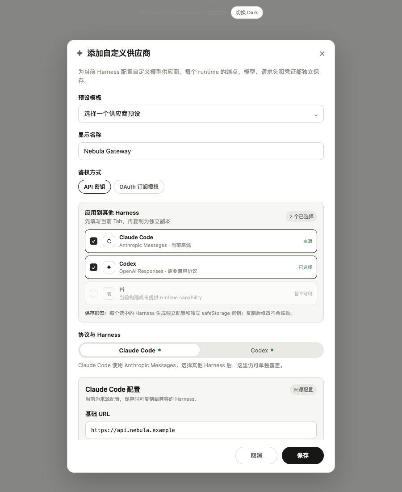

# 自定义供应商一次配置、多 Harness 独立快照

## 1. 结论

这是 Desktop Settings 的纯客户端体验优化。创建自定义供应商时，允许用户先选择多个协议兼容的 Harness，只填写一套来源配置，再把它复制为各 runtime 的独立配置与独立凭证记录。

它不改变 runtime 协议、不建立共享密钥引用，也不让后续编辑产生跨 Harness 联动。

设计原则：**一次输入，复制快照，之后隔离。**



## 2. 用户问题

### 2.1 反馈来源

- 来源频道：Discord `#日常讨论`
- 原帖：`https://discord.com/channels/1524291334654132335/1524310903514992730/1535277016469864550`
- 提问人显示名称：fancy
- 脱敏摘要：同一自定义模型供应商需要接入多个 Harness 时，端点、API Key 和模型重复填写，希望一次填写并选择应用范围。

### 2.2 当前摩擦

现有 `CustomProviderDialog` 使用“共享供应商名称 + per-runtime Tab”结构，Base URL、API Key、模型和请求头都要在各 runtime Tab 中重复填写。底层配置形态已经是 `CustomProviderConfig.runtimes`，但创建 UI 没有批量应用入口。

当前仓库事实还需特别说明：

- `packages/model-providers/src/types.ts` 的 `AgentKind` 目前是 `claude-code | codex`；
- `CustomProviderDialog.tsx` 和 safeStorage helper 目前也只枚举 Claude Code、Codex；
- 本方案将 Pi 纳入目标体验，但正式实现 Pi 前，必须先让 Pi 进入同一份 runtime capability manifest 与 provider 配置契约；
- 不应在 Renderer 中单独硬编码一个只用于视觉的 Pi 分支。

## 3. 产品目标与非目标

### 3.1 目标

1. 用户可一次选择多个兼容 Harness。
2. 公共配置只填写一次。
3. 保存结果仍是独立 per-runtime 配置、模型清单、请求头和密钥记录。
4. 不兼容协议在选择阶段明确禁选并解释原因。
5. 复制后任一 Harness 可单独覆盖端点、路径、协议、模型、请求头和凭证。
6. 维持现有原子提交/回滚、安全存储、日志脱敏和远程投影边界。
7. 单 Harness 创建与现有编辑流程不退化。

### 3.2 非目标

- 不合并 Claude Code、Codex、Pi 的 wire protocol。
- 不让多个 runtime 永久读取同一份可变配置。
- 不共享 API Key、Authorization Header 或 OAuth token 的存储引用。
- 不假设相同模型 ID 在不同 runtime 下具有相同能力。
- 不改变内置预设的一次连接体验。
- 不在本方案中新增服务端接口。

## 4. 交互设计

### 4.1 真实界面基线

入口保持“设置 → 模型供应商 → 添加供应商 → 自定义供应商”。这不是新建一套页面，而是在现有 `CustomProviderDialog` 上增加一个局部模块。

当前真实外壳必须保留：

- 600px 弹窗、标题栏、关闭按钮和底部取消 / 保存；
- 预设模板、显示名称、API 密钥 / OAuth 鉴权切换；
- Claude Code / Codex runtime Tab；
- Base URL、API Key、模型行、请求头、测试连接、获取模型列表。

编辑已有供应商继续使用原来的 per-runtime 编辑流程；“应用到其他 Harness”只在创建态显示，不产生隐式联动。

### 4.2 增量模块：应用到其他 Harness

新增区域放在鉴权方式之后、现有 runtime Tab 之前，使用当前设置页相同的卡片、边框、输入高度和 pill 语言：

1. 标题“应用到其他 Harness”；
2. 说明“先填写当前 Tab，再复制为独立副本”；
3. 显示当前来源 runtime；
4. 列出可选目标 runtime；
5. 兼容项可勾选，不兼容项保留可见但禁选并解释原因；
6. 固定说明“每个选中的 Harness 生成独立配置和独立 safeStorage 密钥”。

当前仓库的真实 runtime 只有 Claude Code 与 Codex。Pi 不在当前 Tab 中显示，只有在 capability manifest、runtime adapter 和 provider 配置契约真正落地后才加入这一区域。

兼容性必须来自 runtime capability manifest，不允许通过模型 ID、厂商名或 UI Tab 猜测。原型中的 Codex 禁选状态只是当前 `Anthropic Messages` 来源下的真实兼容性示例；切换 `OpenAI Responses` 后，原有 Tab 和字段仍然保留，只更新兼容提示。


### 4.3 来源与独立副本

现有 runtime Tab 继续承担配置编辑，不引入第二套向导：

- 当前来源 Tab 显示“来源配置”徽标；
- 选择兼容目标后，目标 Tab 显示“独立副本”；
- 目标 Tab 的 Base URL、模型、请求头和凭证字段仍可直接编辑；
- 编辑目标时明确提示“修改只写入当前 runtime，不会回写来源”；
- 保存时由 draft 物化为现有 per-runtime 配置，不持久化“共享来源”实体。

这样用户看到的是熟悉的真实表单，只增加了批量复制和隔离状态，不需要学习一套新的三步向导。

### 4.4 现有操作保持原位置

以下能力不重画、不迁移：

- 预设下拉仍使用现有 Popover；
- API Key 显示 / 隐藏仍使用现有眼睛按钮；
- 模型和请求头仍使用现有增删行；
- 测试连接、获取模型列表仍是当前 runtime 的原有按钮；
- 底部保存按钮继续触发现有保存链路。

### 4.5 保存失败

任一 runtime 保存失败时：

- 不关闭现有弹窗；
- 不显示部分成功；
- 在当前表单内显示“保存未完成，已回滚”；
- 定位失败 runtime；
- 保留用户已填写内容，允许修正后重试；
- 回滚本次新建的全部 runtime 配置与密钥变更。


## 5. 状态模型

Renderer 使用一次性的 draft，不把“公共配置”持久化为第四种配置实体：

```ts
type ProviderProtocol = 'anthropic-messages' | 'openai-responses';

interface CustomProviderCreateDraft {
  id: string;
  name: string;
  authMode: 'apiKey' | 'oauth';
  source: RuntimeDraftFields;
  selectedRuntimes: AgentKind[];
  overrides: Partial<Record<AgentKind, Partial<RuntimeDraftFields>>>;
}

interface RuntimeDraftFields {
  protocol: ProviderProtocol;
  baseUrl: string;
  requestPath?: string;
  modelsUrl?: string;
  models: ProviderRuntimeModelConfig[];
  headers: HeaderDraft[];
  apiKey?: string;
}
```

提交前执行纯函数物化：

```ts
materializeRuntimeDraft(source, overrides[runtime])
```

产出仍是现有 per-runtime 结构：

```ts
CustomProviderConfig.runtimes[runtime]
RuntimeKeys[runtime]
```

`source` 与 `overrides` 只存在于 Renderer 草稿状态；保存后不落库、不进入 catalog、不进入远程投影。

## 6. 协议兼容性

建议新增共享、可测试的 runtime manifest，而不是在 `CustomProviderDialog` 内写条件分支：

```ts
interface ProviderRuntimeCapability {
  runtime: AgentKind;
  acceptedProtocols: ProviderProtocol[];
  supportsCustomBaseUrl: boolean;
  supportsRequestPath: boolean;
  supportsModelsDiscovery: boolean;
  authModes: Array<'apiKey' | 'oauth'>;
}
```

用途：

- Renderer 决定 Harness 是否可选及原因；
- main 进程在保存时再次校验，防止 Renderer 绕过；
- provider diagnostics 和 model fetch 使用同一协议事实；
- Pi 加入时只扩展 manifest 与其真正的 runtime adapter，不在多个页面重复枚举。

错误结构建议返回稳定 code：

```ts
type RuntimeCompatibilityError =
  | 'PROTOCOL_UNSUPPORTED'
  | 'AUTH_MODE_UNSUPPORTED'
  | 'CUSTOM_ENDPOINT_UNSUPPORTED'
  | 'RUNTIME_UNAVAILABLE';
```

UI 根据 code 展示本地化原因，不展示内部异常文本。

## 7. 保存与回滚

### 7.1 现状风险

当前 Renderer helper 的顺序是“先写 localDb 配置，再逐 runtime 写 safeStorage”。这不是真正的跨存储原子事务：配置写成功、后续某条密钥写失败时，可能出现部分状态。

用户给出的验收标准要求“任一 runtime 保存失败时维持现有原子回滚语义”，正式实现应把批量提交编排收回 main 进程，不能只在 UI 循环调用多个现有 helper。

### 7.2 建议 IPC

```ts
createCustomProviderBatch(input: {
  config: CustomProviderConfig;
  secrets: Partial<Record<AgentKind, string>>;
}): Promise<{ ok: true }>;
```

main 进程流程：

1. 校验 provider id、runtime manifest 兼容性、URL、模型和 headers；
2. 在内存中读取将被覆盖的旧配置与旧密钥（新建通常为空）；
3. 开启 localDb transaction，写入完整 `CustomProviderConfig`；
4. 为每个 runtime 写独立临时加密 secret，再原子替换正式 secret；
5. 任一步失败：恢复旧 secret，回滚数据库 transaction；
6. 全部成功后刷新 active catalog，并只广播一次 provider changed；
7. 返回 Renderer 的错误只包含 runtime、阶段和脱敏 code。

如果 safeStorage helper 当前不支持临时写/原子替换，第一阶段也必须实现显式补偿回滚，并以测试证明不存在半成品；不得把 Renderer 的多次调用称作原子。

### 7.3 更新已有供应商

本轮不改变编辑语义：

- 每个 runtime 单独编辑；
- 留空密钥沿用当前密钥；
- 修改一个 runtime 不向其他 runtime 扩散；
- 若未来提供“复制到另一个 Harness”，它必须是明确动作并再次经过兼容性检查与确认。

## 8. 安全与隐私

- `CustomProviderConfig` 永远不含 API Key。
- 每个 runtime 的密钥使用独立 key，例如 `provider_key_<providerId>_<runtime>`。
- Authorization、x-api-key、Cookie、OAuth access/refresh token 等不得进入 headers 普通字段；输入时应识别并路由到 secret storage，或拒绝保存并给出迁移提示。
- Renderer 日志不得记录 draft、Key、敏感 Header 值或完整 OAuth 描述符。
- IPC 错误、diagnostics、device-link / remote projection 只传 `hasSecret`、测试状态、runtime、脱敏错误 code。
- 测试连接与获取模型列表接受明文 Key 时，仅作为一次性 IPC 参数进入 main 内存，不落盘、不复用到日志。
- 截图、埋点和异常上报不得包含输入值。

## 9. 代码影响范围

主要文件：

| 层 | 建议改动 |
|---|---|
| Renderer | 在现有 `CustomProviderDialog.tsx` 内增加范围选择、source draft、runtime override 状态；不新增第二套设置页 |
| Renderer helper | `lib/customProviders.ts` 改为调用 batch IPC；读取/删除保持 per-runtime |
| Shared types | `packages/model-providers/src/types.ts` 增加协议枚举与 runtime capability；Pi 准备完成后扩展 `AgentKind` |
| Main IPC | `providerHandlers.ts` 增加 batch create/update handler 与 main-side compatibility validation |
| Storage | `custom-provider-store.ts` 提供 transaction/restore primitive；secret store 提供批量写与补偿回滚 |
| Catalog | `buildUserProvider` 继续只消费物化后的 per-runtime 快照，不引入 source/inheritance |
| i18n | 新增范围、兼容原因、快照、回滚、安全说明文案，覆盖 zh-CN/en |
| Tests | draft materialize、compatibility matrix、batch rollback、redaction、单 Harness 回归、Light/Dark visual contract |

不涉及服务端、wire protocol 或远程数据库 migration。

## 10. 交付拆分

### PR 1：能力与原子提交基础

- Provider protocol / runtime capability manifest；
- main-side compatibility validation；
- batch create IPC；
- localDb + secret 补偿回滚测试；
- 敏感数据脱敏测试。

### PR 2：真实弹窗增量 UI

- 在现有 `CustomProviderDialog` 中增加应用范围与来源 / 副本状态；
- 单 runtime override；
- Light/Dark；
- i18n、键盘与焦点管理；
- 单 Harness 回归。

### PR 3：Pi 接入（仅当 Pi runtime provider contract 已落地）

- 扩展 `AgentKind` 与所有固定 agent 枚举；
- 增加 Pi capability manifest、路由、diagnostics 与 secret key；
- 加入创建向导兼容矩阵和端到端测试。

Pi 不应被夹在 UI PR 中作为假入口，否则会出现“能选但不能运行”的产品回归。

## 11. 验收映射

- [ ] 可一次选择多个兼容 Harness 并只输入一次公共配置：真实弹窗内的范围模块 + source draft。
- [ ] 保存后生成独立 per-runtime 配置和密钥记录：materialize + batch IPC。
- [ ] 不兼容协议不能被静默复制：manifest 双端校验 + 禁选原因。
- [ ] 每个 Harness 可单独覆盖端点、模型和凭证：runtime override 与保存后 per-runtime 编辑。
- [ ] 单 Harness 创建与现有供应商编辑流程无回归：单选仍可继续；编辑仍用独立 Tab/详情。
- [ ] 任一 runtime 保存失败时维持原子回滚语义：main 批量编排与补偿回滚测试。
- [ ] Renderer、日志和远程投影不暴露 API Key 或敏感 Header：secret-only IPC path + redaction tests。

## 12. 原型与视觉资产

- 可交互原型：`docs/design-prototypes/custom-provider-multi-harness/index.html`（自包含单文件，基于真实弹窗外壳）
- 范围选择图：`assets/scope-light.png`
- 协议禁选图：`assets/protocol-openai-light.png`
- Dark 确认图：`assets/review-dark.png`
- 回滚图：`assets/rollback-dark.png`
- imagegen 概念图：`assets/runtime-snapshot-concept.png`

概念图使用的最终 prompt：黑白线稿，一份中央来源配置分裂到三个完全独立的 runtime tile；不含文字、Logo、颜色、渐变或共享容器，用来表达 copy-once、isolate-after-copy。
