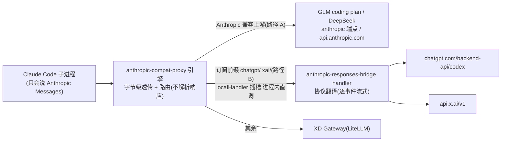

# 订阅直连接入指南(subscription bridge)

> 状态:随 PR #635 引入;架构讨论见 issue #636。owner: zqchris。
> 目标读者:想给 XDMaker 接入**新的订阅模型源**(用户个人包月额度,非公司网关计费)的开发者。
> 核心承诺:**接入新源不需要自己搭 bridge,也不需要改 bridge 的翻译器 / handler 代码**——按本文档的
> 决策树选路径,按 checklist 填数据/配置即可。做不到这一点的接入需求,先来 issue #636 讨论扩展契约。

## 0. 名词与分层



- **compat-proxy**(`packages/anthropic-compat-proxy`):**唯一的代理层**(引擎 + 插槽:routing / request transform / response observer / localHandler),守字节级零延迟透传与路由,响应不解析。所有 Claude 框架请求都过它。
- **bridge handler**(`packages/anthropic-responses-bridge`):插进引擎 `RoutingDecision.localHandler` 插槽的**协议翻译 handler**(Anthropic Messages ↔ 上游 wire 协议),按 model 前缀路由到某个「订阅源 adapter」。**不是独立 server**——消息流不多跳,无额外故障点;会话态(effort / Fast)由 host 的 routingTransform 在决策点闭包传入(无伪 header)。零 Electron 依赖。
- **订阅源 adapter**:一份 `BridgeProviderConfig` 数据(见 §3),不是代码分支。
- **计费不变量**:订阅前缀模型真实计费恒 0(`source:'subscription'`),不写 `daily_spend` / `sessions.total_cost_usd`;判据单一入口 `apps/desktop/src/shared/subscriptionModels.ts`。

## 1. 接入决策树(先判协议,再选路径)

新订阅源第一个问题:**它的推理端点说什么协议?**

| 上游协议 | 路径 | 要不要动 bridge | 例子 |
|---|---|---|---|
| **Anthropic Messages 兼容** | A:catalog provider + compat-proxy 既有路由 | **完全不动** | GLM coding plan(`open.bigmodel.cn/api/anthropic`)、DeepSeek(`api.deepseek.com/anthropic`)、Kimi 等国产 coding 订阅 |
| **OpenAI Responses** | B:bridge 加一份 adapter 配置 | 只加**数据**,不改翻译器 | ChatGPT 订阅(codex 后端)、SuperGrok(api.x.ai) |
| **OpenAI Chat Completions** | C:未支持 | 需要第二个翻译器(见 §7 roadmap) | 尚无落地需求;有需求先到 issue #636 报到 |

> 常见误区:看到"订阅源"就往 bridge 塞。**GLM / DeepSeek 这类 Anthropic 兼容端点走路径 A**,
> bridge 是给"协议不兼容、必须翻译"的源准备的,能不翻译就不翻译。

### 路径 A:Anthropic 兼容上游(推荐优先确认)

1. catalog(`packages/model-providers/catalog/providers.json`)加 provider:`auth.method`(apiKey/oauth)、`routing['claude-code'] = { upstream, authStrategy: 'api-key-header' }`、模型清单。
2. 密钥:走 `providerSecretStore`(safeStorage);oauth 源参照 `grok-oauth-login.ts` 形态另建登录流。
3. **计费**:当前 0 计费 gate 是「前缀制」的,路径 A 的源如果也是包月订阅、不该按 token 计价,需要 provider 级 `billing: 'subscription'` 声明(见 §7 roadmap,尚未实现)——在那之前,路径 A 订阅源接入请先到 issue #636 对齐计费口径。

### 路径 B:OpenAI Responses 上游(本文档主体,§2-§6)

## 2. 新增一个 Responses 系订阅源:改哪几处(checklist)

以「新增源 `foo/`」为例,**全部是数据/配置,按序改完即可**:

| # | 文件 | 改什么 |
|---|---|---|
| 1 | `apps/desktop/src/shared/subscriptionModels.ts` | 加 `FOO_MODEL_PREFIX = 'foo/'` 并加入 `SUBSCRIPTION_DIRECT_MODEL_PREFIXES` —— 路由、0 计费 gate、renderer 判定**自动**跟上,这是单一入口 |
| 2 | `apps/desktop/src/main/maker-host/anthropic-responses-bridge-host.ts` | 加一份 `BridgeProviderConfig`(见 §3 契约),注册进 `createResponsesHandler` 的 providers 数组 |
| 3 | `packages/model-providers/catalog/providers.json` | 加 provider 条目 + `foo/` 前缀模型清单(claude-code 侧) |
| 4 | 鉴权 | oauth:参照 `grok-oauth-login.ts`(PKCE + safeStorage + 自管刷新);key:`providerSecretStore` 加 `ProviderSecretId` |
| 5 | `apps/desktop/src/main/usage/modelPricing.ts` | `SUBSCRIPTION_DIRECT_VALUE_PRICING` 加参考价(只影响「本会话价值估算」显示;不加也不影响计费正确性) |
| 6 | `apps/desktop/src/renderer/components/new-chat/sourceSwitch.ts` | `categorize()` 加一行分组归属(纯展示) |
| 7 | i18n ×4 + `ProvidersSection` | 供应商行 UI(参照 XaiRow) |
| 8 | 测试 | `catalog.test.ts` provider membership;bridge 单测若涉及新 quirk 补用例;有条件跑 `BRIDGE_LIVE=1` 活体 |

**明确不许改的**(改到了说明接入姿势不对,回 issue #636 讨论):
- `translate-request.ts` / `translate-sse.ts`(翻译器;模型级 quirk 用 §3 的 capability 字段表达)
- `handler.ts`(provider 匹配 / 流翻译转发;per-source 差异全部走 config)
- `turnCostCalculator.ts` 的 subscription gate(0 计费不变量)
- compat-proxy 引擎(路由判据从 §2-1 的单一入口自动生效;localHandler 插槽是通用引擎 API)

## 3. adapter 契约:`BridgeProviderConfig`

```ts
{
  prefix: 'foo/',                    // model id 前缀 = 路由/计费/展示的唯一判据
  wireProtocol: 'openai-responses',  // 上游协议标识;未实现的协议注册即抛错(fail-fast)
  upstreamBase: 'https://…',         // Responses base(不含 /responses)
  buildHeaders: async ({sessionId}) => ({...}), // 每请求现取鉴权;内部自理刷新;抛错→该请求 502
  maxOutputTokensSupported?: boolean,       // 上游是否吃 max_output_tokens(codex 会 400)
  supportsReasoning?: (model) => boolean,   // 模型级 reasoning 开关(如 grok-code-fast 不支持)
  fastServiceTier?: string,                 // Fast 映射的 service_tier 值(codex='priority');省略=无 Fast
  onRateLimit?: (info) => void,             // 上游 x-ratelimit-* 头回调(尽力档额度显示)
}
```

翻译器自动提供(adapter 无感):流式(恒 SSE)、tool call 双向、图像、system→developer、
effort 档映射与 Fast(host 在路由决策点经 `prefs` 闭包传入,无伪 header)、reasoning blob
**出处前缀隔离**(签名打 `prefix`,跨源/Anthropic 原生 thinking 不回放,防上游 400)、
count_tokens 本地估算、错误码→Anthropic error type 映射、**单开块不变量**(上游 output
item 交错——如 grok 的 message item 挂着不关、中间穿插 function_call——由 `translate-sse`
强制关块/补开新块整流成 Anthropic 的严格顺序块,新源不需要保证 item 顺序开关)。

## 4. capability matrix(现状)

| capability | ChatGPT(chatgpt/) | SuperGrok(xai/) | 新源接入时必答 |
|---|---|---|---|
| streaming | ✅(恒 SSE) | ✅ | 上游 SSE 事件是否标准 Responses 形态? |
| tool call | ✅ | ✅ | function_call/call_id 语义是否标准? |
| reasoning | ✅ effort 4 档 | ✅(grok-code/build 系除外) | 哪些模型不吃 `reasoning` 参数? |
| Fast / service_tier | ✅ 'priority'(实测) | ❌(未声明 tier) | 有无加速档?wire 值是什么? |
| model discovery | ✅(codex models_cache) | ❌ 静态 catalog | 有无可靠的模型清单来源? |
| OAuth / 刷新 | 复用 codex auth.json(只读+兜底刷) | 自管(PKCE+safeStorage) | 凭证从哪来?谁负责刷新? |
| 限流/额度 | 5h/周窗口(wham 端点) | 尽力 x-ratelimit-* 头 | 有无订阅余量端点? |
| max_output_tokens | ❌(400) | ✅ | 上游吃不吃这个参数? |

## 5. 计费不变量与守护

- 判据:`isSubscriptionDirectModel(id)`(带前缀归一化 id)→ `resolveTurnCost` 恒
  `{costUsd: 0, source: 'subscription'}`;与真网关同名裸模型(如 gateway `gpt-5.5`)天然区分。
- 守护:`turnCostCalculator.test.ts` 回归用例——纯订阅轮 0 计费、混合轮(Opus 主会话 + 订阅子
  agent)只记真实计费、SDK 误算 cost 被 gate 拦截、裸模型不误伤。**新源接入不需要也不允许碰这段**;
  加前缀进单一入口后自动被覆盖。
- 展示:「本会话价值」走 `isEstimate:true` 消息估算(参考价表),与真实账单物理分离。

## 6. 测试要求

1. 单测:`pnpm --filter @lizi/anthropic-responses-bridge test`(翻译器);desktop 侧 catalog/计费相关套件。
2. 活体(有凭证的开发机):`BRIDGE_LIVE=1 pnpm --filter @lizi/anthropic-responses-bridge test`,
   参照 `live-bridge.test.ts` 给新源补一组(文本轮 / 工具轮 / 特性轮)。
3. 端到端:DEV 实例选新源模型聊一轮(计费不涨)、Task 委派 sub-agent 指定新源模型(主会话账单不受影响)。

## 7. Roadmap / 已知边界(欢迎在 issue #636 认领)

- **provider 级 `billing: 'subscription'` 声明**:把 0 计费 gate 从「前缀硬编码」升级为 catalog
  声明,路径 A 的订阅源(GLM/DeepSeek coding plan)才能正确 0 计费;附带 catalog 校验(订阅
  provider 的模型必须带其前缀/标记,违者测试期报错)。
- **`openai-chat` 翻译器**(路径 C):Chat Completions 系订阅源的第二个翻译器;`wireProtocol`
  字段已预留,handler 装配对未实现协议 fail-fast。
- **capability matrix 准入表**:新源 PR 必须先填 §4 的"必答"列。
- scheduler 定时任务的 bridge effort 会话态 hydrate;首请求会话态(prefs)缺失一次的自愈窗口。
